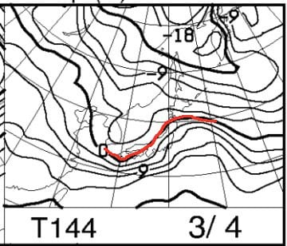

# 3月2，3日の週末の志賀高原スキー場の天気は？…土曜は曇りのち晴れ，日曜は晴れのち曇り

📅 投稿日時: 2019-02-28 02:00:51

えー．

明日28日．

空から液体が落ちてくる危機を

予告していましたが．

28日朝9時の850hpa図を見ると…

うーーーーむ．

きわどい．

ホントにきわどい．

ギリギリ0℃線が志賀高原より北にあるか…

そして，この日の地上天気図は…

朝のうちは，降水域がギリギリ

志賀高原にかかっている感じか…

とりあえず．

28日は朝から何かが降り始めますが．

降りはじめは雪かな．

朝9時ごろに，パラパラと雪が舞い始め．

山頂は雪のままかもしれないけど．

志賀高原でも標高が低いところは，

じきに雨っぽい感じに…（涙）

で．この日は夕方まで．

雨とも雪ともつかない，微妙な感じのモノが

パラパラと降り続けそうです…

止むのは，リフト営業終了のころかな．

ちょうどリフトが動いている間だけ

降っているという，誰かの日ごろの行いの

悪さを証明するような←あなたの日ごろの行いでしょ…

意地悪な天気っぽいです（泣）

うーむ．

それほど強い降りではなく，

パラパラと降ってくる程度なので．

ゲレンデはそれほど壊滅的に雪が

解けることはないと信じたい…

で．

翌1日は，終日全く雪が降らなさそうで．

…うーむ．

この週末までの期間も．

2月下旬というのに，積雪の積み増しどころか．

雪が減っていく感じになりそう…（涙）

ってな感じで．

次に，肝心な週末の土曜日．

2日の850hpa図を見てみますが．

ふむ．

この日は赤い0℃線はかなり南に下がり．

志賀高原には水色の－6℃線がかかっていますね．

この日はそこそこ冷えそうな感じ．

そして，土曜の地上天気図は…

ふむ．

概ね高気圧に覆われるので．

朝のうちは雪がちらつくかもしれないけど．

午前中には止んで，晴れの天気に

なりそうですね！

うーむ．

新雪が乗ってくれれば，雪のコンディションは

良くなりそうな気温なんだけど…

新雪は望むべくもないから．

この日もゲレンデは硬いのかな…（涙）

で．

日曜の850hpa気温を見ると．

うーむ．

この日は，志賀に0℃線が近づいてきてますね…

そして，夜9時の地上天気図を見ると．

ギリギリ志賀高原に，降水予想の網掛けが

かかってない感じなので．

この日も，降り始めるのはリフト営業後ですね．

リフト営業期間中は，降らずにもちそう…

ただ．翌月曜日は．

うむむむ！！？？

うげげげ！

日本全域，降水域が覆ってるので．

日曜夜から月曜の昼間にかけて．

かなり気温が高い雨になりそう…（涙）

なんてこった…

この2月に入ってから．ほとんど雪が降ら

ないどころか．

すっと液体が降る心配ばかりしている

気がするんだけど…（激烈涙）

とても，志賀高原の2月～3月頭の

天気とは思えない…

ってな感じなので．

まとめると．

2日土曜：朝は多少雪が舞う天気でスタートか？

　朝の気温は－7～8℃程度と，結構冷えた朝．

　あさイチは，結構固めに固まった圧雪．

　運が良ければ，硬い雪の上に朝はうっすら

　雪が乗り，滑りやすくなってるかも…

　運が悪いとガチガチアイスバーン．

　リフト営業がスタートするころには晴れ始め，

　それからはずっと晴れ間が続く，いい天気の

　一日になりそう！

　天気が良いのに，昼間も気温は-3℃程度

　までしか上がらず，いい感じの天気だけど．

　下地のバーンは硬めで，バーンのそこかしこに

　氷のコロコロが出てくるようなバーンで，

　雪はちょっと残念な感じ…

3日日曜：朝は晴れでスタートかな？

　朝の気温は-5℃くらいか…

　朝はかなり固めの圧雪．

　朝のうちは雲が多いながらも晴れて

　そうだけど，昼前には雲が増え，

　太陽が隠れ始め，午後は完全曇り空．

　昼間の気温は上がり，0℃を超える

　くらいまで上がるか…

　この日もバーンの下地は硬く．

　バーンによってはコロコロが出てくるか．

　多くの人が滑ったバーンは，

　そこかしこがツルツルアイスバーン化

　していきそう…

4日月曜：朝から雨っぽい…（涙）

　

って感じでしょうか．　　

ああ…

ダメだ．

この2月下旬から，

ダメな感じの天気が続く…（泣）

今シーズン．

注連縄程度では払いきれないほどの，

とんでもない厄に襲われている

ようです…（激涙）．

なにか，もっと強烈な厄除けが

必要らしい…

## 💬 コメント一覧

### 💬 コメント by (ホンダ)
**タイトル**: Unknown
**投稿日**: 2019-02-28 19:18:04

若杉さんがしばらくお留守なので代わりに報告です。朝イチは良かったですがすぐに板がキューブレーキになり滑れなくなりました。今日のヤケビは雪？水分多めでやはりウエアーはびしょ濡れになってしまいました。ゴーグルに滴り落ちる水分で前良く見えずでしたー。アー悲しいですね。もう春が来たようで鳥がたくさん泣いていました。レインボーになりましたー。もう少し寒くなって欲しー！

### 💬 コメント by (若杉勲71)
**タイトル**: Unknown
**投稿日**: 2019-03-01 00:02:56

某H多名人が余りに気持ちよく滑るのを見て、今朝、88°でギンギンにアイスバーン仕様でチューニングを頼んで帰宅しました。でも、よく考えてみると6、7日は妻同伴の予定なので、ゆみりん亭主を見習って自分勝手な動きは戒めなきゃあ。アイスバーンでもズクズクでもいいから、早く自分の居場所に帰りたーい。

ちなみにチューニングは中野の洋服の青山の向かいの『テイク０』です。

### 💬 コメント by (Skier_S)
**タイトル**: この3月もダメっぽい…（涙）
**投稿日**: 2019-03-01 02:10:14

＞ホンダさま

ええ？？

今週も木曜から滑ってらっしゃるんですか！？？？

…しかし．

やっぱり今日は，雪か雨か微妙なものが降り続けましたか…（涙）

このあと，ちょっとやそっと踊ったくらいでは

冷えてくれるような天気ではなさそうです…（泣）．

あぁ…春ですね…

＞若杉さま

しばらく志賀高原から離れるだけで，

ホームシックにかかりそうですね（って，志賀高原の方が本宅ではないはず？？）

しかし，中野の洋服の青山の向かいにそんなチューンナップ

ショップがあるんですね！

まったく知りませんでした…

でも．

私はここ5年ほど，板をチューンナップに出してない

気がします…

