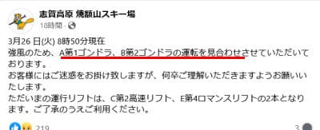
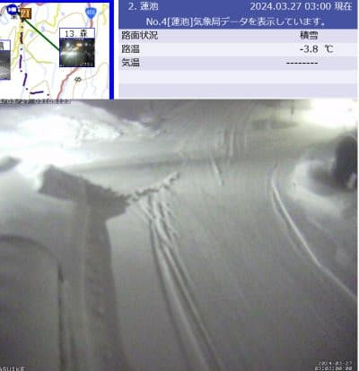
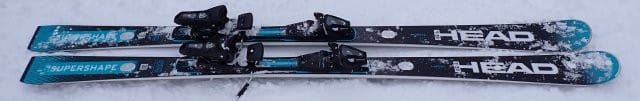
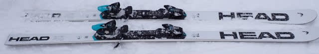
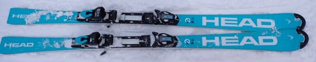
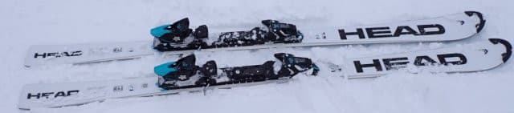

# 2025シーズンモデルのスキー板の試乗レポート速報…HEAD編

📅 投稿日時: 2024-03-27 03:32:33

🏷️ カテゴリ: [スキー板試乗](c0bd8048615710cee890e403a36cc9a2b.md)

えー．

本日は特派員からの志賀高原の写真は

送られてこなかったんですが…

どうやら今日は強風の雨だったらしく．

焼額は第1，第2ゴンドラともに

止まったようです…（涙）

（[焼額山スキー場Facebook](https://www.facebook.com/yakebitaiyama/posts/pfbid0oiHZ4RLBHYkavG5tkLnC49xK15DZsHUm5xThx1j2nQqGE85T575Up63hYVEfDkrGl)より）

午後の早い段階から雪になって，

雪が雨でいっぱい融けちゃう前に

雪が積もり始めるといいな…

と，思っていたけど．

ライブカメラを見ると午後3時くらい

まで雨（涙）

でも．

午後4時くらいから雪に変わり，

深夜3時現在，志賀高原では10cm以上は

積もっているみたいに見えます…！！

（[北信建設事務所道路気象状況カメラ](http://hokushin.pref-nagano-roadcamera.jp/)より）

明日までに運が良ければ20cmは積もるはず…！

そして，明日は天気も回復していきそうだし，

明日はそこそこ楽しめそう…

だのに．

また週末直前の金曜日は高温の雨になって，

その後土日はかなり高温の晴天となりそう…

うーん…

週末は雨の後の高温で，かなりの

ザブザブ雪になりますね（涙）

典型的な春の雪になりそうです…

ってなことで，本題へ．

本日はエキップさん試乗会で乗った板の

速報レポート，HEAD編です！

…それぞれの板の詳細レポートは

また後日お送りしますので，今回は

簡単なサマリー版です．

では，どうぞ～！

〇HEAD Supershape e-SPEED 170cm

170cmでR=14mと，大回りも小回りも

行けるオールラウンドを狙った板ですが…

試乗した日が，新雪が積もった柔らかめ

バーンだったからなのか？

グリップがそこまで強くなく，ずらしが

かなり使いやすい感じ．

上級者にはRebels e-SPEEDがあるので，

こいつは優しい中級者向け板に仕上げて

きたのかな？

切っていこうと思えば切れるけど，今日の

雪ではグリップしないのでたわみが出せず，

サイドカーブなりに曲がっていくような，

ピュアカービングというよりズレとキレを

適宜使い分けて滑るような板．

〇HEAD Worldcup Rebels e-GS 186cm

昨年からキャリーオーバーらしい，

R=25のGS板．

しっかりした張りとどっしりした重さがあり，

GS板らしい安定感があるのに，

186cmにしてはかなり動かしやすく，

予想より扱いやすい板．

グリップさせていけばがっつり

ハイスピードカービング大回りが

できるけど，何かあった時にすっと

板を動かせて，ずれた中でも旋回させやすい，

結構良くできた板．

長くてしっかり張りがあってトップからテール

まできれいにグリップするのに，

ずらしのコントロール性がいい板．

レベルが高い人のゲレンデ大回り用として

おススメ！

〇HEAD Worldcup Rebels e-SL RD FIS SPEEDBLUE 165cm 

この板，モノによって名前が変わっていて…

昨年のカタログには

WC SL-REBEL FIS RP-WCR14 SPEEDBLUE

という名前で載ってます．

FIS規定SLモデルの競技板の青色バージョン．

プレートはRace Plate のWCR14がついてます．

踏んでたわんでいくときに粘りがある

フレックス感で，踏んだ量でたわみを

自由に作れてターン弧がコントロールできる，

私の好きな感じの板．

高速安定性も強く，グリップもいい感じ！

しっかりグリップして，たわみ量で

回転弧を好きなようにコントロールでき，

まっすぐ目から深回りまで，自由度は高いです．

グリップが強いので，ずらして滑るより

しっかりグリップの中で，ハイスピードで

気持ちよく滑れる板．

レベルの高い人のゲレンデ小回り板としては

かなりおすすめ度高いです…！！

〇HEAD Worldcup Rebels e-SL RD FIS 165cm 

これ，上の板の色が変わって白色なだけかと

思ったら…

「トップシートが違うので，微妙に乗り味が

違う」とのことで履いてみたら．

…確かに違う！

SPEEDBLUEの青色版より，フレックスが

硬めで突っ張るような感じがあります．

たわみは青色のほうが出しやすく，

青色のほうが粘りがある感じ．

こっちの白い方は，硬めでたわみが出る

前に，サイドカーブでクイクイ回って

いく感じ．

返りも白いほうが早く，素早く切り返せます．

…青い奴と全然違う…

トップシートだけでこんなに違うとは！

でも，ハイスピード耐性が高く，

ガッツリエッジグリップで曲がっていく

しっかりした板という点は共通．

その中で，硬めでクイックな白色と，

粘って気持ちよくたわむ青色の違い．

どっちもいい板だけど，私は青が好き…

## 💬 コメント一覧

### 💬 コメント by (モイストシルバー)
**タイトル**: Unknown
**投稿日**: 2024-03-27 21:00:10

今日は天気が回復して、風も収まり、コンディションは最高でした。一の瀬のファミリー上部やパーフェクターは軽い新雪でした。焼額も久しぶりに滑りましたが、整備がいいのか、一の瀬と雪質が違いますね。奥志賀まで遠征しましたが、どこも空いていて、3月下旬と思えない雪質と、冬景色（樹氷）を楽しむことができました。

### 💬 コメント by (aki)
**タイトル**: Unknown
**投稿日**: 2024-03-28 01:18:35

本日春雪をDeacon84で滑ってみて凄さがわかりました。

ありがとうございました。

### 💬 コメント by (Skier_S)
**タイトル**: 今週末はザ・春スキーになりそう
**投稿日**: 2024-03-28 03:06:19

＞モイストシルバーさま

今日は良かったみたいですね～！

3月末と考えれば，かなり恵まれた1日だったかと．

今日滑れた人はうらやましいです…！

＞akiさま

いやーーー．

Deakon84はホントに春スキーでは無敵の板です！

これがあるか無いかで，春スキーの楽しさが全然変わります…（笑）

