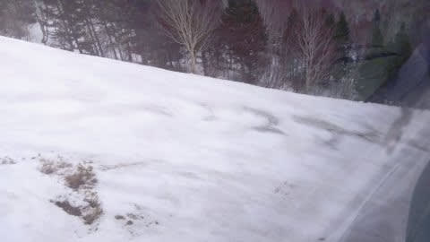

# 今度は4月4，5日の週末の志賀高原スキー場の天気予想！…土曜は曇りで気温は0℃前後，日曜は冷えて，雪もぱらつくかな？

📅 投稿日時: 2020-04-02 00:34:23

🏷️ カテゴリ: [スキー天気予想](c6554f5c3c106093b511a8daae23757e8.md)

なんという事か！！

本日から4月じゃないですかっ！！！

…あぁ…信じられない…

早くも4月か…

トップシーズンが終わっていく…

で．4月から，焼額スキー場の営業時間が

変わるのですが．

最新の情報を見ると…

え？？

土日も営業開始，7:30からになったの！？？

そして，営業終了も15:00？？

([焼額山スキー場HP](https://www.princehotels.co.jp/ski/shiga/informations/spring_ski/)より）

…コロナウイルス騒ぎの前までは．

[土日は6:30～15:30営業という，
すばらしい案内](e9206acd8933c41b9edc43c6554858695.md)があったのに．

お客さんが減ってしまったので，

土日の6:30からの営業開始を

諦めたようです…（涙）

うーーーむ．

残念…（激泣）

で．

本日の志賀高原ですが．

朝から雨の予想はいい方に外れ，

明け方まで雨だったものの，

朝から昼過ぎまでは雨が降らずに

済んだようですね…

ただ，明け方までの雨で，結構雪が

解けてしまい…

（焼額第1ゴンドラから，GSコース下部のショートカット部分ですね…）

さらに強風で，午前10時過ぎから奥志賀ゴンドラ，

焼額1ゴン，2ゴンと死に絶えていき…

（[焼額山Facebook](https://ja-jp.facebook.com/yakebitaiyama/posts/2807951429300185?__tn__=-R)より）

その上に，午後3時ごろからは，

また雨が降り始めてしまったようです…（泣）

気温6℃って，高すぎ…（涙）

（[北信建設事務所道路気象情報ページ](http://hokushin.pref-nagano-roadcamera.jp/)より）

ただ，深夜1時現在，志賀3号トンネルや

硯川のライブカメラを見ると，

ちょうど雨から雪に変わりつつあるようで，

路面はうっすら白くなり始めてます！

（[北信建設事務所道路気象情報ページ](http://hokushin.pref-nagano-roadcamera.jp/)より）

明日の朝は予想通り，数cmの新雪が

積もっているはず…っ！！

そして，4月2日(水)は，昨日の予想通り終日

雪降りの，冷え冷えデーになります！

これで少し積もってくれれば…（祈）

で．

最新の3日(金)の850hpa気温図を

見てみると．

まぁ，何とかぎりぎり赤い0℃線は

志賀高原より南にありますが…

昨日の予想図にはあった，3日の

地上天気図の降水域．

最新の予想図ではなくなっちゃってます(涙）

…昨日の予想では，3日朝まで雪の予想でしたが．

最新の天気図を見ると，雪は2日夜には

止んじゃいそうです…（泣）

うーむ．あまり積雪量は期待できなさそう…

次に，肝心な週末の4日(土)の850hpa図を見てみますが．

…この日は，赤い0℃線は志賀より北に上がっており．

気温が上がりそうですね…（涙）

そして，地上天気図を見ると，

低気圧が日本海側にいますが，

降水域は本州にはかかってませんね…

だもんで．

土曜は晴れ～曇り，と言った感じでしょうか…

気温は午後に向かって下がっていきそうなので，

雪はそんなに緩まなさそう！

そして，5日(日)の850hpa図ですが…

をををを！！！

水色の-6℃線が志賀高原に近づいてます！

これは，真冬並みの冷え冷えっ！！

この日の地上天気図を見てみると…

うーむ．

降水域は志賀高原にかかってませんが．

冬型っぽい西高東低で，冷えた北風が

入りそうなので．

麓は降らないけど，山の上では雪になる

可能性大ですね…これは．

ってなことで．

まとめると．

2日(木)：明け方雨は雪に変わり，朝は重い雪が数cm

　積もっている．

　下地は固まりかけているけどガリガリではなく，

　固まったザラメの圧雪の上に重い雪．

　朝から雪が降ったりやんだり．時折強く降る．

　午前中は風が強そう…

　奥志賀ゴンドラはヤバいかな？

　焼額ゴンドラは止まらないと思う．

　昼間も雪が積もっていくので，

　ゲレンデは重い雪が蹴散らされた，

　荒れ気味の疲れるバーン状況に．

　でも，雪が積もってくれるだけありがたい．

3日(金)：朝から晴れるかな？

　朝は放射冷却でかなり冷える．

　前日降った雪が圧雪されて，

　あさイチはエッジがガッツリ効く

　いい感じのバーンコンディション！

　天気もいいし，朝は最高！

　でも，日が射して昼は気温が

　+5℃くらいまで上がりそうなので，

　午後は雪が緩み，滑りが悪くなる

　ところが出てきそう…

4日(土)：朝は晴れてるかな…朝イチの気温は

　0℃をわずかに下回る．

　ただ，じきに雲が増えていき，

　基本的に曇りの一日．

　朝はしっかり締まり気味の，

　硬めの圧雪．

　昼間は風が強くなり，ゴンドラは

　減速になるかも？

　もしかしたら，一瞬雪がぱらつくか…

　午前中に雪は多少緩むけど，昼間も

　それほど気温が上がらないので，

　雪はザブザブにならず，いい感じで

　エッジが効くバーンをキープ．

5日(日)：朝から冷え冷え！-5℃程度まで

　冷えるかも…

　あさイチはかなり締まり気味で

　いい感じのシマシマバーン！

　そして，基本的には曇りの一日だけど，

　もしかしたら朝から時折雪がぱらつき，

　午前中に　うっすら1-2cmくらい雪が

　積もる可能性も…

　この日は終日冷え冷え．

　寒いよ！真冬の恰好をしていきましょう．

　昼間も-5℃クラスの気温をキープ．

　ところどころ硬い下地が出てきそうだけど，

　雪は全く緩まない冷え冷えデー．

…という感じでしょうか…

この週末はそれほどひどい高温になら

なさそう…というより，平年より冷え気味の

2日間で，バーンコンディションは

そんなに悪化しなさそうです．

で．

来週月曜以降の850hpa図を

見てみると．

6日(月)は0℃線が志賀に近く，

それほど高温にならなさそうですが．

7日(火)，8日(水)とも，

0℃線はかなり北に上がり．

特に8日は水色の+6℃線が

志賀高原に近づくので．

かなり気温が上がりそうです…（涙）

地上天気図を見ると．6，7日は

高気圧に覆われ晴れそうですが．

8日は，網掛けの降水域が志賀に

かかっているので…

おそらく，液体が降りそうな感じ（涙）

まぁ，

6日(月)は晴れて朝イチは最高，昼間の気温はわずかにプラスで

　昼間の雪は緩み気味，

7日(火)も晴れるけど，気温は上がって滑りの悪い雪になり，

8日(水)は朝から気温が高く，昼間のどこかから液体が降り始める…

という感じでしょうか…

ただ，8日の予想精度はまだ低いです．

うーん．

週末までは悪くないものの．

来週はまた高温になりそう(涙）

GWまで，雪がもってくれるかな…？？

## 💬 コメント一覧

### 💬 コメント by (レインボー)
**タイトル**: Unknown
**投稿日**: 2020-04-02 21:13:25

木曜日の志賀高原情報

いっぱい書いて、消えた。立ち直れない。面白いことたくさんかいたのに。

Sさんの予報がピタリ。違ったのは、新雪5cmの下の下地が、カリカリだったことだけです。重くて警戒しながら滑るのは、楽しくない。早上がりして、戸狩まで山菜採りにいきました。

今日はもう書けない。ごめんなさい。

### 💬 コメント by (西館)
**タイトル**: 元気出してくださいね
**投稿日**: 2020-04-03 00:57:51

スキーって安全だと思うんですよね、特に自家用車で出掛ける皆さんは。

楽しみがあるからこそ日々のご無体業務にも耐えられるってものなのに張り合いがないですよね。

今年は飲み会が皆無になったので、その時間分例年よりも余裕がある筈なのに何故か忙しいんですよね。

在宅勤務にした人の分、面倒な仕事が増えてしまったし。

あー楽しいことが欲しい娯楽が欲しい時間が欲しい！

仕方が無いので周囲に志賀高原愛を語りまくっているんですけど、そしたら復帰しようかなと言う人がぼちぼち増えてきて、最初の目標２０×２はあっさり達成できそう。

なばかりか次の冬を待たれよとなりそうな勢いです。

### 💬 コメント by (Skier_S)
**タイトル**: この4月は結構冷えそう
**投稿日**: 2020-04-03 01:05:58

＞レインボーさま

あら…コメント消えちゃったんですね．

何かシステムの不具合があるんでしょうか…

メモ帳的なアプリでコメントを書いて，コメント欄にコピー＆ペーストすると

消えずに良いかもしれません．

で，今日は下地はカリカリだったんですね…

明日はちょっと緩むはず…

＞西館さま

ちょっと最近，いろいろ落ち込むニュースばかりですよね…

職場に感染者が出ないかドキドキの毎日です．

でたらめちゃくちゃ大ごとになりそうなので…

海外の外出禁止をした国では，やはりストレスが溜まって

問題が起こっているようですね．

うーむ．早く騒動が落ち着いて，心お聞きなくスキーやお出かけが

できるようになって欲しいと強く願ってます…

