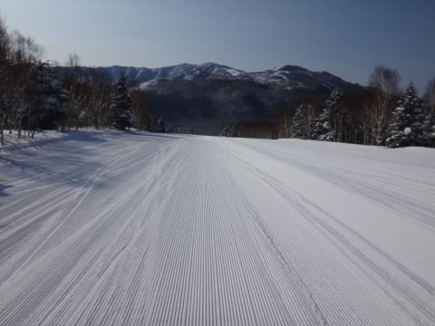
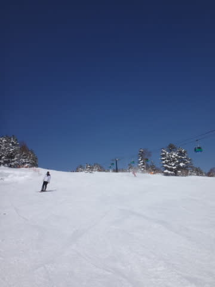
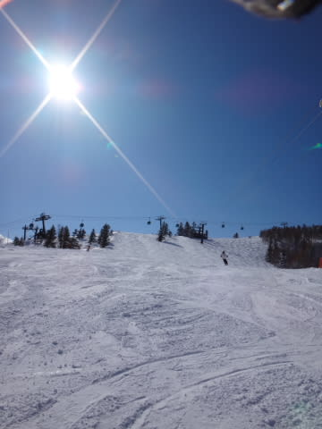

# 3月9日の志賀高原速報モード

📅 投稿日時: 2014-03-10 00:55:46

えー．

今日も帰宅は日付が変わるころだったので．

定番の（？）速報モードで…

本日の志賀高原はですね～

最高っっっでした！

朝はマイナス10度以下の冷え冷えで，

一日中，晴れ晴れで．

トップシーズンの冷え冷え雪の，

最高の雪質で．

晴れているのに，気温は低く，

昼間も雪は緩まず．

見ての通り，人も少なく．

もう，1月2月でも，ここまでいいコンディションは少ないよ～！

って感じで．

もう，3月というのに．

超～楽しい，最高の一日だったのでした．

詳細レポートはまた明日…

…五竜いいもりゲレンデとは違いすぎる…

## 💬 コメント一覧

### 💬 コメント by (Goku)
**タイトル**: Unknown
**投稿日**: 2014-03-10 19:56:44

行きたかった・・・・マジで(T_T)

「今頃Ｓさんウハウハ言いながら滑っているんだろうな～」

なんて志賀の山並みを見ながら、娘の新居用の家電を買いに行ってました。

### 💬 コメント by (Skier_S)
**タイトル**: Gokuさま
**投稿日**: 2014-03-10 23:29:43

いやーーーーー．

シーズンぴか一のコンディションでしたよ～．

この日曜は…

もう，お察しの通り，ホントに「ウハウハ」言いながら

滑ってました…

また落ち着いたらゲレンデに復活してください！

