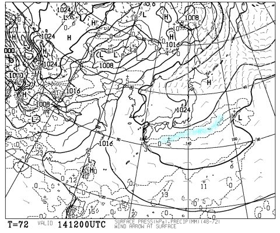
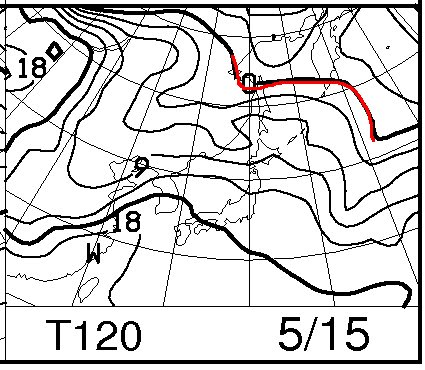

# 5月14日の週末のスキー場天気予想…かぐらは2日とも晴れかな

📅 投稿日時: 2016-05-12 03:26:20

えー．

今週末のスキー場天気予想を気にする人も，

もうほとんどいなくなったかと思う今日

この頃，いかがお過ごしでしょうか．

でも．

まだ，かぐらが営業しているので…

水曜恒例，スキー場天気予想は，まだ続くのだ…！！

…しかし．

この時期のスキー場の天気予想が気になる人は，

おそらく，もう終わった人だと思いますが（笑）

とりあえず，土曜14日の地上天気図を

見てみると…

うむ．

概ね高気圧に覆われてますね．

まぁ，この時期，雪が降る可能性があるわけじゃないので，

意味がないと思いつつ，850hpa気温図を見ると…

まぁ，0℃線は北海道よりはるか北で，水色の12℃線が

かぐら近辺にいるので．

まぁ，かぐらは昼間は10℃を超える，

典型的暖か春スキーの一日かな…

で．

日曜の地上天気図は…

引き続き，高気圧に覆われてますね．

気温も，土曜と似たようなものになりそうですね…

ってことなので．

まとめると．

土曜：たぶん終日晴れ．

　気温は朝から高く．昼間は+10℃以上．

　典型的な暖かい春スキーの一日かな…

日曜：この日も終日晴れ．

　夕方はちょっと雲が増えていくかな…

　でも，雨の心配はなさそう．

　この日も，日が射すとTシャツで十分な，

　暖かい一日になりそう…

ということで．

「2日とも晴れ」

以上の情報量がほとんどない天気予想に

なってます…（笑）

…

って，天気予想をしながらも．

今週末も，スキー場の天気予想が気になるような人は．

もう，終わった人だよなぁ…ホントに…

と思わざるを得ない，Skier_Sなのだった…
