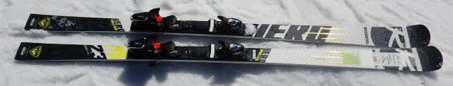
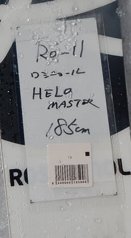
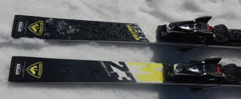
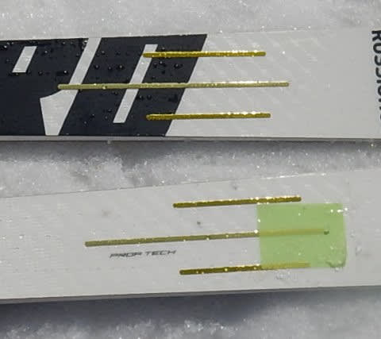

# 2019シーズンのスキー板，試乗レポート第13回…ROSSIGNOL編 その2

📅 投稿日時: 2018-06-08 00:52:25

ってな感じで．

ここ数日，プロジェクトXネタが続いてますが．

本日は，このBlogの本筋に戻って，スキーネタです．

あぁ…

聞こえる！

スキーネタはいいから，プロジェクトXの続きを…

という声が聞こえてくる…っ！

でも．

あくまでこのBlog．

Skierブログなのです．

スキーネタが本筋なのです！

「徒然ドライバー日記」

ではないのですっ！！

…だもんで．

ときどき挟まねばならない（義務），スキーネタ．

今回はスキー試乗レポート．

ロシニョール編です．

では，どうぞ～！

---

○ROSSIGNOL HERO GS MASTER 185cm

GS競技用（FIS非対応）

マスターズGS用と銘打っている，この板．

ロシのDEMOシリーズは，LCT(Line Control Technology)とかいう，

センター部分を突き抜ける細い板を内蔵する構造になったのですが．

この板は，今シーズンまでと同じく，まだ3本スリットの

Proptechが残ってますね…

基本的には昨年からのキャリーオーバーの

板なのかな？

で．

滑ってみたところ…

エッジのビベルがかなり少なめなのか？

エッジに強い引っかかり感があり，

板がちょいと動かしにくい…

私にとっては，ちょっと手ごわい感じです．

ただ，谷回りで板を動かしていこうとすると，

かなり早い段階から強いエッジの抵抗を感じるので，

谷回りから板のたわみを出しやすいともいえるかも．

谷回りで適切なところに体を運べると，

気持ちよくかなり大きな半径で落ちていく

ことができます．

山回りでは，強い板がしっかりガッツリグリップして，

いい感じで走っていきます．

私が今履いているX-RACE程ではないけど，

かなりエッジグリップは強いです．

フレックスも強いので，この板の求めるスピード域は

結構高め．

小回りは全く持って無理です．

強烈にずらしにくいです．

板を動かしていこうというのは，

私にはできない感じ．

うーむ．

マスターズと言っているけど，かなり本格的な，

体力がある人じゃないと履きこなせない，硬派な

大回り専用板…って感じ．

かなり本格的なレーサーが，

FISレギュレーションに縛られない条件で

履くにはいい板かな．

しっかり硬い斜面で，体力のある人が

気合を入れて攻める板のように感じました．

ゲレンデで普段履きにしようとか思わない方が

シアワセな感じです．

## 💬 コメント一覧

### 💬 コメント by (三代目 J Soul スキーヤーズ)
**タイトル**: 雪たっぷり
**投稿日**: 2018-06-08 20:51:39

はじめまして

三代目 J Soul スキーヤーズの岩田剛典2世です(笑)

月山はまだまだ雪たっぷりありそうですよ

### 💬 コメント by (新潟のスキーヤー)
**タイトル**: Unknown
**投稿日**: 2018-06-08 22:25:30

昨日、月山行って来ましたよー！

クローズ間際に一所懸命、雪つけしてましたので、もうしばらくはリフトぐるぐる楽しめそうです！

ただ来週、私の休みとリフトの掛けかえが重なってるので、次に行けるとすると月末に…

おそらく、その頃には…

月山最終形態の修行モードかな…

劇的に雪解けが遅れるか、私の精神力がアップしないかぎり、一足お先にシーズン終了になりそうです！涙

来年シーズンも志賀高原にお邪魔したいと考えておりますので、お見かけしたらお声掛けさせていただきます！(^^)

### 💬 コメント by (olaf2125)
**タイトル**: Unknown
**投稿日**: 2018-06-08 23:45:27

「徒然ドライバー日記」のDriver_S// さん？

いいですね。

いっそ二本立てはどうですか？

両方とも毎日更新で (^^)

### 💬 コメント by (Skier_S)
**タイトル**: 月山は来週に…
**投稿日**: 2018-06-09 01:31:51

＞三代目 J Soul スキーヤーズさま

初めまして～！

今週も用事があるので，月山は来週末の

予定です！

今週末まではリフトに滑りこめそうですね．

でも，多分激込みでしょうね…

＞新潟のスキーヤーさま

おっと．

月まで行きましたか！

まだリフト乗り場，降り場とも

直前まで雪があるみたいですね．

来週まで，リフトに滑りこめると

いいんですが…

やっぱり無理かな～．

来週日曜に日帰りという，

無謀なチャレンジをしようとしています．

＞olaf2125さま

徒然ドライバー日記…

あまり読者を引きつけなさそうなタイトルです（笑）．

スキーヤー日記でさえ，

毎日1時間近くかけてるのに，

両方毎日更新したら死んじゃいます（笑）

