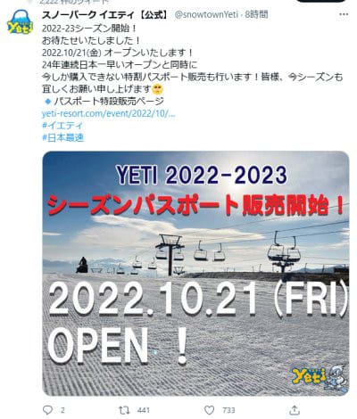
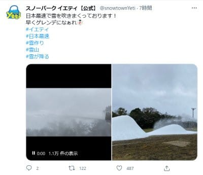

# イエティの2022/2023シーズンオープン日が10月21日（金）に決定！…だいたい予想通りだな．

📅 投稿日時: 2022-10-14 01:08:16

🏷️ カテゴリ: [スキー雑談](c1f9d2cb7478308da16419928ea3945e9.md)

えー．

昨日はまた，深夜に帰宅後，疲れからか

そのまま倒れたように寝てしまい，

Blog更新できませんでした…

いや．

気づいたら，着替えもしないまま床に

転がって，そのまま朝を迎えていたの

でした（涙）

どうせ寝るなら布団で寝たかった…

ってなことで．

昨日は更新できなかったのですが．

今日，イエティのホームページを見てみると…

でたーーー！！

スノーパークイエティの2022/2023シーズンの

オープン日が出ましたよ！！！

（[スノーパークイエティTwitter](https://twitter.com/snowtownYeti/status/1580449491563388928)より）

やはり予想通り，

来週金曜日の10月21日オープンです！！

いやーー．

ライバルの狭山のオープン日がまだ

アナウンスされてなく，どうもオープンが

遅くなりそうなので．

もしかしたら，一昨年みたいに10月最終週

オープンになったりしないだろうな…？

と，ちょっと心配したけど．

例年通りの，10月20日前後のオープンと

なりました～！

で．

オープンまであと約1週間．

もう，ガンガン雪を作り始めてるみたいです！！

（[スノーパークイエティTwitter](https://twitter.com/snowtownYeti/status/1580460538168942594?cxt=HHwWhICp8Yuf9u4rAAAA)より）

いやーー．

白い粉を見ると，テンションが上がる！！

これから先の天気を見ると，

17，18日あたり，雨になりそうだけど．

いつぞやの年みたいに，台風が来ることも

なさそうだし．

18，19，20日の当たりはかなり冷え込み

そうで，それ以降も気温が平年比でそんなに

高まることはなさそうだし．

そこそこ順調に雪は作れそうな感じですね…

ってなことで．

私は10月23日の日曜に，今シーズンの初滑りと

なりそうです！！！

ついにシーズンインまであと1週間ちょいですよ～！！
