# 2023シーズンモデルのスキー板，試乗レポートその5…FISCHER RC4 Worldcup SC M-track

📅 投稿日時: 2022-05-28 00:00:54

🏷️ カテゴリ: [スキー板試乗](c0bd8048615710cee890e403a36cc9a2b.md)

えー．

本日，27日の金曜の渋峠スキー場の情報が

特派員より送られてきました～！！

今日はさすが平日だけあって，そんなに

混んでなかったようですが…

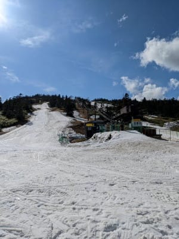

渋峠，まだ中間駅より上まで行けて．

山頂までコースが繋がってるようですね…！！

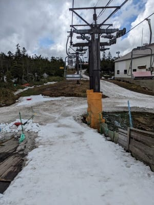

ゲミュートコースの方は，

上の方はまだ幅が広そうに見えますが…

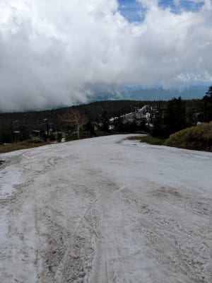

中間地点はヤバそうです（涙）

今週末はもつだろうけど，あと1週間

もつのかな…？？

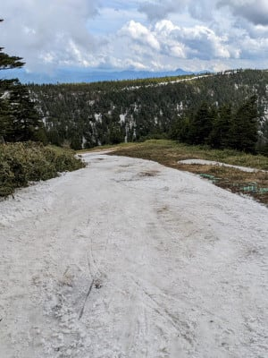

下の方，このあたりもなんだかヤバそうな

感じになってますね…（涙）

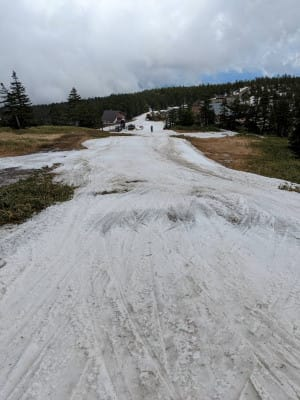

これ…ホントに来週末までもつのかな？？

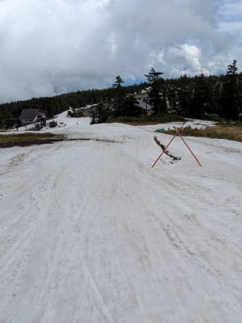

まだ，ウエイバーコースの方がちょっと

広い感じですね…

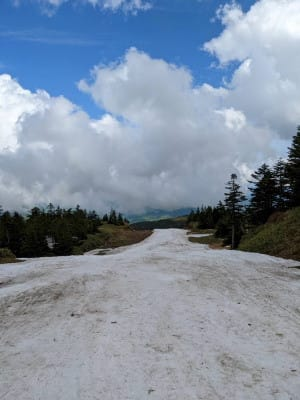

とはいえ．

ここも来週末までもってくれるかは

微妙な感じ…

大雨とか来たらヤバいかな（泣）

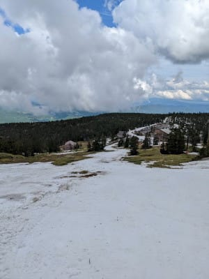

うーん．

31日あたり，結構雨が降りそうなので．

ゲレンデがもってくれるのかどうか

心配…

でも．

今週末はまだ滑れそうかな！

硫安ガチガチにする気マンマンみたいなので．

朝のバーンは結構固めになってるかも？？

（コース脇に大量に積まれた硫安）

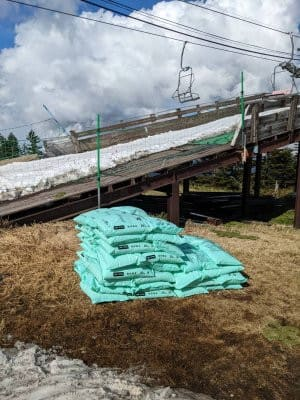

…ってなことで本題へ．

今日も2023シーズモデルのスキー板試乗レポート．

今回もフィッシャー編です．

では，どうぞ～！

○FISCHER RC4 Worldcup SC M-track　165cm

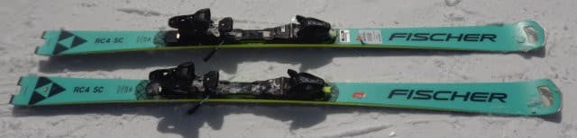

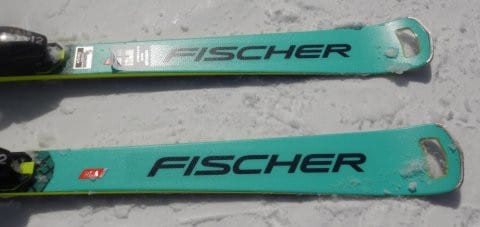

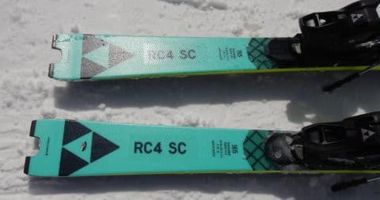

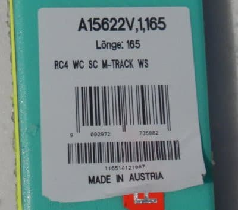

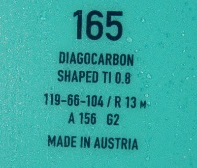

基礎小回り用

[その3](e987349984f149be3ae8d6c1ecb1daa55.md)で，強いほうのM/Oプレートを搭載した

RC4 worldcup SC Proの試乗レポートを

書きましたが．

こちらは弱いほうのM-trackを搭載した，

RC4 Worldcup SC M-trackになります．

板自体は同じで，プレート＆ビンディングのみの

違いになりますね．

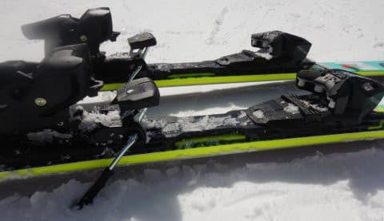

このモデル，今シーズンは黒色モデルと，

サイドウォール＆ロゴがピンクのモデルの

2色の展開でしたが．

来シーズンは黒色モデルと水色モデルの2色の

展開になるようです…

で．

滑ってみたところ…

SC Proと同じく，粘りがあって，

トップからテールまでエッジがしっかり

グリップしてきれいにたわみが出て，

その板のたわみに沿ってまわって行く

板です．

やはりProよりたわませやすく，それほど

力が無くても簡単にたわみます．

そして，ターン後半の返りはProに比べると

ずっとマイルド．

かなり優しく返ってきます．

たわみはProより出しやすいけど，

グリップは結構しっかりしていて，

スピードを出すとトップからテールまで

すごくきれいにたわんで，エッジが

しっかり食いつきます．

でも，Proに比べるとエッジグリップは

優し目かな．

ターン中に板をずらして動かしていく

こともできます

基本的には完全グリップして滑っていく

板ですが，動かそうと思えばずらして

いけます．

M-trackはM/Oプレートに比べると

結構軽いのか，履いてみると板はかなり

軽めに感じます．

それもあって，板は動かしやすいです．

比較的軽快な感じ．

低速では，ずらしのコントロール性も

結構良くて，練習するにはいい板かも…

高速のスピード耐性もそこそこありますが…

でも，ホントのトップスピードを出すと

私にはちょっとたわみすぎるかな．

スピードを出していくと，グリップが

そこそこ強めなのにフレックスが

優し目ということもあり，板がたわみ

すぎて旋回半径がぐんぐん小さく

なっていきます…

傾きすぎて，手やお尻が雪面につくかと

いうくらいの小回りになっていきました（笑）．

この板も，今シーズンモデルに比べれば

来シーズンモデルの方がしっとりした

上品な感じに仕上がってますが．

Proの方ほど，今シーズン・来シーズンモデルの

差は大きく感じなかったかな～．

とりあえず．

板は軽くて動かしやすいし，

それほど力を入れなくても簡単にたわませ

られるのに，グリップは比較的しっかり

していて良く回ってくるし．

比較的体重の軽い人，筋力がそこまで強くない

人だけどガッチリカービングしたい人とかに

向く板かな～．

## 💬 コメント一覧

### 💬 コメント by (ikkun)
**タイトル**: Unknown
**投稿日**: 2022-05-29 12:41:54

コブで難しさを感じたのは硬めな方でしたか？ しかし緩んだ雪でもステキでした！

### 💬 コメント by (Skier_S)
**タイトル**: ＞ikkunさま
**投稿日**: 2022-05-30 02:35:03

こっちの板なら，コブでも大丈夫だと思います．

Proの方は，コブでは手ごわいと感じる人が多そうです．

