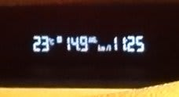
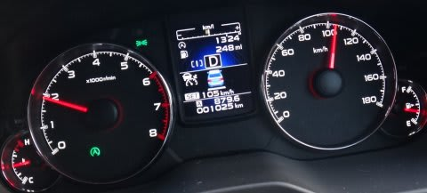
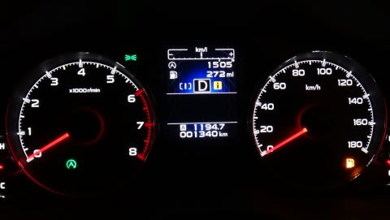

# プロジェクトX第2章…BRレガシィで，月山往復1200km走ってみて　その1

📅 投稿日時: 2013-06-21 02:56:16

🏷️ カテゴリ: [車](cba0e8330b3f2ded7c1addfacc75d4547.md)

えー．

って感じで．

BR LEGACY購入1週間に，月山往復の1200km走ったわけですが．

とりあえず．

これは，長距離運転が超楽な車ですな～．

EyeSight，これは…長距離運転の強力な味方ですね．

片道300km，アクセルもブレーキも一度も踏むことなく走れちゃったという…

予想以上に使えるぞっ！

…この，アイサイトのすごさについては．

また後日詳細を書くとして…

んで．

今回．

驚いたのは．

レガシィの，燃費．

予想以上に良かったですね～．

月山往復，山道の登りも含めて．

1200km走ってのトータル燃費．

なんと，リッター14.9km！

うほ～！

カタログ値の，14.4km超えてますね…．

月山の登りをかなりのペースで2往復してますし．

観光その他で街中を含め，下道を100km以上走ってますし．

高速も，燃費重視でゆっくり走ったわけでもなく．

メーター読みで法定速度5%～10%増量キャンペーンで走っていたんですが…

＃ナビの移動速度表示でちょうど法定速度だったので…

＃法律はちゃんと守っているはず…だと思う

…とりあえず．

そんな走りをしていても，

無給油で900km以上走っちゃいました…

街中での燃費は，結構アイドリングストップが効いてる感じ

がしますね～

＃アイドルストップ中．タコメータが0になってます

いやー．

高速だけならまだしも，山道も走ってトータル燃費リッター15km近く

走るとはっ！

4WDだというのに…

予想以上に，燃費のいい車で，結構満足…
