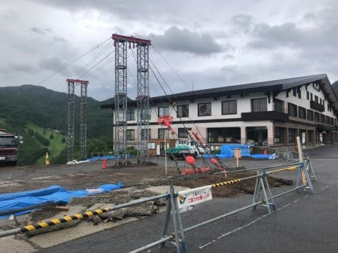
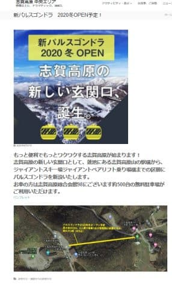
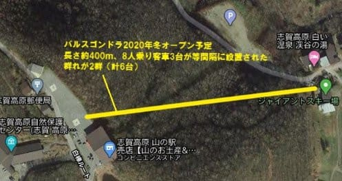

# 志賀高原スキー場のパルスゴンドラのもう少し詳しい情報…8人乗り搬器3台x2セットらしい

📅 投稿日時: 2020-07-17 05:39:00

うむ．

ちょっといろいろ切羽詰まっていて．

記事更新もとんでもない時間になってしまい，

長い記事を書くパワーがない今日この頃，

皆様いかがお過ごしでしょうか（時候の挨拶）

ということで．

今日は短い記事で更新！（更新するだけ偉い！！と褒めてほしい）

えー．

以前話題にした，志賀高原スキー場に2020/2021シーズンに

[新しく登場するパルスゴンドラ](ec28c2df866cada7c6854eed042fb3c6c.md)．

山の駅の横で，工事も順調に進んでいるようです…

（写真を送っていただいた某氏，使わせていただきました…

　ありがとうございます！）

このパルスゴンドラ．

蓮池の山の駅から，ジャイアントスキー場乗り場

までの400m，一の瀬ダイヤモンドスキー場より

短いくらいのゴンドラですが…

志賀高原中央エリアのホームページのお知らせに，

もう少しだけ細かい情報が載っていました！

（[志賀高原中央エリアホームページ](http://shigakogen.co.jp/archives/6604)より，以下同じ）

この下の図を拡大すると．

どうやら，ゴンドラ搬器は8人乗り3台が

2セットになるようですね…

前回の記事で書いたように，

パルスゴンドラって普通のゴンドラみたいに

乗り場・降り場で搬器がケーブルから

外れる仕掛けは無く，

ゴンドラが乗り場に着くたびに，

ケーブルごと減速させる仕掛け．

搬器が2セットということは，運用としては

ロープウェーに近く，相手のもう1セットが

自分と対向する駅に着いたタイミングでのみ

減速，乗り場から降り場までの途中で

減速になるゴンドラは無いようです…

で．

前の記事に書いたように，乗車時間が1分30秒と

いう情報もあるので．

ガラガラで待ってる人がいなくても，

最悪1分半待たなくては乗れないってのも，

ロープウェーと同じ感じですか…

そして，輸送能力としては，

1分30秒＋乗り降り減速時間（20秒くらい？）

ごとに8人x3台の24人が乗れるという

ことになり．

110秒ごとに24人の運送能力となると…

大体ペアリフトよりちょっと少ない

くらいの輸送力．

クワッドリフトや普通のゴンドラに比べると，

半分以下の輸送力ですか…

あさイチとか，昼ごろの人が多くなる時に

混まないか心配になりますが．

まぁ，逆に混んで並ぶくらいに人が

乗ってくれるなら，むしろ喜ばしいこと

ということで．

このパルスゴンドラが，志賀高原の

回復の一助になるか暖かく見守りたい

ところですが…

コロナ感染防止で乗車定員が半分に制限されて，

輸送能力がさらに半分，一度に12人とかに

減らされるようなことになっちゃうと，

かなり痛いことになりそう…

50人ほどが乗った満員のバスが到着した

直後とか，4~5サイクル待たされると，

それだけで10分くらい待つことになるなぁ…

とか，いろいろ心配してしまう

Skier_Sだったのでした…

…短い記事と言っておきながら，十分長くないか？今日の記事←自己突込み
