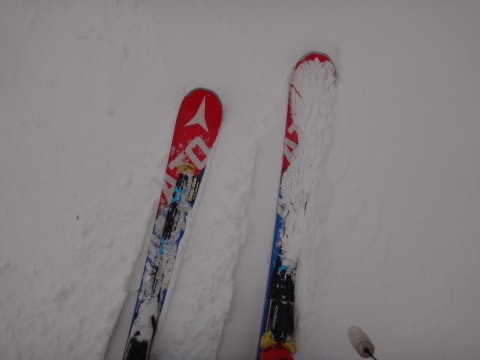

# 一日遅れたけど，1月4日の志賀高原レポート！…朝は晴れたけど，ガスってて，平日なのに人も多め…

📅 投稿日時: 2017-01-06 02:59:59

昨日の天気予想で．

　5日は終日冷え冷え雪が積もる！

と書いたように．

…本日の志賀高原．

そこそこの雪が降ったようですね…

[まうちゅうさんのBlog](http://blogs.yahoo.co.jp/mouse_tyu/64096911.html)や[Gokuraku SkierさんのBlog](http://red.ap.teacup.com/gokurakuskier/626.html)のレポートにあるように.

焼額で約20～30cmほど積もったようで…

これでかなりゲレンデ状況は改善してくれたかな～！

で．

南岸低気圧が危惧された8日．

さっそく，私の祈りが効いたようですっ！

こんな感じで，水色で塗った，8日の降水域．

概ね本州より南にとどまるので…

私の祈りのおかげで，

スキー場は，雨にならずに済みそうです！！

ふはははは！

そうです．

志賀高原の天気を決めてるのは，私だ！←違うから．あなたは昨日

「雪になるように」祈ってたから．今回は「雨にならずに済んだ」のだから．

…しかし．

逆に．9日の気温が高くなりそうで．

8日の深夜から9日の朝にかけて…微妙．

おそらく志賀高原は雪だろうけど．

標高が低いところは，降り始めは雨かも…

ってことで．

とりあえず，本題の，

1月4日のスキー場レポートに行くのだ．

えー．

まず．この日．

前日から結構積雪があったようで．

志賀高原への登り道．

かなり本格的な積雪路面．

道路の途中で息絶えている車，多数…

でも．

これは，ゲレンデは新雪が積もってるに違いない！

と期待して，朝イチの焼額第1ゴンドラへ向かいますが…

ありゃ．

今シーズンから，平日はプリンス東館宿泊客のみ

10分早めにゴンドラに乗れるという

「ミニファーストトラック」をやっているのね…

ってことで．

東館宿泊者に遅れること10分．

通常営業開始の8時半のゴンドラで，山頂へ出ると…

朝はうすく雲がかぶっているけど，

日が射す天気！

山頂の気温もマイナス7℃と，まーまーの冷えです．

そして．

ゲレンデは．

そう．シマシマっ！！

朝イチのミニファーストトラックで数人が

先行しているものの．

冷え冷えの新雪が圧雪された，

気持ちいいやわらか圧雪を楽しめるのだっ！！！

…と，超気持ちよくゴンドラを数本滑ると…

あら．

えええ！？？

今日は…

今日って，本来平日じゃなかったっけ？

なのに，なんでこんな混雑に…？？

意外と，私と同じく．

4日も正月休み…って人が多いんだろうなぁ…

まぁ．

ゲレンデは結構混んだけど．

ゴンドラ待ちはほとんどないので，許してやろう←だから，なんで上から目線？？

で．

朝は日が射していたのに．

10時頃には…

かなり激しく雪が降ってきましたよ…？

そして，ガスも出てきましたよ…？

時々かなりガスが濃くなって．

全く前が見えないレベルになってきたんですが…？？

…まぁ．

私は焼額なら，目をつぶっても滑れるので，前が見えなく

ても大丈夫っ！

＃ホントに目をつぶって滑ったら，ガケから落ちるか，

＃木にぶつかって死ぬからやらないけど

でも．

この日は午後になっても，気温は朝とほとんど変わらず，

かなりの冷え冷えデーで．

この冷え冷え気温で，

そこそこの勢いで雪が降ったので…

午後は，人が少な目だったオリンピックコース．

コース上に冷え冷え新雪が積もっていき．

下地のアイスバーンが隠れて，

いや，結構滑りいい！

GSコースは午後になっても人が多かったけど…

でも．

オリンピックコースは人もいなくて．

新雪が積もったプチパウ状態で．

結構楽しかったな！！

ってことで．

本日も気持ちよく，16:15の焼額営業終了まで

すべりつづけたのでした…

…が．

16:20に滑り終えて，焼額の駐車場へ着いたら．

車で速攻一の瀬へワーーーープ！

16:40の一の瀬営業終了まで，

一の瀬を滑りましたが…

ここも，そこそこの勢いで雪が降っていたので．

コース上，うっすら1-2cm新雪が乗っていて．

結構滑りやすかったな！

ということで．

4日の昼間，ちょっと雪が積もってくれたおかげで．

他のスキー場は雪不足に悩んでいるようですが．

志賀高原，少なくとも焼額に関しては．

ブッシュに悩まされることも無くなりました～！

5日も冷え冷え雪が降ったので．

これで完全に，コース上は

ブッシュの心配が無くなったんじゃないかな～．

…去年の雪不足から比べると，

かなり恵まれたコンディションになってきて．

とりあえず，一安心かな！
