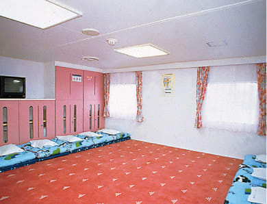
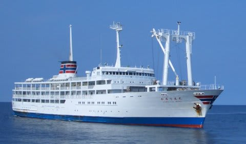

# 2007年8月　三宅島ドルフィンスイム＆ダイビング旅行記　プロローグ2

📅 投稿日時: 2013-09-06 00:53:27

🏷️ カテゴリ: [ダイビング日記](ce3a7a8d424d112fce83ee85c81a0e344.md)

ってことで．

三宅島旅行記，続くのですが．

…今日は文字ばっかりで面白くないなぁ…

------

ってことで．

船で空いてるのは，超お高い1等船室のみ．

(1等船室の写真：東海汽船HPより拝借)

…お高いチケットを買ってまで，行こうかどうしようか悩ましいわけですが．

まぁ，ドルフィンスイムに空きが無ければ，悩んでても始まらないよなぁ．

ドルフィンスイムは店によっては2～3週間前に申し込みを締め切るとかいう

噂も聞いたことがあるし…．

とりあえず，ドルフィンスイムの空きだけでも確認しておきましょう…

S「もしもし？次の週末の土日なんですが，ドルフィンスイムって

まだ予約できますか？」

店「できます．空いてますよ．」

…なんと．予想外に即答っ！

店「予約しますか？」

うぐぐ．どうしようかなぁ…

S「と…東海汽船が1等しか空いてなくて，悩んでるんですよ～…（汗）」

…ここで，予想外の展開がっ！

店「席なし券買えば良いじゃないですか」

席なし券っ？そんなものがあるのか!?

S「…席なし券って，デッキかどこかで一晩過ごすんですか？」

店「あの船，満席って言ってもだいたい1週間から3日くらい前に

　かなりキャンセルが出るんで，席なし券でもかなり高い確率で

　席をもらえますよ」

…なるほど．

直ちに東海汽船に電話．

S「8月24日初の三宅島行き予約したいんですが」

東「2等座席，2等和室，特2等は埋まっていますので，空いて

　　いるのは1等か特1等だけになります」

S「席なし券で，2等のキャンセル待ちお願いしたいんですが」

東「では，席なし券で予約を入れておきます．2等のキャンセルが出ましたら，

　　21日までにお電話します．21日に電話が無ければ，22日以降に電話ください．

　　出発3日前までのキャンセルはキャンセル待ちの人に連絡して，

　　それ以降は電話がかかってきた人に席を割り当てます」

…なるほど～．そういうルールなのね．

ひやひやして2日ほど待つと，往復共に2等の席が取れたと

連絡が．

なーーーーんだ．

発売開始日に売り切れてしまい，プラチナチケットといわれる

東海汽船も，要するに旅行社だかどこだかが買い占めて

チケットが無くなるわけで，逆に直前になるとだぶつき

始めるわけね…．

というわけで，出発1週間を切ってから予約したのに，

意外とあっさり往復の船，ドルフィンスイムともに予約

できてしまいました．

…意外と，直前に動くのが吉かも？

あとは出発するのみ！
