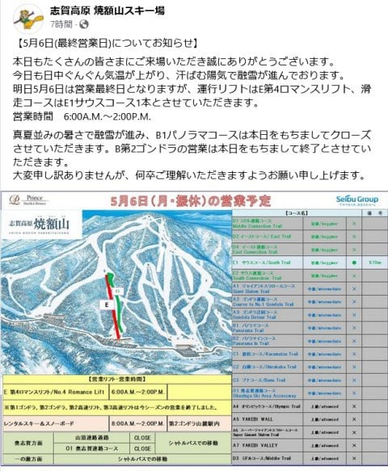
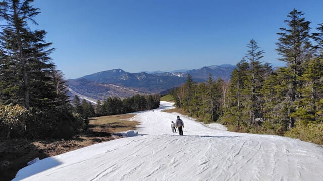
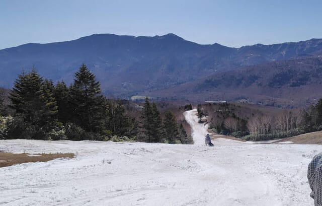
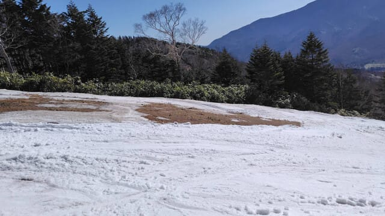
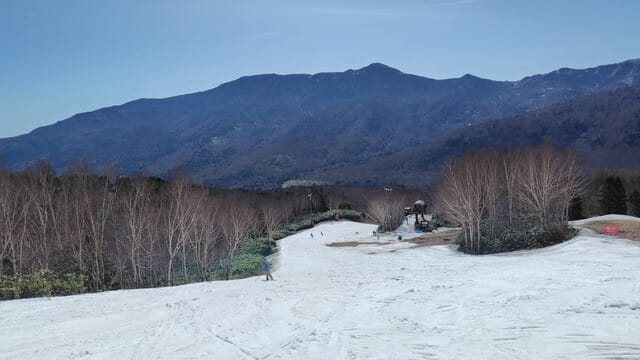
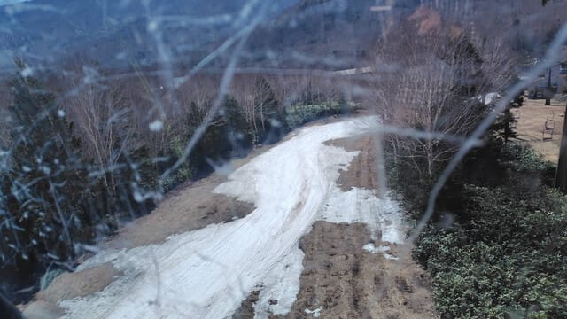

# 5月5日(日)の志賀高原スキー場は夏並みの高温で雪が解けたみたい…焼額は明日4ロマ営業！でも，強風でリフトが動くか？

📅 投稿日時: 2024-05-06 00:26:25

ということで．

本日，日付が変わった2時ごろに帰宅して，

4時過ぎに寝て…

今日はスキーに行かず，2日間で

1000㎞運転した疲れをいやすべく，

昼まで寝てました．

…しかし．

月山日帰りに行った時は，1日で1000㎞

運転して，さらに一日滑ってきたり

するので，2日間で1000㎞運転なら

月山日帰りより楽なはずなんです

けどね～←月山日帰りを比較対象にすることがおかしい

で．

本日，予告通り焼額山は第2ゴンドラの

営業が終わったようですが…

明日は4ロマの営業をやるみたいです…！！

（[焼額山スキー場Facebook](https://www.facebook.com/yakebitaiyama/posts/pfbid0ZRJ4FS3KXijmnf1vUTELQ2VxKS5Q2WDa35yvr99VJ6Uj6bPNmdnBrUq5g3cNFr9Ul)より）

ただ．

焼額山の特派員からの情報によると．

やはり今日も早朝は冷えて雪が

硬かったものの，昼間は真夏並みの

高温になり…

雪解けが一気に進んだようです（涙）

ゴンドラを降りてからも廊下だし…

パノラマコースの急斜面も，幅が

狭く雪が薄くなり，荒れ荒れで…

コース脇はかなり土が出てきてる

みたいです

サウスコースも…

かなり雪が解けましたね（泣）

右側の土が出ている部分の面積が

広くなってきているし．

何よりも，サウスコースの一番下の

緩斜面．

ここがヤバい感じ…

もう，ホントに何とかつながってるって

感じですね（泣）

確かにこりゃ明日で終わりだわ…

しかし，このGW，真夏並みの気温が

続きすぎました（激涙）

平年並みの普通の気温だったら，もっと

余裕でGWラストまで雪がもってた

だろうに…

ちなみに，GWが終わった5月7日以降でも

動くのは

横手第4と渋峠のみです（泣）

これもいつまで動くのか…

でもまぁ．

2月ごろの異常小雪を考えれば，今シーズン

GW最後まで滑れるだけでも良かったと

言ってよいのかも…

とりあえず．

明日は曇りで雨にはならなさそうですが，

強風の南風が吹きそうです…

リフトが動くかな？

でも．営業するという予定になっているので．

とりあえず，焼額山に今シーズンのお別れを

告げに行ってきます…！！
