# 2023年9月，今度は大菩薩嶺へ行ってみた，その4…大菩薩峠から石丸峠へ

📅 投稿日時: 2024-08-10 01:30:24

さぁ．夏休みだ！！

夏休み前の仕事が終わったぞ！！

夏休みがやってきました！！

（夏休み中にも会議があるけど…）

…でも．

夏休みって，夏休み中より夏休みに

なるまでのころが一番うれしくて．

夏休みになっちゃうと，

「あぁ…あっという間に1日終わっていく…

　すぐに夏休みが終わっちゃう！！」

と，悲しくなっていくので．

夏休みがずっと来ないで，夏休み前が

ずっと続けばいいのに…！

と思ってしまったけど．

…それなら，夏休みがずっと続いたほうが

いいんじゃない？？

という，素晴らしい解決方法に気づいたのですが．

それはすなわち失業ということでは…？

ということで．この夏休みは，また海に潜りに行く

予定ですが．

ダイビング日記は，また休みが終わって，

旅行から帰ってきたら書きます～！

だもんで今日はまた，大菩薩嶺のレポートです！

ーー

ってな感じで．

大菩薩峠までやってきましたが…

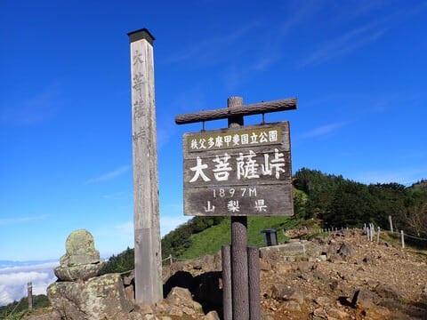

ここまで，駐車場を出てから2時間41分．

心拍数も132と低いし…

ホントにお気楽山歩きですね．

p/user_image/08/fa/d676e54feeb7bfaaf218c63d1ce967bb.jpg" border="0">

振り返ると，さっき絶景を見れた

親不知の頭がすぐ目の前にありますね…

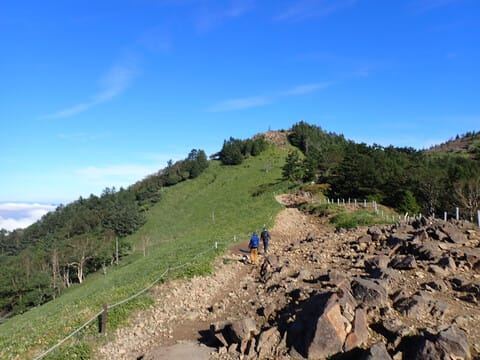

で．

大菩薩峠には，こんなお土産屋さんが

あって．

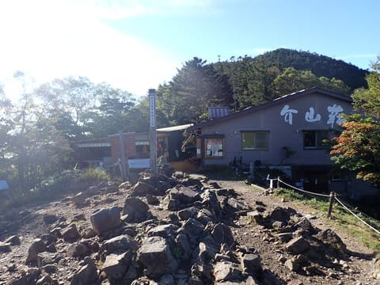

朝7時過ぎというのに，ちゃんと営業

しています…！

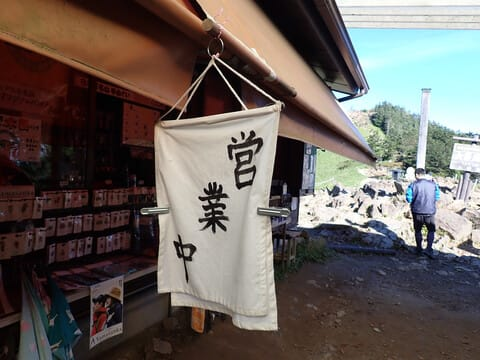

Tシャツやらバッジやらを売っていて．

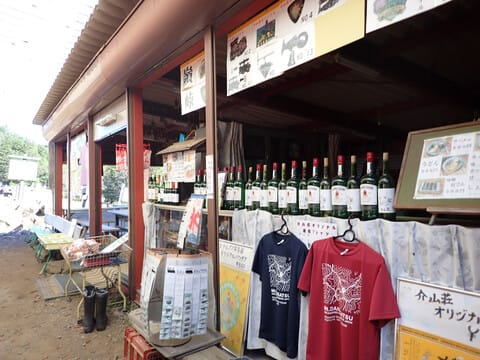

食事メニューもありますが…

え？？

この時代にまだテレホンカードを

売ってるの！？？？

すごい…

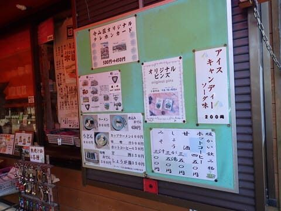

この案内に書いてあった，

ポンプアップした湧水を太陽光発電で

ゆっくり凍らせたというかき氷も，

ちょっと魅力…

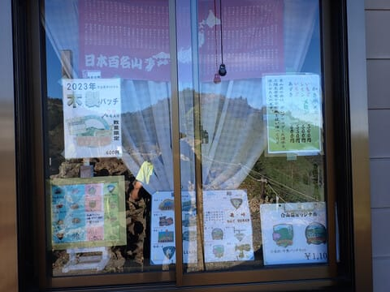

トイレもありました～！

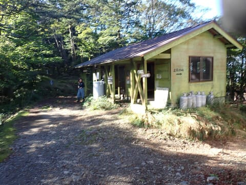

ってなことで．

大菩薩峠で10分ほど休憩して．

7時56分にスタート！

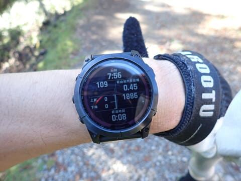

ここからは，いったん林の中に入り，

標高差80mほどを登り返します…

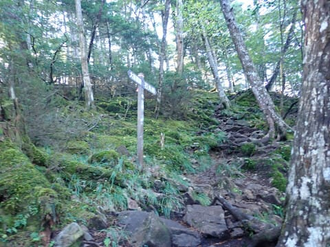

登り切ったら．

また視界が開けた場所に出て．

ここを下っていきます…！

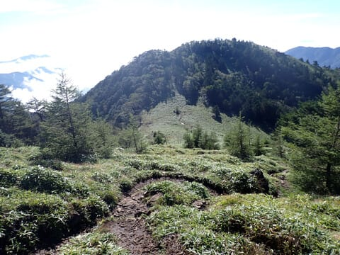

周りの山に囲まれて，遠くの見晴らしは

悪くなっていってるけど．

でも，晴天の中，いかにも山歩きと

いった，のんびり登山ルートですね…！

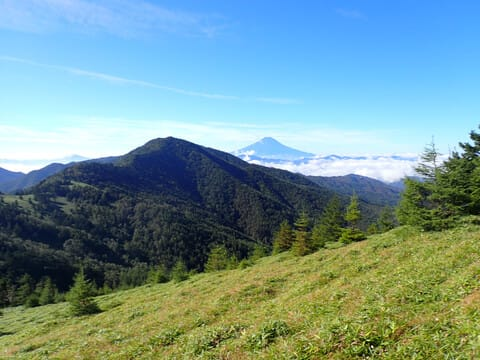

で．

この標識があるのが石丸峠．

本来ならこの標識を右に曲がって

駐車場に戻るのですが…

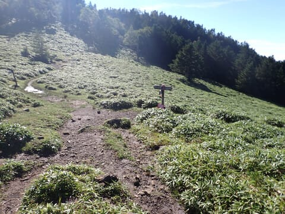

ここを400mほどまっすぐ行った，

天狗棚山というところが．

地形を見ると小高い頂点になってるので，

もしかすると見晴らしがいいかも…

と，ちょっとだけ寄り道してみました～！

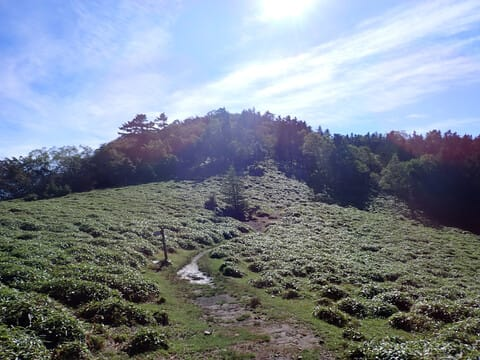

ってなことで．

石丸峠から5分ほど．

そこそこの斜面を標高差50mほど

登ってみましたが…

え？なに？

ここが天狗棚山！？？

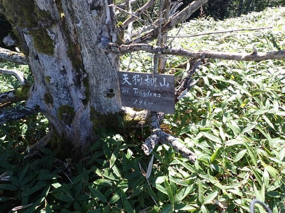

うーん．残念ながら，見晴らしが

良いところではなかったですね…

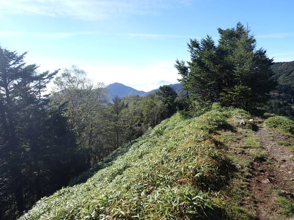

残念．期待外れだったか…！

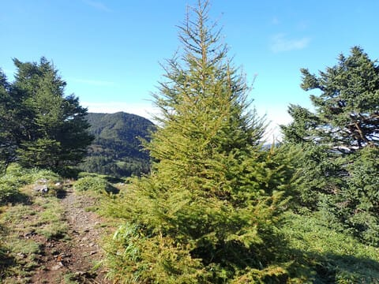

天狗棚山まで往復15分．

ちょっともったいなかったけど．

また石丸峠まで戻ってきて…

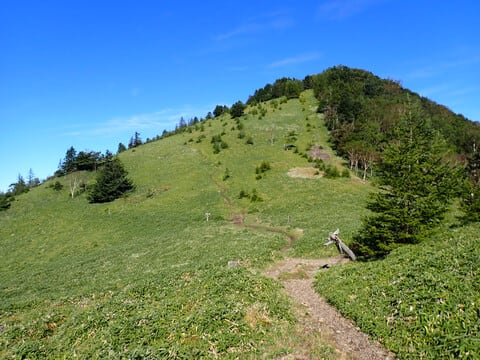

石丸峠の分岐を8時半に通過！

ここからは駐車場まで約7km．

ほぼひたすら下っていくばかりの，

下山ルートです…！

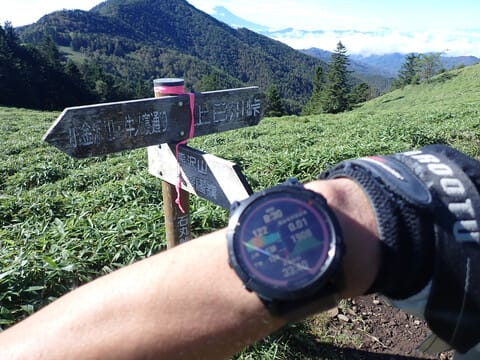

（[続く](e65955fe2e5fd85fafbbdcab9500849b4.md)）

## 💬 コメント一覧

### 💬 コメント by (ねも)
**タイトル**: Unknown
**投稿日**: 2024-08-10 09:02:11

Ｓさん　お久しぶり！

私にとって大菩薩峠は、晩秋から初冬の山という印象ですが、こちらも気持ち良さそう👍

無事に夏休みおめでとうございます(笑)

私は昨日から夏休みに突入、社会復帰は29日です😅　リタイアした私に声かけて小遣い稼ぎをさせてくれる人たちがいて、ありがたいです(^^;)

### 💬 コメント by (副院長)
**タイトル**: Unknown
**投稿日**: 2024-08-10 11:46:16

夏休みお楽しみください。私は平常営業です。夏休みは1月に取ります（夏休みとは言わないかも）でも毎週末乗鞍、ヒルクライムレースの練習（ただ上るだけになっています、タイム短縮は無理）しております。乗鞍剣が峰には上ったことありませんが、山歩き記事見てると一度は登ってみたい気になりました。S様、おからだ休めるように祈っています。

### 💬 コメント by (Skier_S)
**タイトル**: 回答遅れました…
**投稿日**: 2024-08-12 00:41:42

＞ねもさま

お久しぶりです～！

大菩薩嶺＆大菩薩峠って，秋から初冬の山なんですか…

夏でも気持ちよかったですよ！

しかし，29日社会復帰って，すごい長い夏休みですね．

私ももう少し長い夏休みが欲しいけど，長い夏休みがあったら，

旅行やダイビングですごいお金を使ってしまいそうで怖いかも…

＞副院長さま

夏休み，思いっきり楽しんできます～！

でも，そちらはお仕事休みなしですけ…

相変わらず自転車走ってらっしゃるのですね．ヒルクライムはきつそう…

