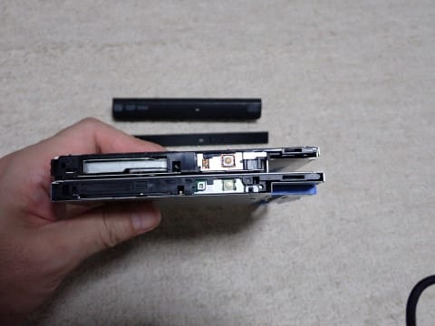
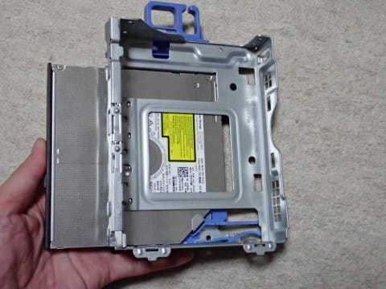
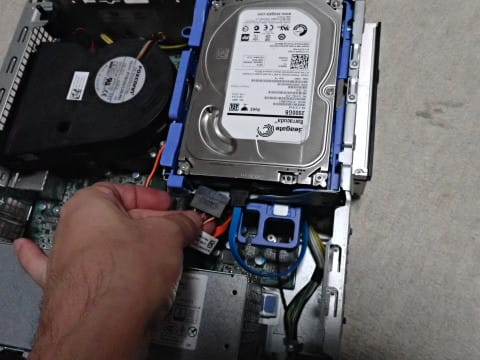

# メインのデスクトップPCを買い替えた…リース落ちの格安中古PCは使えるのか？？その2

📅 投稿日時: 2023-08-18 04:59:12

[前回](e3f0a0b72f0d7d93821bf0ea0b33d3429.md)，リース落ちの26000円程度の中古PC，

DELLのOptiplex 3060 SFFを

買ってみたわけですが…

注文して3日ほどで到着！

開けてみると…

本体とWifi&Bluetoothアダプタ，

電源ケーブルと．

こいつと別箱で，ワイヤレスキーボード＆

ワイヤレスマウスセットが届きました．

うーん．

ついてきたWifi&Bluetoothアダプタは，

802.11gの2.4Gのみ対応で，

802.11aシリーズの5Gには対応してない，

遅い奴だし．

すでに旧PC用の802.11ag対応の高速

Wifiアダプタを持ってるし，

デスクトップPCにBluetoothで何かつなごうと

思わないし…

ついてきたWifiアダプタは使わんな．

さらに，マウスも当然持ってるわけだし．

ASCII配列のHappy Hacking Keyboard（HHKB)

使いの私としては，日本語キーボードもいらない．

キーボード，マウス，Wifiアダプタはいらない

から，それだけ値引いてくれると嬉しいんだけどな…

でも，これだけついてきて26000円は安い！！

で．

このPCをそのまま使うかというと…

そのまま使うわけではないのだ．

前のPCから，いろんなパーツを移植して

から使うのだ！！

でも．

まずは初期不具合がないかどうか，

起動テストしてみて…

（なぜかHHKBが3つもある不思議な環境には突っ込まないこと）

初期不具合なく，無事起動することを

確認したら，早速分解開始！

私のこれまでのPCは，

ドライブとして…

（１）OS/アプリ用の128G 2.5インチSSD

（２）写真保存用の2TB HDD

（３）（2）のHDDバックアップ＆TV録画用の3TB HDD

が搭載されていたので．

新しいPCに，

（２）の2TB HDDと（３）の3TB

を移植します．

さらに旧PCからは，

TVチューナーカード

も移植します．

そのうえ，書き込み不可能なDVD-ROM

ドライブを，

不要ノートPCから取りはずした

書き込み可能なDVD-RWドライブに

置き換える

という作業をする必要があるのだ…！

まずは，256G SSDと1TB HDDの2ドライブが

搭載されている，この新PC．

こいつから，不要となるこの1TB HDDを

取り外します．

見たところ，完全に工具不要で取りはずせ

ますね…

余ったこの1TBのHDDは使わないので，

残念ながら不良在庫となります…

SATAケーブルと電源ケーブルの2本を

引っ張って外して…

ドライブをこっち方向に持ち上げてあげれば…

工具不要で，無茶苦茶簡単に外せます．

そしてHDDがはまっている枠は，

ねじ穴に引っかかる爪ではまってるだけ

なので，こいつも引っ張れば簡単に

外せます…

DELLのPC，生産性を高めるために

組み立てやすさを徹底的に突き詰めて

あるな…

そして．

次は，HDDの下にあるDVD-ROM

ドライブを外します．

まずは，フロントパネルを外しますが．

こいつも工具不要．

引っ張れば外せます．

いやー．

DELLのPC，ばらすのにドライバーが

いらないんだな…

そして，この部分をもって…

上に持ち上げてやれば，HDD搭載部分と

ともに，DVD搭載部分が持ち上がって…

こいつも簡単に外れます！

ってなことで．

DVD-ROMドライブを外した後，

フロント化粧パネルを外して．

古いノートPCから外したDVD-RWに

入れ替えようと思ったら…

え？？

古いDVD-RWドライブ．

12.7mm厚じゃないか！！

新しいPCの9.5mm厚とは，厚さが

違うんですが…（涙）

いや…古いノートパソコン．

今は死に絶えた，12.7mm厚のドライブを

使ってるとは思ってなかった…（泣）

（上が12.7mm厚，下が9.5mm厚）

うーん．

手持ちのDVD-RWへの交換はダメだったか…（泣）

まぁ，DVD-RWに書き込みたかったら，

外付けUSBドライブをつなぐしかないな…

と，DVDドライブは交換せずに

元通りに組みなおします（涙）

そして，古いPCから，2TBのHDDと

3TBのHDDを外します．

…一番右の，古いPCの128GのSSDは，

新PCでは搭載スペースが

ないので，残念ながら処分ですね…

搭載スペースがあれば，メモリの

スワップ用につないでもよかったんですが．

で．2TBのHDDを，新PCの元の1TB HDDが

はまっていた青い枠にはめなおします…

こいつは，HDDのねじ穴にこんなピンを

差し込むだけで固定できるので…

この青い枠を，本体シャーシにはめ込みます．

こうしてカチッとはめて…

ケーブルを挿せばHDD接続完了！

いや…ホントに工具不要で組み立て簡単だな…

そして．

3TBのHDDですが…

新PCは古いPCのようなタワー型の

大型筐体ではないので，新PCには

2台目のHDDを内蔵するスペースがありません…

だもんで．

別途購入した外付けの3.5インチHDDケース．

2000円でおつりがくる，USB3.0対応

外付けケースを買って．

こいつに入れて，外付けすることに

します…

こいつへのHDDの組み込みは，

HDDをはめてねじ止めするだけで

終了！

…でも．

ねじ止めするだけの手間でも，

工具不要のDELLのPCの組み立てに

なれると，めんどくさく感じる…

あとは，TVチューナーカードですね．

あんまりTVを見ない私ですが．

TVをPCで見たり録画したりしている

私には必須のデバイスです．

新PCの背面の，PCIスロットの蓋の

固定部分をちぎって外して…

カードを新PCのPCIスロットに

差し込みます．

これで，旧PCから移植すべきパーツは

移植し終えたかな？

あとはフロントパネルを戻して，

ケースパネルをはめれば完成！

（[続く](e912f6dcf6f45e50861a1bb31794fff3c.md)）

## 💬 コメント一覧

### 💬 コメント by (中古ワークステーションもいいですよ)
**タイトル**: Unknown
**投稿日**: 2023-08-20 16:14:15

ヤフオクなどで中古業者が大量に引き取ったXeonワークステーションを格安でさばいてます。早く処分したいのかオークションでなく格安定価です。ワークステーションは通常のPCより長持ちするのでとても助かっています。おすすめです。

### 💬 コメント by (Skier_S)
**タイトル**: ＞中古ワークステーションもいいですよさま
**投稿日**: 2023-08-20 23:06:39

Xeonマシンですか！

それは対象外でした…

筐体も大きくてディスクも何台も積めそうだし，いいかもしれませんね…

次は候補に入れてみます！

