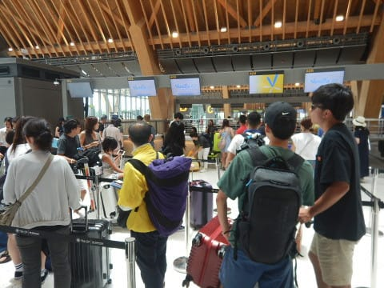

# 2018年8月，モアルボアルで小5の娘をダイバー化！ファイナル…無事帰国

📅 投稿日時: 2019-08-17 02:58:58

…この，モアルボアル旅行記．

連載開始は，たしか昨年の11月だった

気がするのですが…（遠い目）

となると．

かれこれ連載開始から，はや9か月．

3/4年の長きに渡って続いた連載が，

ついに．

ついに，最終回を迎えますっ！！←いや，途中7か月半

スキーシーズンで連載中断してただけだから

ってなわけで．

ようやっと，ラストのモアルボアル旅行記

です…

では，どうぞ～！

----

ということで．

飛行機出発は15時過ぎというのに．

マラソン大会による空港周辺道路の封鎖

という．

なんじゃそりゃ～っ！！！

ってな理由で，朝6時に空港に

送り込まれた我々．

レストランやカフェどころか，

ベンチすらまともにない，

チェックインカウンター前の

空港の一角の床確保して，

長期戦に備えたわけですが．

今は，朝の7時．

15時までまだまだあるな…（泣）

前回の帰りは朝8時セブ発の飛行機で

ホテルの出発が深夜で辛かったけど．

今回は夕方発の飛行機だから，

朝はホテルでのんびりしてから

出られるぞ！！！

と，喜んでいたのに．

なぜ，夕方便を選んだ時に限り，

こんな嫌がらせのような仕打ちに

あうのか…（涙）

いつもの朝便だったら，空港でこんなに

待つ必要もなく．

日本にも早くに帰れたのに…

なぜ，夕方便を選んだ今回に

限ってこんなことに…

ってなことを嘆きながら．

PCに入れておいた映画を見たりして，

空港の硬い床に座って過ごすこと，

6時間．

PCにいっぱい映画を入れておいて

良かった…

おかげで，娘もなんとか時間を

潰せたけど．

これが無かったらヤバかった…

で．

映画を3本見終わった午後1時ころ．

やっと．

ようやく．

チェックインカウンターが

開きました…！！

朝6時から午後1時まで．

何もすることなく，椅子に座ったり

寝転がったりできるわけでも無く．

ひたすら硬い床に座り続ける

この辛さから，

やっと解放です！

チェックイン後，このカウンターで

空港利用料を払います．

一人850ペソ．

空港利用料は，現金しか使えない

という説もありますが．

どうやら今では，VISAカードも

使えるようです．

（2019/8/23時点では，カード利用不可．

　フィリピンペソ，またはUS$の現金のみ）

ってなことで．

無事チェックインが終わったので．

セキュリティーチェックを受けて，

セキュリティーエリアに入りますが…

なんだよ～．

セキュリティーエリア内には，いっぱい

お店やら座るところがあるじゃないか～！！！

セキュリティーエリア外も

こんな感じにしてくれれば，

床に座って過ごさなくても

済んだのに…（泣）

ってなことで．

ようやくレストランに入れたので，

お預けを食っていたお昼ご飯を

食べますが．

うーーーむ．

セブ空港のレストラン．

異常に高いぞ！

フィリピン物価に慣れた

身にとっては．

こんな麺が1000円を超えるのは

信じられない！！！

で．

セキュリティーエリアに入って．

お昼ご飯を食べても．

まだ出発までは2時間ほど

待たなくてはなりません…（涙）

あぁ…果てしない待ち時間…

娘は今度はスマホで動画を見てますが．

なぜ，椅子じゃなくカバンに座る？？

ってことで．

果てしない待ち時間の後．

ようやっと搭乗時間に

なりました…

9時間の待ち時間．

うち6時間半は，椅子もない

床に座って過ごしたし．

よく頑張った…

あぁ．

これで日本に帰れる…

ってなことで，飛行機に搭乗し．

ようやっと，セブ空港を離陸！

さよなら，セブ島…

日本までのフライト時間は，

予定では5時間半．

夕方便を選んだので，

飛行機に乗っている間に，

太陽が沈んでいきます…

飛行機から見る夕日，

きれいだよな…

でも．

朝便を選んでいれば．

空港で待たずに済み．

日が沈む前に日本に着いてたのに…（涙）

そして．

さらにそれに追い打ちをかけるように．

なぜか飛行機が30分以上遅れ，

成田到着は夜9時過ぎ…（泣）

成田から家まで，これから

2時間半運転しなきゃならないのに…

さらに今日は，早朝2時に起きたと

いうのに．

帰宅は深夜0時を回るということか…（涙）

ということで．

眠い中，車を運転すること2時間半．

深夜1時に，無事帰宅できたのでした…

朝2時に起きてから，23時間の旅路．

明日から出勤なんだけど．

仕事になるのかな…

でも，

モアルボアル，楽しかったし．

ジンベエザメにも遭遇できたし．

娘もCカード取れたし．

みんな無事に帰ってこれたし．

最後の帰国がつらかったけど．

全体的には，良かったということに

しておこう…

（そしてこの翌日から，朝イチからフルパワーで

　深夜までしっかり働かさせられたのだった…）

おしまい．
