# 12月10日，日曜日帰り焼額の詳細レポート…シーズン中ずっとこんなだったらいいなぁ．．．

📅 投稿日時: 2017-12-12 01:39:07

やはり．

この週末も．

何人かの焼額のリフト係員の方に

「あれ？土曜はお見かけしなかったんですけど，

　お休みだったんですか？」

と言われ．

やっぱり，焼額のスタッフのみなさんは，焼額に

来るのが私の仕事だと思っているのね…

と思わずにいられなかった，Skier_Sです．

ええ．

違います．

休みだから焼額に来てるのであって．

焼額に来ないのが「休み」ではないのです…

ってところで．

ニュースなんかでやってますが．

これからすごく冷え冷えのようで．

ええ．

冷えますよ．

12，13日は日本海側はドサドサ降って．

13日夜から14日朝は，志賀高原でも

ドサドサ降るかも？？

…という．

期待できそうなニュースなのですが．

なのですが．

うむ？

な，なんだ，これは！？？

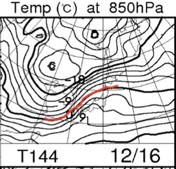

そして…

ええええ？？

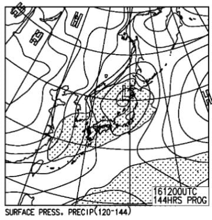

…

…みなさん．

16日の土曜日．

雨にならないよう，

全力で祈りましょう…

という，

ちょっと恐ろしいものを見てしまった後は．

本題．

日曜の焼額スキー場の詳細レポートです…

日曜日の朝．

営業開始前のゴンドラはそれほど列も

長くなく．

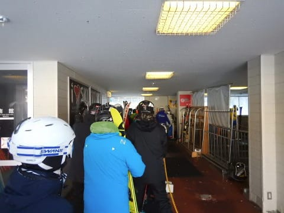

予想以上に人が少ない状態でスタートした，

この日の焼額でしたが．

山頂に出ると…

うむ．

気温はマイナス5℃ですか．

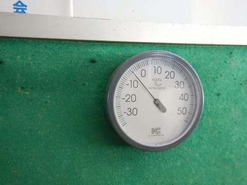

日曜：朝は晴れ！気温は-5℃程度か…

と予想した通り，ドンピシャの気温！

ふふふふふ．

見たか！私の天気予想の精度をっ！！

そして，

山頂の天気は…

ぴかぴかピーカンっ！！！

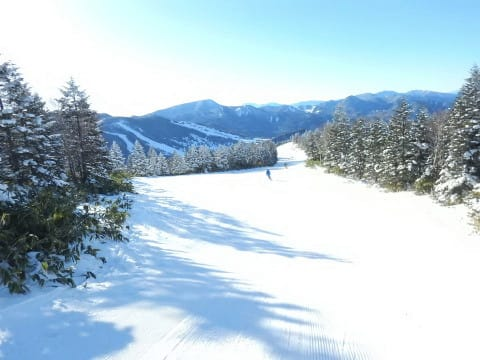

これも，見事予想通りっ！

素晴らしいぞ！わが天気予想の精度っ！←自画自賛

ふはははは．

気温が低めの快晴となれば．

ゲレンデは，最高級のシマシマが刻まれた

状態で私を出迎えてくれるのだ！

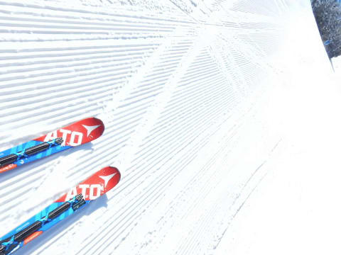

シマシマ，いただきま～すっ！！！

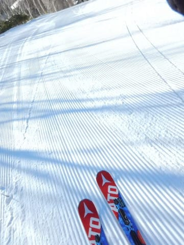

うひょーーー！！

昨晩からの積雪は無いけど．

そのぶん，柔らかすぎない締まり気味の圧雪で．

しっかりスピードが出るのに，エッジがガッツリ

食い込むという．

これ以上何を求めるのか？？？

という最高級品のシマシマバーンっ！！

もう，叫びながら滑っちゃいます．

トップシーズンでもこんないいバーンに，

こんないい天気で出くわすこと，

そうそうないよ！

この日の朝．

「うひょひょ～っ！！」

って叫び声をゲレンデで聞いた方がいたら．

…それは私の叫び声かもしれません（笑）

とりあえず，もうこんな天気の

こんなバーンです．

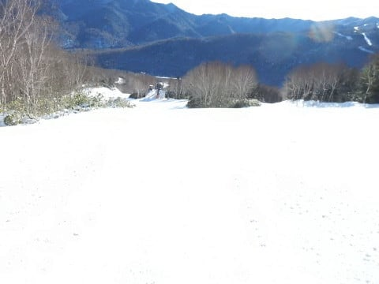

それも…他の人がほとんど滑ってません．

写真に，誰も写ってません．

貸し切りバーンです．

叫びながら滑ってしまうのも，分かろうというもの！！←いや，普通は叫びながら滑らないから…

第2高速沿い，唐松コースもコース全面

滑れるようになってるし．

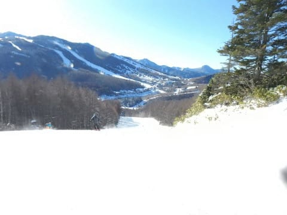

…それどころか，この週末から

白樺コースがオープン！

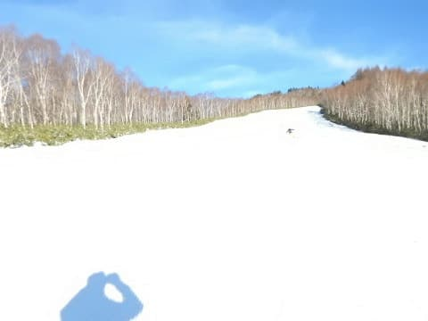

この白樺コースが，イイ！

白樺コースだけを滑れるリフトがないので．

ここを滑ろうと思うと，わざわざゴンドラと

リフトを乗り継がないといけないため．

滑る人が少なく…

もう，コースは誰もいない完全貸し切り状態！

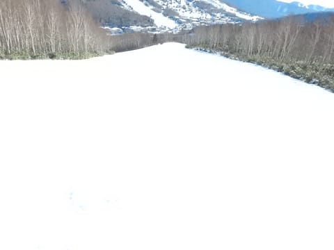

さらに，滑る人が少なく．

午前中かなり遅い時間までシマシマが残っていて…

もう，快感…（感動）

午前中は天気も良く．

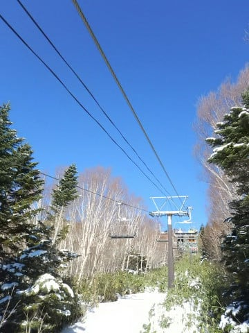

リフト待ちもないし，ゴンドラもほぼ

飛び乗り，待ってもせいぜい搬器3-4台で．

ゲレンデの人も少なく．

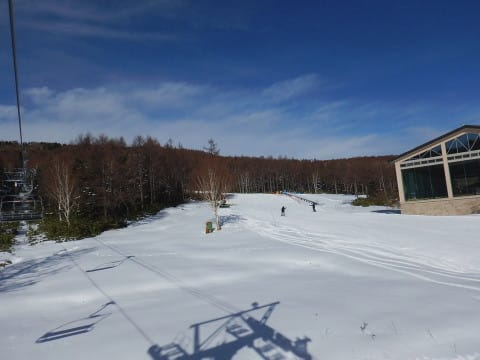

あぁ…こんなシアワセで良いのだろうか…

という時間が過ぎていきます…

でも．

昼ごろになると…

うむ．気温0度ですか…

ちょいと気温が上がってきたかな？

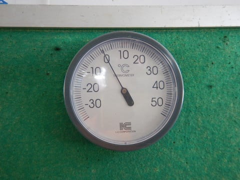

そのせいで，白樺コースの下の方．

ありゃ？？

ちょっと，土が出てきましたよ…（涙）．

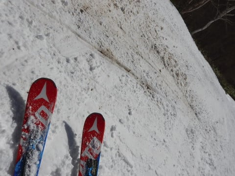

…とはいえ．

土はこの部分以外，全く出ておらず．

先週ちょっとヤバかった，パノラマの落ち込み部分．

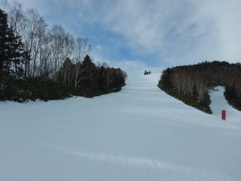

ここも含め，ブッシュの心配は全く無く

滑れましたね～！

そして，気温が上がった午後になると．

　昼に向かって気温は上がり，0度前後まで上がる．

　昼ごろから雲が増え始める．

という予想がぴったり当たり．

雲が増え始め，太陽がうっすら隠れ

はじめました…

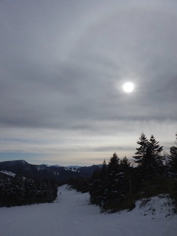

…うむ．

最近の私の志賀高原の天気予想．

芸術の域に入ってきたか…？？←さらに自画自賛

この，曇り空のおかげで．

強い日差しに雪が緩むことなく．

午後になっても，意外と雪はいいままで．

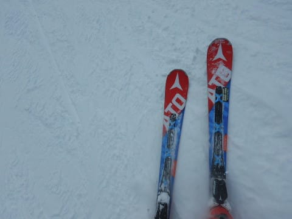

…そして．

ここはちょっと予想を外したところだけど．

ゲレンデに硬い下地が出てくるようなこともなく．

最後まで，かなり快適な，しっかりエッジが効く

いい雪をキープ！

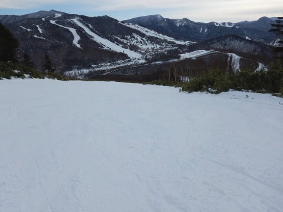

だのに，人が少なくてコースが全く

荒れてこないという…

あぁ…なんて恵まれてるんでしょう．

そして．

日曜午後は，いつも通りゲレンデがゴーストタウン化し．

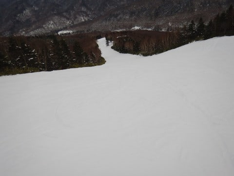

こんなガラガラで，経営大丈夫か？？

という，いつもの心配をしてしまうような

無人スキー場状態になったというのに．

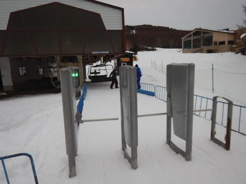

最後までいい雪質をキープして，

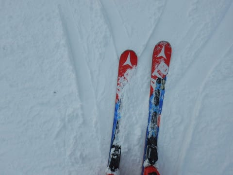

そして，全く荒れることのなかったゲレンデを．

日が落ちていく夕方まで，ひたすらひたすら

滑り続け．

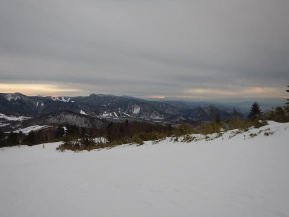

気持ちよく，リフトストップの16時まで

滑り倒したのでした…

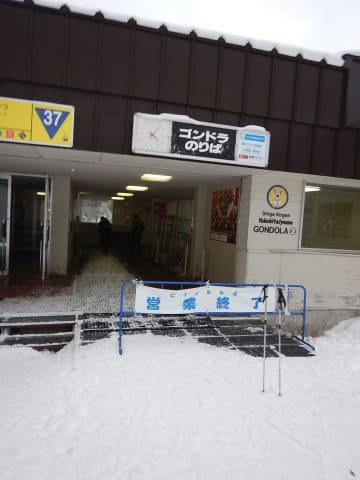

…いやーーー．

楽しかった．

この週末も，楽しかった．

しかし，ここ3週間，

週末は雪よし，天気よし，ガラガラという

3拍子揃った週末が続いてますね～！

…今週末は，残念ながら久しぶりに

太陽が拝めない週末になりそうです…

この週の半ばドサドサ積もるので．

これで週末が晴れてくれれば，文句なし

なんですけどね～．

というより．土曜は空から液体が降ってこないか，

心配をしないといけないのか…

## 💬 コメント一覧

### 💬 コメント by (Goku)
**タイトル**: 最高でした！
**投稿日**: 2017-12-12 06:30:54

午前中の集団爆走は楽しすぎでした！

何だか、今シーズンは濃いメンバーがやたら集合しますね。

長野は雪がチラチラしてきました～。

### 💬 コメント by (サトシ父)
**タイトル**: 子供の事情と仕事で
**投稿日**: 2017-12-12 07:56:10

今週末は上記の理由でお休みします。

日帰りかぁ、今度やってみようと考えてしまう実にあぶないブログです！

### 💬 コメント by (はなげ親分)
**タイトル**: 楽しかった～
**投稿日**: 2017-12-12 12:58:25

白樺コース、最高のコンディションが気持ち良く、危うく昇天しまうところでした!!

ゴンドラ乗車時に何度かお見かけしましたが、タイミングが悪かったのかお会いできませんでした。

今週末は甥っ子の結婚式のためお休みです。

### 💬 コメント by (はっち)
**タイトル**: 白樺コース行けばよかった
**投稿日**: 2017-12-12 22:59:17

白樺コースの方が安定した斜度なので、妻の練習にはそっちの方がよかったのですが、ブッシュを心配して白樺コースには入りませんでした。行けば良かったと後悔しています。

### 💬 コメント by (タカ)
**タイトル**: Σ(Дﾟ;/)/気温が
**投稿日**: 2017-12-13 01:24:02

日帰りお疲れ様です

シマシマバーンで何よりです。明日休みでかぐらでパウダーヒャッホーする予定でしたが、まさかの仕事飛び込みで断念です(泣)

さらに来週気温上がりますね(涙)冷え冷え踊り踊っときます

### 💬 コメント by (Skier_S)
**タイトル**: 今週末は…土曜の午後はそれほどひどい雨にならずに済みそうかな
**投稿日**: 2017-12-13 02:13:15

＞Gokuさま

日曜AMの集団滑走は，かなりヤバかったですね～！

珍しい顔ぶれで滑れて，楽しかったです～！

長野は，明日水曜は，日中から夜にかけて

結構降りそうな天気図です…

＞サトシ父さま

あら．

今週末は来れないのですね…

残念です．

志賀まで日帰りは全然いけますよ．

日帰りでナイターまでとかも問題なく

行けますよ！←普通の人は問題ありくりだから

＞はなげ親分さま

日曜は一度もご一緒できませんでしたね～．

KENKENさんとは一緒だったようですが…

白樺コースは，午前中は私は何度も昇天して

しまいました（笑）

いや，良すぎました…

今週末は滑れないのですね…

日帰りって手もありますよ（悪魔の誘い）

＞はっちさま

白樺コースは，ブナとの分岐点のあとは

ちょっとブッシュが出てたので…

午前11時過ぎごろからは，石ころを踏みたくない人は

行かない方がいい感じでした．

でも，朝イチは最高でしたよ！

＞タカさま

あらーーー！

明日休みなら，間違いなくパフパフヒャッホー

だったんですけど…

それは残念でしたね．

来週は今週ほどの激冷えではなさそうですが，

土曜以外は雨の心配はいらなさそうな

感じです…

