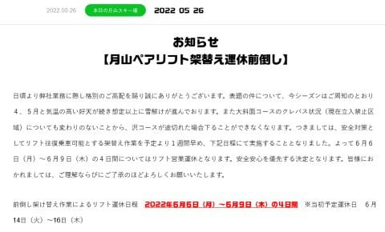

# 今週は雨が多めで雪解けが進みそう（涙）．月山スキー場のリフト架け替えも1週間前倒し．今週末まで渋峠がもつかな…？

📅 投稿日時: 2022-05-30 02:25:07

えー．

本日も，志賀高原の特派員から写真が

送られてきましたが…

今日，日曜の渋峠．

早朝のうちはそこそこ冷えて

良かったみたいです！！

…が．

早朝営業時に，リフト6-7分待ちと，

結構リフト待ちが長かったみたいで．

7:30頃のリフト待ち，かなり列が長いですね…

コースは，今朝にかけてかなり雪を入れて

補修したようで．

昨日に比べても，まともになってたようです…！

今週末，6月5日までの営業を目指して

頑張っている渋峠．

果たして，今週末の5日までゲレンデが

もつのかどうか？？

うーん．

31日（火），そして3日（金）と，

結構な雨が降りそうなので…

この雨次第ですかね．

壊滅的な雨だったら，週末はヤバそう…

そして．

月山ですが．

雪が多かった今シーズンも，

5月に想定以上の雪解けがあったようで…（涙）

リフトを高い位置から低い夏山用の位置に

掛け替えるのを，予定より1週間早めた

ようです．

（[月山観光開発ホームページ](https://gassankk.co.jp/)より）

「４、５月と気温の高い好天が続き想定以上に

　雪解けが進んでおります」

って…（涙）

本来，6月14~16日で架け替える予定だったのが，

1週間早い6月5日~9日になったって…

もう来週じゃないですか！

…大体6月10日前後に掛け替えてるので，

例年並みかそれ以下に雪が減っちゃったって

ことか…

大斜面がクレバスの影響でクローズになってる

今年は，沢コースが終わったらリフト滑れなくなる

から…

例年よりかなり早くにリフトを滑れなく

なるのかも（涙）

ただ，1か月予想を見ると．

赤矢印で示した6月3日までの週の

850hPa気温はちょっと上がりそうだけど，

せいぜい平年比+2度程度．

水色の矢印で示したそれ以降は大体

平年並みの気温になりそうで．

全体的に，4月や5月ごろの異常高温ほど

気温が上がらなさそうなのが，まだ

期待できるところかな…

（ホントは平年より冷えてほしいところだけど）

気象庁の[過去3か月気温](https://www.data.jma.go.jp/gmd/cpd/longfcst/tenkou/hensa_temp.html)のページを見ると．

この3月，4月は東日本の気温のピークが

平年比+3℃を大きく超えていて，

異常高温だったのがよく分かります…

これに比べれば，かなりマシ！！

ってなことで．

来週まで渋峠が滑れて，

6月末くらいまで月山のリフトが

滑れることを期待…！
