# 2018年8月，モアルボアルで小5の娘をダイバー化！その6…イワシポイントに突然，あいつが現れる！

📅 投稿日時: 2019-07-13 03:38:46

ということで．

モアルボアルでのダイビング初日，

午前2本目のダイビングで，

大好きなイワシポイントで．

雲のように頭上を覆う巨大群れを

満喫していたわけですが…

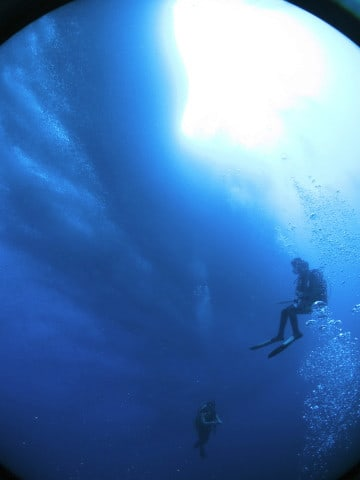

娘がCカード講習中の今回．

去年までのように，夫婦どちらかが

ボートに残って娘の面倒を見る必要が無く，

夫婦そろって潜れるのでいいなぁ…

去年だったら，

1本目のぺスカドールか，

2本目のイワシダイビングか．

どっちかを選ばないといけなかったけど．

今年は両方とも夫婦で潜れるので．

いや，いいなぁ…

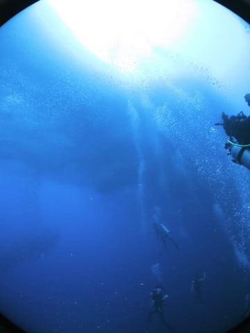

と．

夫婦そろって，巨大なイワシの群れを

眺めていた時．

それは起こったのだった…

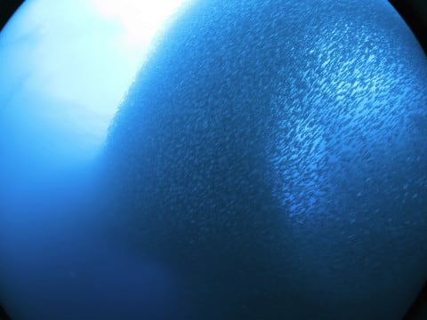

私一人，

群れの引きの写真を撮ろうと思い，

ちょっと群れから離れ気味のポジションで

いたら…

沖から近づく，何か巨大な影！？？

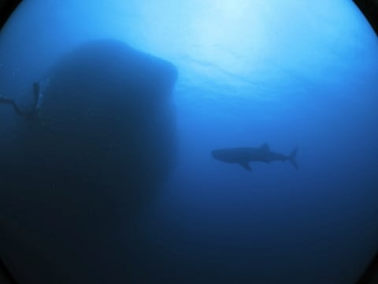

って…

なに！！

え？？あれ！

ジンベエっ！！！？

なぜ，こんなところに！？？

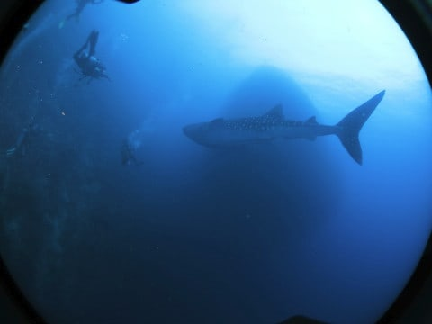

起こっている事態をよく理解できないまま，

とりあえず全力ダッシュ！

…かなりフレンドリーなジンベエなのか．

我々ダイバーのグループの中に突っ込んで

きてますよ！

そして，うちの嫁さんの真横をかすめ…

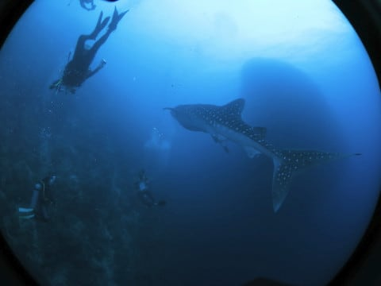

我々のチームに囲まれながら，

かなりゆっくり，優雅に泳いでいき…

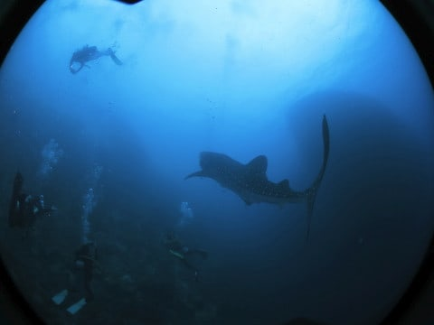

ゆっくり泳いでくれたので，

私も何とか，ここまで接近！

真後からの追いかけなのが悲しいけど…

ワイドレンズでここまで寄れたので，

かなりの接近！

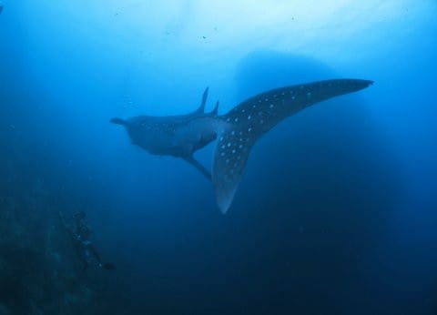

ダイバーにちょっかいを出した後，

ジンベエはイワシの群れに向きを変えて…

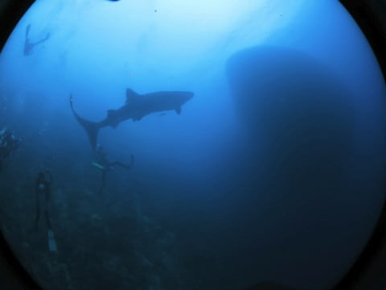

そして，群れの中に突っ込んでいき．

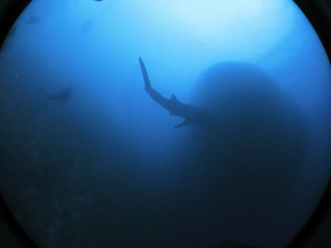

そのまま，イワシの群れの中に紛れ，

見えなくなってしまいました…

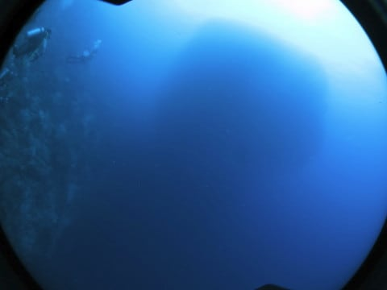

メンバー全員，ジンベエザメが消えていった

イワシの群れを眺め．

今起きた事態に，呆然としています…

いや．

まさか．

モアルボアルで，ジンベエザメに会えるとは！

スキューバダイビングでジンベエを見たくて．

モルジブダイブクルーズにも2回参加したけど．

1回は完全外し．

もう1回も，シュノーケリングだけでの遭遇で．

残念だけど，ダイビングジンベエには

縁が無かったか…

と思っていたのに．

まさか，こんなところで出会うとは

思わなかったよ…！！

…そして．

このジンベエを．

夫婦どちらかしか見れなかったら．

おそらく，家庭内の平和は保てなかった．

いや．

娘がCカード講習中の，夫婦そろって潜れる

タイミングで良かった…

いや．

モアルボアル初日の，まだ午前中だけど．

これで日本に帰っても悔いはない

というほどの満足感で，エグジット！！

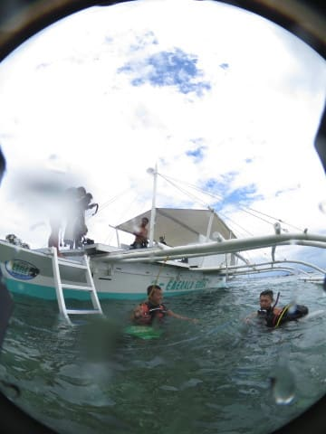

私「ここって…ジンベエ出るんですか？」

ガイド「いや…滅多に出ないです…」

ということで．

かなりレアな事態に遭遇してみたいです…

あぁ…

娘にも見せてあげたかったなぁ…

（2019/8追記…2019年では，月に1回ぐらい

　ジンベエに遭遇しているようです）

ちなみに．

ジンベエに真横まで接近された妻は．

私よりすごい写真を撮ってました…

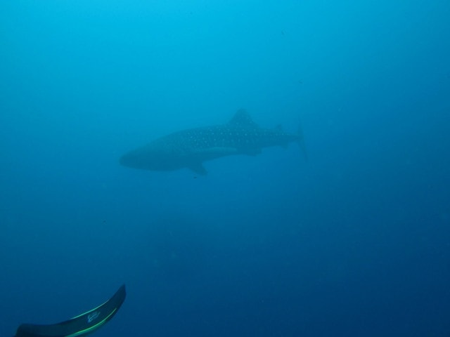

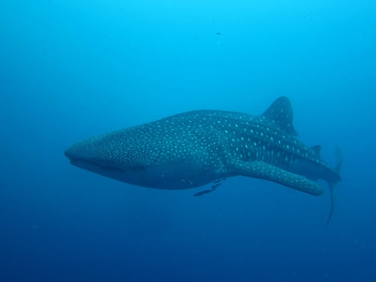

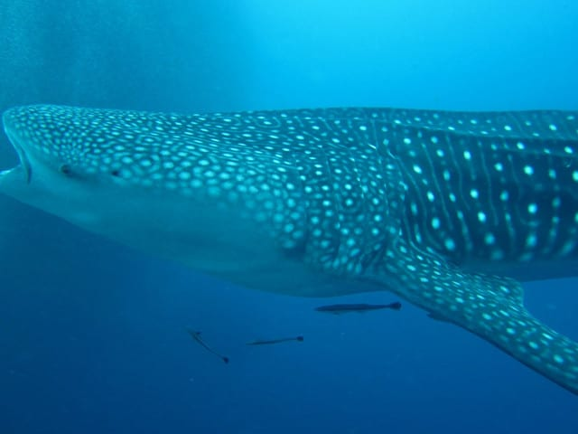

ジンベエダイビングじゃない，

普通のファンダイビングで

これほどの接近遭遇ができるとは…

私と妻で潜ってきた，これまでに．

ゲストよりガイドが大興奮の，マンボウ遭遇とか．

予想外のイルカとの出会いとか．

マンタポイント以外での，巨大マンタ遭遇とか．

割と大物運が強いわが夫婦．

いろいろ大物伝説を残してきましたが…

今回．

究極の大物伝説を残してしまったようです…

## 💬 コメント一覧

### 💬 コメント by (マルハバ)
**タイトル**: やっぱり・・
**投稿日**: 2019-07-13 10:03:33

コイツでしたか

まるで「モーゼの奇跡」のように

イワシの海が真っ二つに割れ、ヤツは現れた・・

みたいな感じでしょうか？（笑）

### 💬 コメント by (Skier_S)
**タイトル**: ＞マルハバさま
**投稿日**: 2019-07-13 21:15:25

そうです．

こいつでした…

イワシが割れて現れたのではなく，沖合からひそかに

近づいてきました（笑）．

気づいた時には結構近く，びっくりしました．

