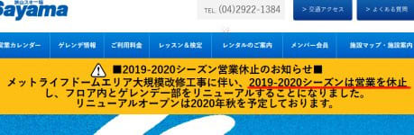
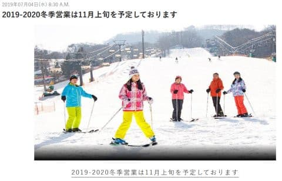
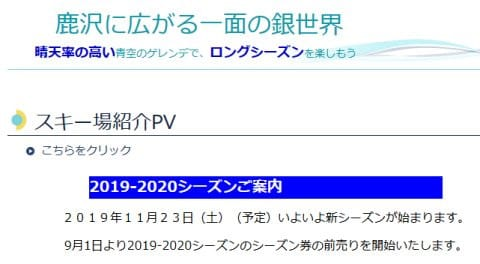

# 2020シーズンのスキー場オープン情報を探してたら…なぬ？狭山スキー場，このシーズンは営業しないの！？？？

📅 投稿日時: 2019-09-09 01:20:54

🏷️ カテゴリ: [スキー雑談](c1f9d2cb7478308da16419928ea3945e9.md)

えー．

もう，9月になったことだし．

そろそろ，2019/2020シーズンの

スキー場オープン情報が

出てくるころだな…

と，つらつらと情報を見ていて．

狭山スキー場のページを見たところ…

（[狭山スキー場HP](https://www.seibu-leisure.co.jp/ski_web/index.html)より）

うん？？

うむむむむ～！！！？？？

これは…っ！？？

なんと！！！

狭山スキー場，このシーズンは

営業しないの！？？？

…毎年，シーズンオープンを，

Yetiと争う狭山．

どうやら次のシーズンは改装のため，

オープンしないようです…っ！！

一応，2020年秋…

すなわち，2021シーズンには

ちゃんとリニューアルオープンしてくれる

ようですが．

このまま

「お客さんが減ったから，閉鎖です～」

とならないか，ちと心配…

さらに．

今シーズンオープン時．

いつもなら狭山に行く人が，

大量にYetiに流れ込んで．

ただでさえコース上の人口密度が

すごいことになる，オープン時期の

Yeti，さらにすごい混雑になるん

じゃないかと心配…

で．

そのYetiは，まだオープン時期が

公表されてませんが．

…っていうか．

いつも10月に入るころまで

オープン日を公開しないのですが．

今年は最大のライバルの狭山が

すでに脱落しているのため．

オープンを急がなくても，

11月頭にオープンすれば，

いつも通りの

「日本一早いオープン」

の称号を確実にGetできるので．

いつもよりオープンを遅らせるん

じゃないか…

と心配しちゃいます．

どうか，いつもと同じくらいには

オープンしてくれますように…

それ以外には，

軽井沢は，例年通り11月上旬オープン．

（[軽井沢プリンスホテルスキー場HP](https://www.princehotels.co.jp/ski/karuizawa/summer/)より）

鹿沢は，11月23日オープン

（[鹿沢スノーエリアHP](http://www.kazawa.com/snow/)より）

関東圏とは違いますが，

ウイングヒルズ白鳥が11月8日オープン

（[ウイングヒルズ白鳥リゾートHP](https://winghills.net/)より）

…ってくらいが，例年11月までに

オープンするスキー場で，

オープン日がすでに公表

されているところですね…

それ以外の，

丸沼，アサマ2000，かぐらや白馬山麓などは，

まだオープン日が公表されていないようです…

ちなみに，志賀高原は，

雪が積もれば

熊の湯が11月23日（土，祝）

からオープン予定となってますが．

例年なら，その1週間前の週の

オープンを狙って人工降雪を

始めるのに．

今年はすでに，それより

一週間遅めを狙う…

と宣言してしまってます（涙）

逆に言うと，11/16,17日の週末の

オープンはありません（泣）．

ってなことで．

ライバル狭山の脱落に

Yetiが気を抜かず，

例年通りの時期にオープン

するなら，あと1か月半

ほどに迫った，

2019/2020シーズン．

早くから冷えて，恵まれたシーズンインに

なることを祈るばかり…

## 💬 コメント一覧

### 💬 コメント by (スノー)
**タイトル**: Unknown
**投稿日**: 2019-09-09 07:25:51

6日に狭山スキー場の2019〜20シーズンの営業休止が発表されたので、自分の友人で狭山スキー場のリフトのメンテナンスをしている索道会社の社長に聞いてみました。

彼の話によると、現在狭山スキー場のゲレンデの両脇にある、シングルリフトを撤去し、昔千葉のザウスにあったような「ベルトコンベア（エスカレータータイプ）」、「スノーエスカレーター」を3月頃を目安に設置するようです。

### 💬 コメント by (スノー)
**タイトル**: Unknown
**投稿日**: 2019-09-09 07:37:14

「ベルトコンベア（エスカレータータイプ）」、「スノーエスカレーター」のお話をもう一つ。

栃木県の「ハンターマウンテン塩原」という人工降雪の東急のスキー場があって、11月30日にオープン予定なんですが。

そこも「ファミリーゲレンデ」のトリプルリフトをこの9月に友人の索道会社が撤去し、樫山が、急いで「ベルトコンベア（エスカレータータイプ）」、「スノーエスカレーター」を設置するようです。

### 💬 コメント by (カンタロス)
**タイトル**: Unknown
**投稿日**: 2019-09-09 08:55:04

情報集め、ありがとうございます！このブログを見たほうが早いため、自分で調べる労力を節約できます(笑)

イエティは10月12日より三連休なので、一昨年のように第二週の11日金曜日にオープンではないか？と予測していたのですが、なるほど、オープン遅らせてコストを節約しても

日本一早い！が達成できるなら遅らせますよね。(涙)

いずれにしても、オープン日にはいく予定ですが(笑)

### 💬 コメント by (Skier_S)
**タイトル**: 久々のスキーネタ
**投稿日**: 2019-09-10 01:38:28

>スノーさま

情報ありがとうございます～！

…狭山，リフトじゃなくベルトコンベアになるんですね．

ただでさえ混む狭山，輸送力が落ちないか心配です…

そして，ハンターマウンテンもリフト撤去ですか！？？？

いろんなスキー場のリフトが減っていきますね（涙）

しかし，ハンターマウンテンのファミリーゲレンデの

トリプルリフトって，そこそこ長かったと思うんですが，

そのトリプルリフトの長さのベルトコンベアをつけるんですか！？？？

うーん．

初心者には，やっぱりリフトは鬼門だから，

初心者や子供連れのために，ベルトコンベアを付けると

いいのは分かりますが．リフトが撤去されてしまうのは

残念です…

＞カンタロスさま

私の読みは，早ければ例年通りの第3金曜日，18日オープン，

遅ければ例年より1週間遅い，25日オープンじゃないか…

と思ってます．

おそらく，敵は11月3日にオープンの軽井沢のはずなので．

それに勝てればいいとなると，

いつもより1週間遅らせるのは大いにありそうかと

勝手に推測しています．

うーん．

18日オープンしてくれるといいんですけどね…

今年は10月22日が祝日ですし．

