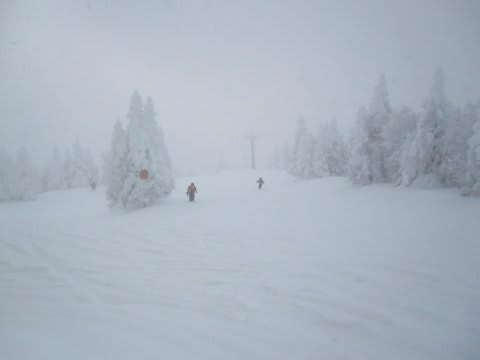
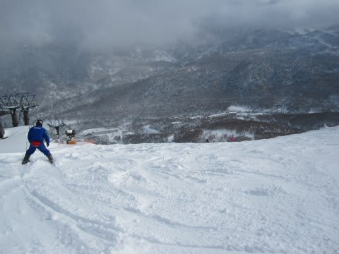
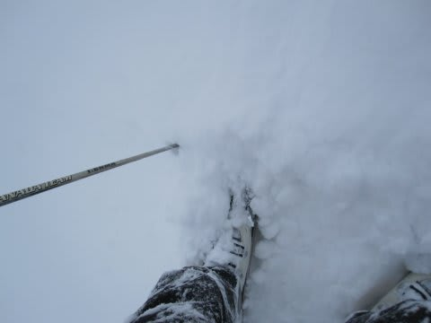
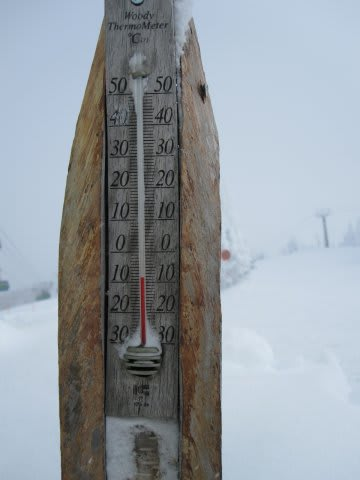
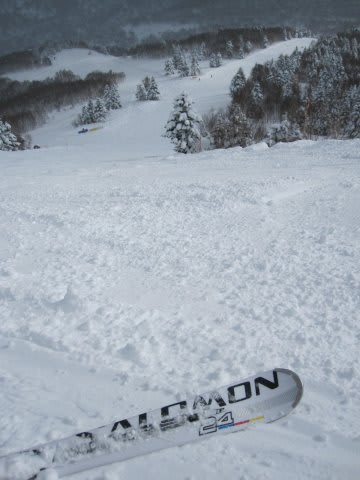
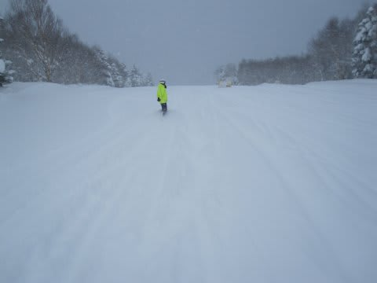

# 日曜の志賀は…

📅 投稿日時: 2011-01-24 00:30:12

🏷️ カテゴリ: [2011スキー滑走日記](ca488c98cfb9169941c3e73770dcefb56.md)

今日…っていっても，もう日付が変わってるから昨日かな…

の志賀高原は．

朝のうち雪，

昼は曇り～時々ガス，

午後は2時ごろからうす曇～晴れ，

という天気．

朝イチは，非圧雪コースで昨晩からの雪が10cm程度積もったような

状況．

雪はほとんど明け方に降ったらしく，圧雪コースでも5cm以上の積雪が

ありました．

気温は朝から寒くてマイナス14度．

昼間も，山頂はマイナス8度．

寒かったので，雪は軽かったですよ～！

ゲレンデも結構空いていて，一回だけ焼額第1ゴンドラ5分待ち

になったけど，後はゴンドラ待ちほとんど無し．

ガラガラ，雪よし，午後は天気もよし，という

恵まれた一日…

朝から晴れれば最高だったんだけど．

こんな週末が一年中続くと最高なんだけどなぁ

