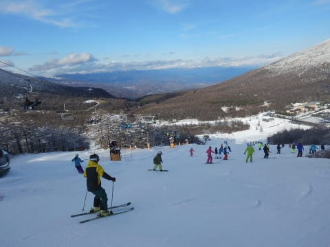
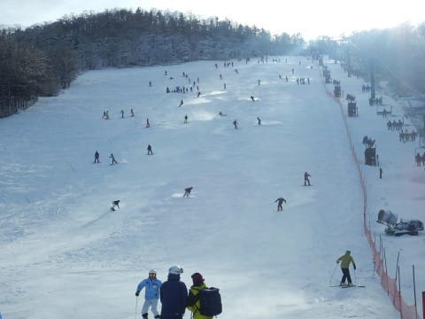

# 11月25日（土）のアサマ2000は…本来スキー場オープン予定の日，雪はたっぷり！でも，人口密度高し（涙）

📅 投稿日時: 2017-11-25 22:47:28

🏷️ カテゴリ: [2018スキー滑走日記](c11b88dc181f34079ab41db74a3587646.md)

というわけで．

昨日はかぐらを滑ってから嬬恋近辺に泊って，

今日はアサマ2000へ移動したわけですが…

いや．

土曜日のかぐら，混むだろうなぁ…

というのと．

アサマ2000の早割券を買ってあったので．

まぁ，今日はアサマへ行っておくか～，

って感じで．

2か所のスキー場をはしごしたわけですが．

今日は自宅へ帰ってきています．

…そして．

また明日は熊の湯に日帰りという…

自分でも「いったい何をやっているんだ」

ツッコミどころ満載の移動ですね←なぜ自分で分かっていながら，あえてそれをやる？？

いやーー．

ホントは明日はスキーに行かずに休むつもりが．

熊の湯があまりにも良さそうだったので．

明日は熊の湯へ行きたいな～，と…←アホだ…まぁ，みんなもうよく知ってるけど

ってことで．

本日のアサマ2000ですが．

朝の道路は，当然積雪路で…

そして．

ゲレンデに出ると…

をを！

雪はたっぷりっ！！！

…ただ．

天気は曇りなのね…

晴れるかな，と思っていたのに…

で．

11月中の間は，

リフト営業8:30～15:00と，15時で終わってしまいますが．

その代り，一日券が3000円とちょっと値下げです．

んで．

8:30のリフト営業開始で，

ゲレンデに出ると…

うほう！！！

うひゃーーー！！

雪はしっかり締まった固めの圧雪．

スピードが出るよ！

すごい傾けるよ！

で，朝のうちはリフト待ちも無く，

快適！！

…だったんだけど．

開始から1時間半，10時ごろには…

あう．

なんだか，かなりのリフト待ちが…（涙）

そして，ゲレンデの人口密度がかなり

高くなってきたのですが…（泣）

まぁ，まだこの程度なら，雪のいいうちなら

ぎりぎりトップスピードで降りれなくもないけど…

11時近くになると．

表面の柔らかい雪が削れて行き，

下地の固い雪が現れ始め…

そして，この人口密度になると．

もう，トップスピードは厳しい感じか…（残念）．

で．

いつもなら朝イチレーサーがいなくなると，

結構空いてくるアサマ2000ですが．

今日は昼近くに一瞬待ちがほぼ0になった以外は．

午後になっても，意外とリフト待ちがあり…

うーむ．

しまった．

今日はかぐらも鹿沢も志賀もオープンするから，

人が分散してアサマはそれほど混まないはず！！

…という予想だったのだが．

予想を外したようだ…（涙）．

ってことで．

午後のリフト待ちは2-3分程度と，

それほど大したことないけど．

ゲレンデ人口密度が予想よりかなり

高かった本日．

午後になってもこんな感じで…

うーむ．

好きなラインでターンするのは絶対不可能な

感じ…

惜しいっ！！

そして．

昼を過ぎると，アサマ2000の定番．

小回りレーン様がそのお姿を現し始めます…

この小回りレーン．

エッジをしっかり研いでおかないと，

ちょっとズルッと行っちゃうツルツルバーンで．

この硬い斜面を滑ると，

「あぁ…アサマに来たな」

という感じがします…

ただ．

今日の雪は，天然雪が混ざっていて，

100%人工雪じゃなかったから，いつもの

完璧ハイパーツルツル斜めアイススケートリンク状態

殺人青氷に比べれば，まだちょっとマシだったかな…

午後になると，コース脇に，

異常にピッチが短いラインコブもできてました…

ってことで．

リフト営業終了の3時ごろには，ゲレンデも

日が陰り暗くなってきますが…

でも．

大変残念なことに．

営業終了まで人口密度は高かった…（涙）．

ってことで．

昨日のかぐらがガラガラだったので．

「今日のアサマも混まないはず！！」

という，根拠のない読みは外れ．

人口密度が高かった本日．

…まぁ，リフトが例年のこの時期のように，

10分待ちとかにならなかったのが救いか…

でも．

気温は終日マイナスをキープして寒かったし．

11月と考えれば．

…そう．

今シーズンは恵まれているので，基準がずれてるけど．

11月とすれば．

かなり恵まれたコンディションだったかな！

ってことで．

明日は熊の湯です～！

## 💬 コメント一覧

### 💬 コメント by (いか)
**タイトル**: Unknown
**投稿日**: 2017-11-26 20:09:24

アサマは、有名所のゲレンデがオープンして空いているかな？と思いましたがそうではなかったみたいですね。

固そうで、私の板ではオフシーズンにチューンに出しそこねたのでターン不能です、、、笑

私は土、日ともにホームの八方に戻ってまいりました。土曜日は新雪1m未圧雪のうさぎ正面に先頭で飛び込み、見事ラッセルでした。午前中いっぱいサブファットでばしばしやっておりましたよ。

日曜日は、朝イチ快晴でピッカピカの圧雪で久しぶりに思い切り倒し込んでの大回りができました（＾＾）スカイラインも開いたので、SXで新雪もがしがし、、、　

熊の湯も晴れて良かったのではないでしょうか？

### 💬 コメント by (Skier_S)
**タイトル**: いかさま
**投稿日**: 2017-11-27 01:23:15

いや…

私もいろんなゲレンデがオープンしたら，

アサマは混まないだろうと思いましたが…

意外と混みました（涙）．

土曜日の八方，良かったんですね…

八方に行ってみたかった…

でも，今日の熊の湯も良かったですよ！

快楽のチョー傾きターンがガシガシ楽しめました．

うーむ．

来週までこのコンディションがもってほしいところ…

