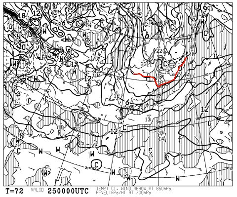
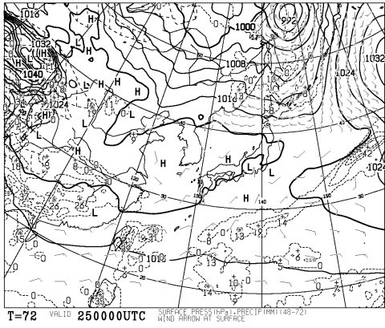
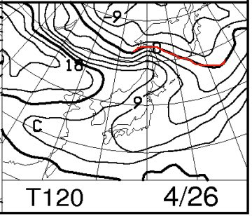
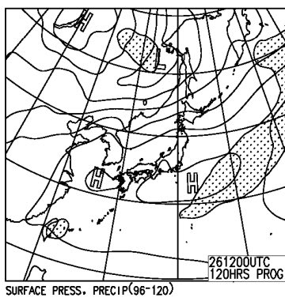

# GW直前，この週末の志賀高原の天気は…まぁまぁ良さそうだけど…暖かそうだなぁ．

📅 投稿日時: 2015-04-23 01:19:41

🏷️ カテゴリ: [スキー天気予想](c6554f5c3c106093b511a8daae23757e8.md)

なんだか．

[この情報](http://www.princehotels.co.jp/chain/files/top_release_150417_01.pdf)によると．

来年の夏から，かぐらスキー場のみつまたエリアに．

スノーマットを敷き詰めて．

サマー営業をやるらしいんですが．

…サマー営業より，春スキーやシーズンインのとき．

みつまたロープウェーからゴンドラまで，バス移動を

しなくても済むようになるってことが，私にとって

うれしい気がする今日この頃．

皆様いかがお過ごしでしょうか．

…ということで．

そろそろGWも近づいてきましたが．

水曜夜定番，今週末の志賀高原の天気を，予想してみましょうか…

ふむ．

ふむ．

（天気図読み込み中）

…はい．

そうですか．

…2日間とも，晴れです．

そして，平年並みの気温です．

以上．

…としてもいいくらい，面白くもなんともない天気図で．

土曜の850hpa図はこんな感じ．

0℃線は東北まで上がり，志賀高原はプラス6℃線が近づいてます…

そして，土曜の地上天気図はこんな感じなので．

まぁ，薄雲がかかるかもしれないけど．

基本的には高気圧の勢力下なので，晴れですね．

んで．

日曜の850hpa図は…

うむ．

0℃線は北海道よりはるか北…

志賀高原は9℃線が近づきつつあります．

…こりゃ，土曜より気温が上がりそう．

日曜の地上天気図は，こんな感じなので…

まぁ，日曜も晴れですね．

ってことで．

2日間とも晴れそうで．

あまり難しい予想は要らないんですが．

とりあえず，このBlogの天気予想は，

天気だけじゃなく，雪質予想もするところがミソなので．

土曜：朝から終日晴れ！時折薄雲がかかるかも…

　　気温は朝から高め．でも，早朝スタート時は放射冷却で

　　表面は固い雪になっているかな．

　　でも，早いうちから雪は緩みはじめ，通常営業開始時には

　　かなり緩んだ雪に…

　　昼間に向かい気温は上がり，ウェアのジャケットを着てると

　　暑く感じるほどかな．

　　昼近くには板が潜る感じの，柔らかい春雪になり，午後には

　　荒れたゲレンデになりそう…

　　でも，人が少なそうだから，そんなにひどい荒れ荒れに

　　ならないかな～．

日曜：この日も朝から終日晴れ！

　　この日も気温は朝からプラス気温で，早朝スタート時に

　　表面が固くなっていたとしても，すぐ緩んでいく感じかな…

　　この日は日差しが強く，昼の気温は+10℃を超え，

　　暑さを感じるザ・春スキーになるでしょう．

　　当然，昼前にザブザブ雪になり，

　　あっという間にゲレンデはボコボコになるでしょう…

　　人が少ないけど，逆に誰も滑ってないところは，

　　かなり汚れた雪になっちゃうかも．

って感じかな～．

あ，そうそう．

雪が降ったりしなければ，

志賀～草津ルートが今週金曜日にオープンですので．

今週末から，草津経由で志賀にアクセスできるようになりますね～．

志賀高原は4月に入ってから路面に積雪がなく．

また，路面が凍るほど気温も下がらず．

夏タイヤでも突っ切れるような状況が続いてますが．

うーん．今週末も，冷えたり積雪はなさそうな

感じだな～（涙）．

[おととし4月の奇跡](d20130427.md)みたいに．

もう一回，冷えてくれないかな～．

＃そういや，この年は5月に入っても[こんな感じ](d20130502.md)だったんですよね～
