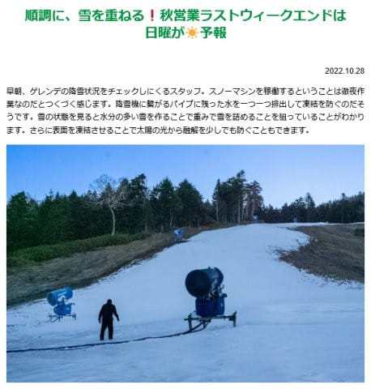

# 明日もイエティへ滑りに行きます～！天気はすっきり晴れの予定！

📅 投稿日時: 2022-10-29 00:55:48

やはり，昨日の記事は，

予想通り読者を完全に振り落としてしまった

ようですね…

アクセス数に如実にその事実が現れました(笑)．

ってなわけで．

難解な論文の解説記事ではなく，

スキーネタをまた入れておこうと

思うわけですが．

昨晩もそこそこ冷えたみたいで，また

横手山は人工降雪機が動かせたみたいです～！！

([横手山ホームページ](https://yokoteyama2307.com/news/18584/)より）

いや…

アイスクラッシュじゃない人工降雪で，

10月にここまでゲレンデに雪がつけられる

とは…

さすが標高が高い横手山！！

あとは，これが海和ゲレンデという

日当たりバツグンの南向き斜面じゃなく，

北向きの渋峠ならもう少し効率よく

積雪させられそうな気がするんですが…

渋峠まで水を上げるのは，やっぱり

無理だろうなぁ…

さて．この人工降雪．

1日夜から2日にかけての雨に耐えるのか？

とりあえず，この雨に耐えれば…

また4日からしばらく冷え込むので．

上手くいけば11月上旬に，ホントに

オープンできるかも？？

さすが11月3日のオープンの可能性は

無理だろうけど，横手スタッフの

すばらしい気合にエールを送りたい！

ってなことで．

横手山や軽井沢が一生懸命オープン準備を

していますが．

イエティは無事オープンしてくれた今．

私としては，

何があっても毎週末滑りに行かなくてはならない

という義務を負うので．←そこ，義務じゃないから

また，明日イエティに滑りに行きます～！

明日も天気は良さそう．

気温は，先週よりは3℃くらい低そうだけど．

日が射すと暖かく感じるかな．

イエティはさすがに近いので，出発はあと

5時間後．

これから寝ます…

今日は4時間は寝られそうだな．

おやすみなさい…

## 💬 コメント一覧

### 💬 コメント by (副院長)
**タイトル**: Unknown
**投稿日**: 2022-10-29 08:25:18

VAAMしっかり読ませてもらいました。結局、2万メートルクラブの方々は、VAAMを摂取して昼飯も取らずひたすらぐるぐるして、リフトストップまで頑張りましょうという内容でしたね。次回最終回ですか、落ちを期待しています。（関西人なので）

### 💬 コメント by (Skier_S)
**タイトル**: ＞副院長さま
**投稿日**: 2022-10-30 01:28:54

さすが関西人，オチですか…(笑)

ハードルが高い…

とりあえず，今シーズンはスキーの時もVAAM飲んでみようかな？と思ってます…

