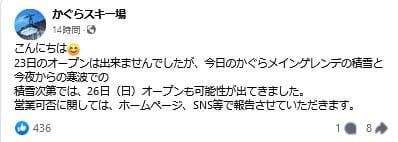
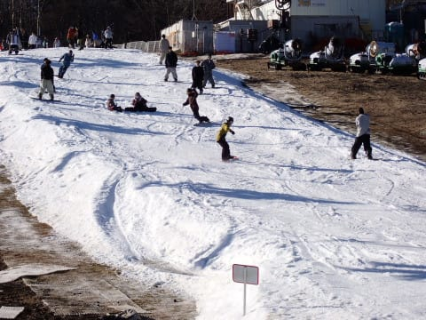

# 2023/11/23(祝)のイエティ詳細レポート…そしてかぐらは26日にオープンできるのか？

📅 投稿日時: 2023-11-25 04:40:10

えー．

本日24日の金曜から雪が降ると予告して

いましたが…

志賀高原は，昼間は降らなかったみたい

ですね（涙）

…でも．

深夜…というか，土曜の早朝4時現在，

志賀高原では降ってます！

積もってきてます！

-5.4℃と冷え冷えで，道路もそこそこ

積雪してるっぽいです…！

（[北信建設事務所道路気象情報カメラ](http://hokushin.pref-nagano-roadcamera.jp/)より）

そして，明日25日も降り続けます！

午後は降りが弱くなるかもだけど，

午前中まで積もり続けてくれます！！

果たして，どれだけ積もってくれるのか…

この雪で，かぐらは26日からオープン

できるかも？

と言ってますね…

（[かぐらスキー場Facebook](https://www.facebook.com/snowkagura/posts/pfbid05CaczNCMH3Nv8b6d7DGzkJJ1Uz1XZtKCJvvJy34PRYuFkZugFVWDUmAWkT6usvmtl)より）

ただ．

そのほかの，23日から25日オープン予定の

スキー場は，鹿沢，丸沼，湯の丸ともに，

まだオープン日未定となって

ます…（ちょい涙）

白馬方面，47や五竜も今のところオープンまで

あと一降り必要なようで，オープン予定は

まだアナウンスされてないです…

果たして．

この24-25日の雪が救いになるのか？？

…ちなみに．

来週の11/29，30，12/1日の水～金曜にかけても

冷えそうです！！

これなら，12/2の焼額山スキー場のオープンは

安泰な感じですね…！

ってなことで．

シーズンインはちょっと遅れ気味ながらも，

予定通り12月第1週に焼額山がオープン

できそうな天気で安心している今日この頃．

皆様いかがお過ごしでしょうか

（以上，無茶苦茶長い季節の挨拶）

という時候のあいさつの後は，本題へ．

23日の祭日のイエティの詳細レポートです…！

…いまさらイエティの情報が欲しい人がどれだけ

いるのか気になりますが…（独り言）

まず．

あさイチは営業開始の9時前にゲートが開いて，

ゲレンデ前でオープンまで待つ形に

なりましたが…

予定通り，朝9時ぴったりにゲレンデオープン！！

あさイチのシマシマに飛び込みます！！

うはーーー！

シマシマっ！！

雪はいい感じに硫安で締まっていて，

板がかなり走るうえに幅も広がっていて…

この1本目は，今シーズンのイエティで

最も気持ちいい1本でした！！

そして．

普通の土日と違って，平日の合間の

祭日は人も少なく．

ゲレンデはしばらくガラガラで，

気持ちいいクリアラップが取れる

状態が続き…

いや．

硫安が効いていてバーンも堅いので

雪も全く荒れず，朝のうちはかなり

気持ちよかったよ！！

ちなみに，コースが広がったのもあり．

そろそろいくつかアイテムがコース上に

設置されるようになっていて…

このパイプのほか，合わせて三つほど，

コース上に分散されて設置されてました．

午前中はリフト待ちも少ないし．

午前中はピークでも待ってこれくらい．

最大5分くらいですね…

お昼休みタイムには，さらに人が減って，

これは平日並みじゃないか…？

というガラガラ具合．

そのおかげで，午前中はコース上の

渋滞もほとんどなく．

タイミングによってはかなりのクリア

ラップが取れることもあり…

午前中は，かなり気持ちよくすべれ

ました…！

ただ．

午後に入ると，コース上の人が増えてきて…

午後2時ごろには…

うぎゃーーー！

リフト10分待ち…（涙）

このあと，午後4時のコース整備タイムまでは

大体リフト10分待ちが続きました．

…これでも今シーズンは，ペアリフトが

動かないのね（涙）

そして，日差しが強くなってきたのもあり．

午後になると雪も緩み始め…

ところどころ，ちょっと板の走りが

悪くなるところもあったけど．

基本的にコース前面に渡って硫安が

結構効かせてあったので，

そこまでひどい荒れにならなかったかな…

人口密度も高いけど，コース幅が広がった分

まだ回避もしやすかったし．

ペアリフトが動かなかったため，

コース上はリフト1本で送り込まれる

人数だけなので，そこまでひどい混雑に

ならず．

先週に比べればかなりマシかな…

夕方になると，コース上に1か所，ちょっと

雪が茶色いところができたけど…

ここ以外は雪が薄くなったり土が出てきたり

するところはなく．

雪の厚みも十分ある感じ．

ただ…

ペアリフトが動いてないというのもあり，

ナイター券が使えるようになる15時半以降，

リフト待ちは16時前は10分待ちを越える

こともあり．

午前中がガラガラだったおかげで，朝から16時の

コース整備タイムまでに，いつものナイターを

1-2時間滑った時より多い本数を滑れたという

こともあり，

家に帰って仕事をしなくてはならないという

悲しい状況の私は，16時のコース整備タイムで，

素直に帰路についたのでした…

で．

今週末も滑りに行きたいところですが．

この土日は家で仕事をやっつけなくてはならないし．

（そもそもこのBlogを朝5時近くに書いているところで，

いろいろクリティカルなことを察してもらえると…）

さらに，車のタイヤを変えるという大仕事も

あるので．

今週末は，涙を呑んで滑りに行くのはあきらめます…

ってなことで．

来週は予定通り焼額がオープンできそうなので．

今回が今シーズンのラストのイエティとなるはず…

来週からは，志賀高原に滑りに行きます～！！！
