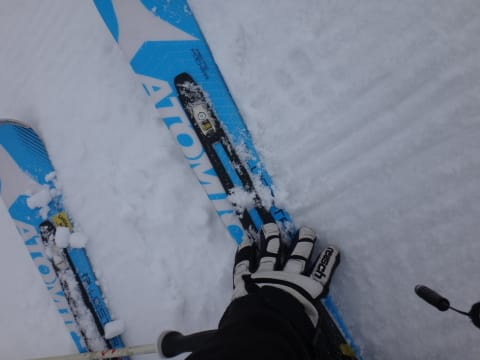
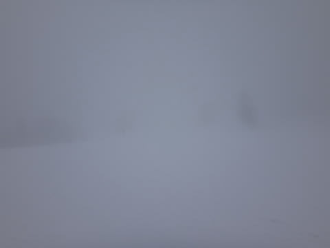
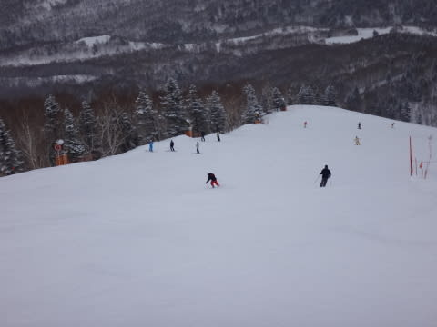
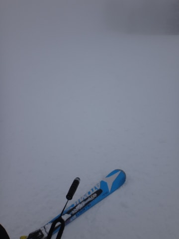

# 3月2日の志賀高原速報

📅 投稿日時: 2014-03-02 23:54:44

🏷️ カテゴリ: [2014スキー滑走日記](c992167609b6415052179ee69ea1ea7d8.md)

えー．

いつものパターンで．

今日もリフトストップまで滑り，帰宅が遅かったので．

今日の志賀高原，速報モードで…

あー．

昨日よりは，冷えました．

…昨日よりは．

んで．

冷えたおかげで，昨日とけた雪が凍っちゃってるんですが…(涙)

朝に5～10㎝ほど雪が積もったので，全面アイスバーンの悲劇は

なかったのが，せめてもの救いでしょうか…

で．

天気は，やっぱり昨日とおんなじ感じで．

山頂はほぼ終日ガスの中(涙)．

でも，午前中はまだ，ガスは山頂付近のみで，

下の方は視界も良かったんですが…

午後は，ふもとまでガスが下りてきてしまい．

…昨日に引き続き．

何も見えないのですが…

うーむ．

うーむ．

なんだか．

2日連続，微妙な感じのゲレンデ状況でした(涙)．

…とりあえず．

詳細は，また明日報告します…
