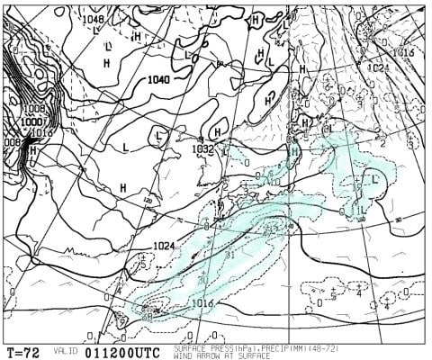

# 1月28日，日曜の志賀高原詳細モード…晴れ時々曇り．気温は冷え冷え！雪よし，天気よし．最高の一日！

📅 投稿日時: 2018-01-30 03:12:50

🏷️ カテゴリ: [2018スキー滑走日記](c11b88dc181f34079ab41db74a3587646.md)

ってなわけで．

また1日夜から2日朝にかけて，南岸低気圧が

やってくるようですが．

2月1日の850hpa気温を見てみると…

うはーー．

確かに，赤い0℃線は太平洋の南まで下がってるし．

さらに，平地でも雪になりかねない，水色の-3℃線が

関東にかかってますよ…

これは，降れば間違いなく雪になるんだけど．

1日夜の地上天気図では，こんな感じで

意外と低気圧が発達していないし．

水色の降水域が関東にかかっていないので．

このままの天気図なら，1日の夜までは，

関東は冷えるけれども，

雪が積もることはなさそうかな…

と思っているSkier_Sです．

ってなわけで．

昨日速報した志賀高原．

本日は詳細モード，行ってみよう！

えー．

まず．

日曜の朝ですが．

うむ．

土曜の夜からは，わずかに積雪があったようですね…

とはいえ，せいぜい3～5cm程度ですか…（ちょいと残念）．

で．

朝からすっきり晴れの本日．

いつも通り朝イチの焼額第1ゴンドラの

オープン待ちに並んで…

オープンと同時に，山頂へGo!

だけども．

山頂に着くと，太陽は雲に隠れてしまい…

天気はうっすら曇り空．

朝，スキー場に来るまではすっきり晴天だったけど…

うむ．

ここは私の金曜夜の修正予想の

　天気は，朝のうちは曇り時々日が射す．

という，ちょいと雲が多めの予想が当たった

のかな…

うん．当たったことにしておこう．

そして，朝イチの山頂の気温は…

ふむ．

-12℃ですか．

こちらは予想より冷えましたね…

でも．

-12℃クラスの冷え冷えってことは．

ふはははははは．

そうです！

朝イチは最高級の冷え冷え柔らか圧雪バーンっ！！！！

（ここで「[この圧雪跡は大原だな](ea23b31f14dd30fcd4173de7d0496ef2e.md)」とつぶやくところ）

昨晩のわずかに積もった雪が朝に圧雪されて，

最上級の冷え冷え雪がシマシマ化された，

激烈シアワセ圧雪バーン！！

…そして，雲に隠れていた太陽も顔を出し始め…

日が射す中，超最高プレミアムシマシマを

切り裂いて行ける，この幸せっ！！

朝のうち1時間ほどは，ほとんど人も

おらず…

うひょひょひょ～っ！！

最高っ！！

最高のシアワセバーンだ！

ガラガラ最高雪質のシマシマバーンを自由落下！

ひたすら重力の赴くままに落下っ！！

天気もすっきり晴れてきたし．

いや，最高っ！！

と．

気持ちよく1時間ほど滑っていたけど…

強風で奥志賀ゴンドラが運休だったこの日．

奥志賀から流れてくる人が多く…

あれ？？

なんだか人が増えて来ましたよ？？

10時を過ぎると，GSコースは人口密度が高くなり…

ちょっと飛ばすにはつらい感じに…（ちょい涙）

オリンピックコースを見に行ってみると．

人口密度はGSコースほど高くないけど．

夜のうちに圧雪するオリンピックコース．

昨晩の雪が圧雪の上に乗っていて…

ちょっと荒れ気味で，あまり気持ちよく

飛ばせない感じ…（残念）．

さらに．

10時半には…

奥志賀ゴンドラが止まった影響か．

うぎゃーー！

ゴンドラ待ち5分…

焼額はパノラマコースに行っても…

サウスコースに行っても…

今日は混んでるよ…（泣）．

だもんで．

知らぬ間に焼額の呪いが解けていたらしく．

あれ？？

気がついたら…なんだか一の瀬に来てますけど？

意識を失っている間に，焼額バリアーを

突破してきたようですね…

で．

一の瀬ダイヤモンドはそれほど混んでませんな．

ダイヤモンドも雪質は良いですな～．

一の瀬ファミリーもそれほど混んでませんね～．

でも．

ファミリースキー場は，柔らかい雪が

風で飛ばされたのか．

なぜか正面バーンもパーフェクターも，

上部はちょいとカリカリ＆コロコロした感じの

バーン状況…（残念）

ならば．

西館方面まで遠征だ！

…志賀高原に毎週やってきている私ですが．

今シーズン，西館を滑るのは初めてかも…←焼額に偏りすぎだから

西館は，ファミリーと違って，

焼額と同じような冷え冷えGoodな雪質！

そして…

人がいない．

トップシーズンの日曜としては，

ありえないほど人がいないんですが！？？

…志賀高原，大丈夫か…？？？

と，心配しつつも．

リフト飛び乗り，ゲレンデ貸し切り．

おかげで，それほど荒れてなくてフラットで

最高雪質の，気持ちいい西館のゲレンデを

しばらくぐるぐるしてましたが．

やはり長い時間ホームゲレンデを離れると，

落ち着かないので…

東館ゴンドラ経由で焼額へ戻りますか．

強風で3人乗り制限の東館ゴンドラ．

5分以上待ちましたが．

…この全面金色のゴンドラが，

噂の「金さん」か…

そして．

東館ゴンドラを降りたところにある，

このクラシカルな雪上車．

ノーズのエンブレムに

「OHARA」

とありますね．

はい．そうです．

こいつは，大原製鉄所製の雪上車です．

で．

東館経由で，午後3時ごろ焼額に戻ってきましたが…

この時間になると，焼額もゴーストタウン化

してますね…

人が多かった焼額は，ちょいと凸凹

してましたが．

でも，ちょいと表面に起伏がある程度で，

コブ斜面にまではなっておらず．

最後の一時間をガシガシ飛ばして．

また，夕日が暮れるラストリフトまで

滑り続けたのでした…

…ってなわけで．

先週までのアイスバーンから，一気に雪質が

最高レベルにまで復活した志賀高原．

今週はそれほど積雪がなさそうですけど．

冷え冷えが続くので，今週末まで雪質は良さそう！

今週末は，最高の締まった圧雪が滑れそうな予感…

## 💬 コメント一覧

### 💬 コメント by (サトシ父)
**タイトル**: 2回目です。
**投稿日**: 2018-01-30 06:27:49

中央エリアまで出張されてたのですね ！こちらはジャイアント、西館、東館、寺小屋を徘徊してましたのでかなり接近してたかも…

金さんゴンドラに乗れたは2回目で志賀高原で運を使い果たしてしまってます。今週末は熊の湯日帰り予定、関東の雪が心配です。

### 💬 コメント by (しんちゃん)
**タイトル**: 遠足
**投稿日**: 2018-01-30 21:37:59

遠足されてたんですね。

どうりで終礼まで姿が見えなかったわけです。

ジャイアントまで遠足したことがあるのですが、今シーズンどこかでサンバレーまで行ってみたいです。

（ジャイアントのアップルパイ、美味しかったんですよね。ジャイアントでくじけるかも(^^;）

### 💬 コメント by (Skier_S)
**タイトル**: 遠足してました
**投稿日**: 2018-01-31 02:52:05

＞サトシ父さま

あら．

ニアミスかもしれませんね…

ただ，焼額を脱出してたのは11時半ごろから

3時までの3時間半．

うち1時間は昼食だったので，

やっぱりほとんど焼額で滑ってたのですが…

今週末は日帰りですか！

今回は熊の湯なんですね…ぜひ焼額にもお越しください～！

＞しんちゃんさま

私には珍しい遠足でした…

今回，久しぶりに西館に行ってみて，

やっぱり西館は楽しいと思いました．

昔は結構西館のフード付きクワッドが

好きだったんです…

今シーズン，いつかサンバレーまで行って，

奥志賀まで1時間以内で戻ってみてください！

