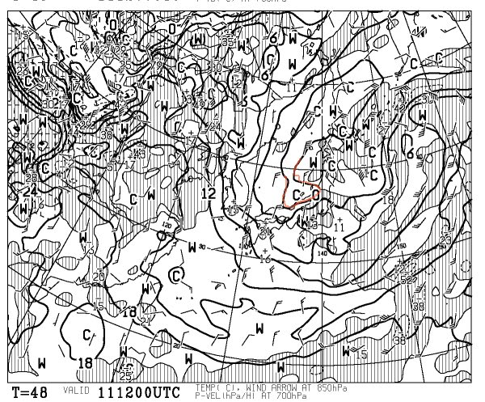
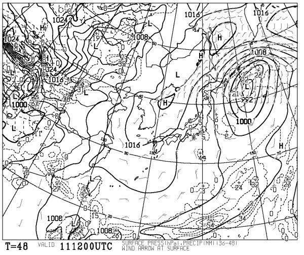
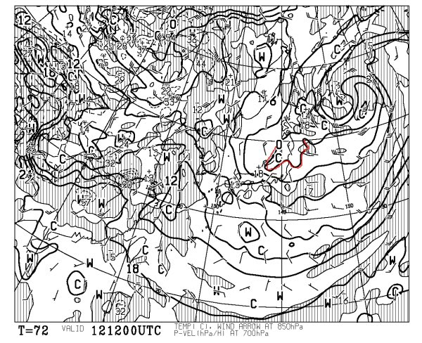

# え？まだ続くの？今週末のスキー場の天気予想っ！

📅 投稿日時: 2012-05-10 01:38:54

はっきり言って．

「え？まだスキー場天気予想続くんだ…」

と思っている人が1億2000万人ほどいそうですが．

私にとって，スキーシーズンはまだ1ヶ月以上続くのです．

まだスキーシーズンは終わっていないのです．

当然，天気予想ももうしばらく続くのですっ！

…ということで，もうしばらく，お付き合いのほど…

さてさて．

この週末営業しているのは，残るは志賀横手・熊の湯と，かぐら，月山，奥只見くらいですかね～

んで．

この週末ですが．

金曜の夜から土曜の朝にかけて．

ちょっと降るかもしれません．

…それも，雪が！

木曜夜から金曜は終日，日本海側は雨になると思うんですが．

あー．

かぐらは，金曜はおそらく終日雨ですね．志賀は降ってもときどきぽつぽつ降るくらいかな…

でも．

金曜夜からこの時期に珍しい寒気が入るんですね～

．

これは金曜夜9時の850hpa図ですが．

この時期にはありえないことに．

赤く記した850hpaの0度線が，日本海側にかかっている…

これは．山沿いでは雪になる寒気です．

さらに金曜夜は．

こんな感じで，地上の天気図も西高東低の冬型に入ります．

日本海側に降水域がかかる，冬の天気図になってます．

…このままの天気図なら，金曜夜は，スキー場には時期はずれの雪が降るかも．

…そして，土曜の朝は，時期はずれに冷えた，しっかり下地が硬い

バーンになっているでしょう…

この寒気は，土曜一日居座ります．

土曜の夜9時になっても，850hpa予想図には…

こんな感じで．まだ，赤く記した0度線が日本海側にかかっています．

ということで．

土曜日は冷えます．終日冷えます．

「5月か？？」

とおもう，ひんやりした空気の中滑れるでしょう．

ジャケット忘れないように！

という感じで．

時期はずれに冷える土曜日ですが．

この日は，かぐらは雲が多い天気でしょうね～．時折，みぞれが降るかも．

志賀は…雲が時折流れるかもしれないけど，晴れるかな～．

で．

日曜は．

晴れますね．

終日晴れますね．

気温も平年並みに戻り．

暖かい，気持ちよい春スキー日和になるかな．

…だけど．雪は張り付くベト雪になっちゃうかも．

という感じで．

天気はぐずつくけど冷えて雪のコンディションがよい土曜日と，

天気がよく暖かい，雪がべとつく日曜日，

といった感じになりそうかな．
