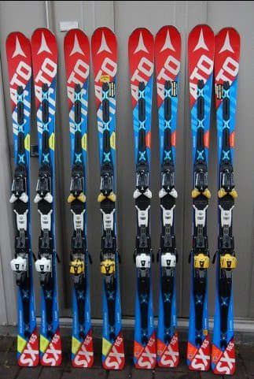

# ATOMIC Bluester DD3.0 SX三郎君を出動させてみた…次郎君はもうヘタっていたのか？？

📅 投稿日時: 2018-03-16 06:45:20

🏷️ カテゴリ: [スキー雑談](c1f9d2cb7478308da16419928ea3945e9.md)

本日の志賀高原．

焼額は，朝から+3℃，昼間には+8℃まで

上がっちゃったようですね…（涙）．

（[焼額山FB](https://www.facebook.com/yakebitaiyama/posts/1604972842931389)より）

たぶん，昼間は天気も良かったので．

板に張り付く，ベトベト雪に

なっちゃったんじゃないかと心配…

しかし．

しかし．

ようやく．

久しぶりに，平年より気温が下がる日が来ますっ！！

水色で囲ったように，16，17日は平年より2℃ほど

低い気温になりそう！

…でも．

赤矢印で示した22日には，平年より気温が

かなり上がりそうですが…

…そして，22日，何かが降りそうなので．

空から落ちてくるのは液体っぽい…（涙）

うーむ．

16日の午後～深夜にかけて，ちょっと雪が

ぱらついてくれそうだけど．

…やっぱり，積もらなさそうなんですよね（泣）．

うーーーむ．

うーーーーーーむ．

そろそろいろいろヤバそうなんで，

あと3mくらい降ってほしいんですけど…←それは降りすぎだから

ってことで，本題へ．

えー．

我が家には，'16SXと'17SXが合わせて4台あるわけですが．

…[SX一郎君は「かつてSXだった何か」レベルにまでヘタって死んでしまっており](e27e2a7149d362e76794896614d0f18f3.md)．

現在，メインで使っているのは'17SXの次郎君．

この次郎君は，昨年3月にデビューさせ，

デビューからそろそろまる一年になるという

ことに気づき．

「前のSXは確か約4か月で死んでしまうという

　根性の無さだったなあ…」

ということで．

…認めたくないけど．

もしかしたら…

もしかしたら，次郎君ももうヘタってしまっているのでは？？

毎回こればっかり履いているから劣化に気づいていないだけで．

実はすでに

かつてはSXだった時代もあった

って板になり果てているのでは…！？？

と心配になり．

あまり現実を直視したくはないけれども．

まだ我が家には三郎君と四朗君の2セットもSXが

あることだし←普通はありえない…

こないだの月曜日．

三郎君を出動させて，

次郎君がマイルド版SXになっていないかどうか，確認して

みました…←月曜朝，1ゴン下に私のSXが2セット並んでいるのを見た人がいるはず…

まず．

ガラガラの朝は，朝イチ大回り用のSALOMON X-race 175cmで滑り．

そして，昼前に．

現在のメインマシン，次郎君へチェンジ！

うーむ．

今のところ．

まだヘタっているように感じないんだけど…

でも，1年経ってるし．

私のメインマシンが1年ヘタらずにもつわけがないんだよなぁ…

とりあえず．

数本滑ったところで．

新品の三郎君，デビューっ！！！

三郎君で数m滑ったところ…

…

え！違う？？

次郎君と違うよ！！

…

…

…

これ，新品の板だから…

…

ガンガンに自分でエッジを立てている次郎君に比べ．

…固めの斜面でのエッジの効きが甘いよ！！

買ったままでプレチューンもせず，

さらに自分でエッジを立ててもいない三郎君．

固い斜面でちょいと板が流れ気味…

そして．

エッジが効く柔らかめの斜面を滑ってみても．

あれ？？

次郎君と比べて，そんなに違いを感じない…

…これは．

私が一年履いた次郎君．

まさか，マイルド化がまだ進んでないとはっ…！！

まぁ，昨年も次郎君をデビューさせた後も，

雪が悪くなったGW以降はまだ一郎君に出動

してもらっていたというのはあるけど…

一郎君はわずか40日近くでヘタってしまったというのに．

現時点で60日近く履いている次郎君．

どうやらこいつはタフなやつで，まだマイルド版SXに

なっていないことが分かりました…！！

いやーーー．

予想外…．

ということで．

一郎君がわずか40日でヘタってしまい．

「SXって根性無しの板だなぁ（涙）」

と思ってましたが．

どうやらこれは一郎君がたまたま弱い個体だった

可能性があり．

私のメインマシンが，丸々1シーズン以上

マイルド化せずにもつという驚異的事実から．

「実はSXって，かなり根性がある板だったのかも？」

と思い直した，Skier_Sだったのでした…

次郎君だけが，異常に強い特異体質だった…

ってことでは無いように祈りたい…

## 💬 コメント一覧

### 💬 コメント by (olaf2125)
**タイトル**: 四郎くんが寂しそう…
**投稿日**: 2018-03-16 12:51:10

次郎くんがまだまだ元気だと、三郎くん活躍できないですね (^^)

四郎くんに至っては出番の見通しが立たないので放っておいたらグレますよ (笑)

### 💬 コメント by (Unknown)
**タイトル**: 平等に使えば気付かないような？
**投稿日**: 2018-03-16 16:32:29

この使い方だと四郎くんのビンディングは要らないのでは？

個々のマイルド化を遅らせる＆均等化して意識できないようにするため、

次郎〜四郎は週替りで廻しているんだと思っていました。

### 💬 コメント by (いか)
**タイトル**: Unknown
**投稿日**: 2018-03-16 20:49:45

もしや、黄色は弱い、、、？ということはなくて、初期状態だとズルズル流れますよね(+_+) 私の次郎くんもチューンするまでは流れまくりでした。

明日は朝礼前の朝練から参加したいと思います〜

### 💬 コメント by (Skier_S)
**タイトル**: 四朗君の出動はいつになるのか…？
**投稿日**: 2018-03-17 00:22:21

＞olaf2125さま

このままだと，四朗君は2020シーズンに出動！

…ってことになりかねません．

確かにグレそうなので，まっとうな道に

進むよう教育しないとダメですね（笑）

＞unknownさま

今，四朗君のビンディングは古いX-raceに取り付けてます．

四朗君，ビンディング無し状態で保管中です．

…次郎君から四朗君を順番に回す手もありそうですが，

今シーズンは次郎君をシーズン終わりの石ころ踏んで

いい板＆マイルドコブ用板にするために，

あえて選択的に履いてへたらせようと思ってました…

＞いかさま

16SXと17SXはプレートが違うので，ヘタリの

速度が違うのではないか…とも思いましたが，

初期性能は変わらないかと．

やっぱり自分でエッジを立てた板がいいですね（笑）．

明日は朝練の時間に間に合わないので，

普通の朝礼から参加です…

