# 2019/3/3(日)の志賀高原スキー場，詳細モード！…曇り空の一日だったけど，そのおかげで雪は緩まず．硬かったりコロコロもあったけど，意外と楽しめたよ！

📅 投稿日時: 2019-03-06 01:30:33

🏷️ カテゴリ: [2019スキー滑走日記](c3e4496fc0fb7f9c17ff21214a35b1ace.md)

ということで．

昨日は天気予想だけで終わっちゃったので．

今さらながらの感がありますが．

今日は日曜の志賀高原詳細レポートです！

えー．

まず．

日曜朝は，お約束の焼額第1ゴンドラ

営業前から並ぶわけですが．

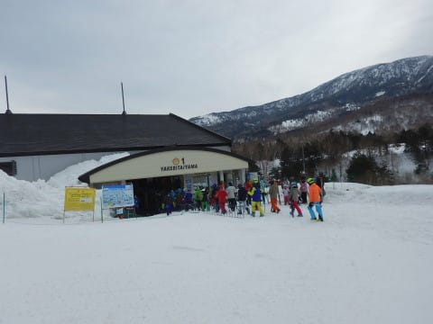

…今日は朝は晴天でスタートする

はずだったのに…

曇ってるんですけど…（涙）

で．

ゴンドラで山頂へ行くと．

山頂の温度計は，-4℃ですか．

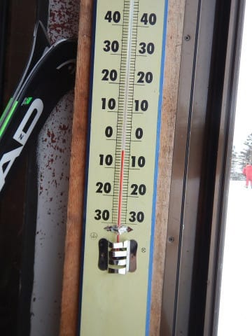

　朝の気温は-5℃くらいか…

という予想は，ほぼ当たり．

で．

山頂に出ると…

どんより曇り，というより

うっすら日も射し，

うす曇りという感じ．

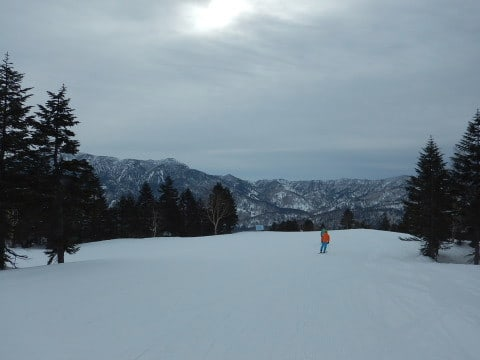

まぁ，水曜段階の

　朝のうちは雲が多いながらも晴れて

　そうだけど

というのが，予想よりちょいと雲が多かった…

という感じかな～←素直に予想外したと言いなさい

でも．

ゲレンデは…

そうです！

今日もいい感じのシマシマっ！！

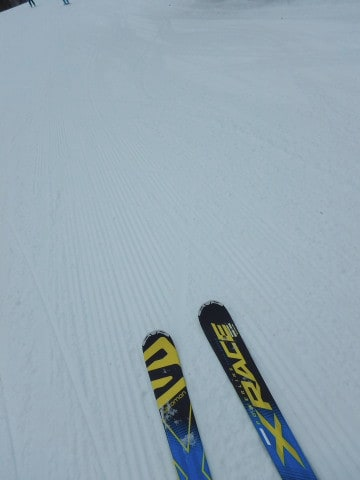

土曜よりはちょいと締まり気味の，

超フラットシマシマ！

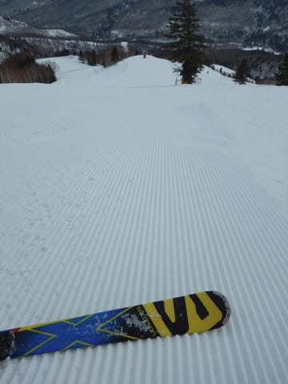

朝の3本ほどは，かなりいい感じで

シマシマをいただけましたが…

でも．

1時間も経つと．

…ちょっとゲレンデ表面に，

コロコロが増殖中…（涙）

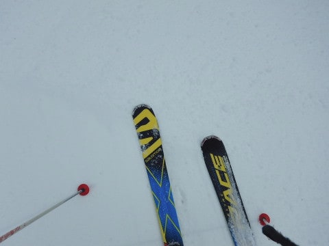

コースの人は少なくていい感じなのに．

コロコロが惜しい…

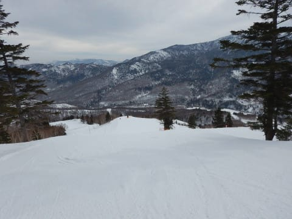

オリンピックコースも見に行ってみましたが．

こっちは結構固めのゲレンデで．

エッジを研いでないと多少厳しい感じ．

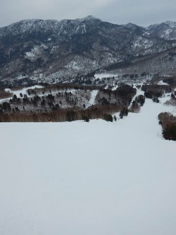

でも，人が少なくて．

ちょいと手ごわい感じもあったけど．

まぁそこそこ楽しめるかな…

と，思っていたら．

だんだんとコース上の人も増えてきて．

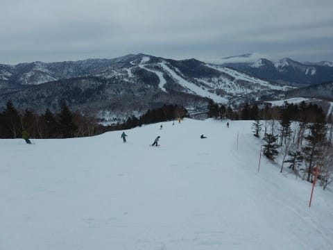

さらに，ゲレンデのかなりの部分に，

コロコロがばらまかれた状態になり

快適度がダウン…（涙）

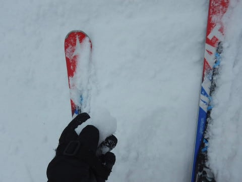

まぁ，ゴンドラ待ちはそれほどでも

無かったんだけど…

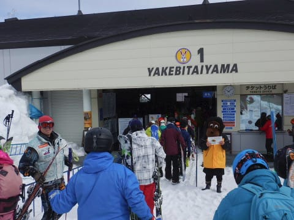

ちょいとコロコロが多くて，

人口密度が高かったので．

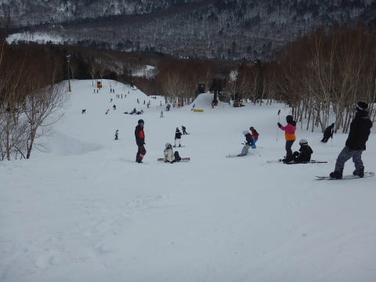

焼額の住人の私だけど…

今日もちょっとだけ．

ちょっとだけ，様子見のために．

奥志賀へ行ってみましょうか…

と，奥志賀のリフト側，エキスパート

コースを見に行ってみたところ．

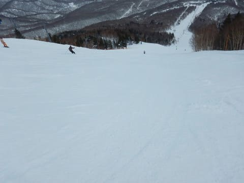

うは～！

しっかりフラットで，

コロコロもないし．

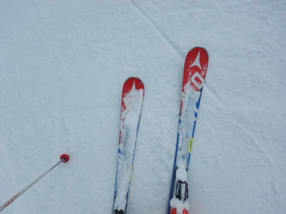

もう昼に近い11時ごろというのに．

まだまだ超快適大回りバーンじゃ

ないですか！！！

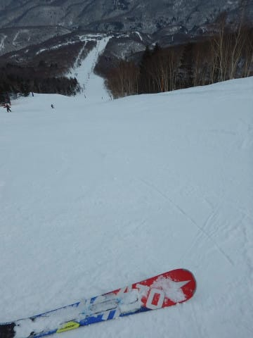

リフトも，最大でこの程度待つタイミングが

あったとはいえ．

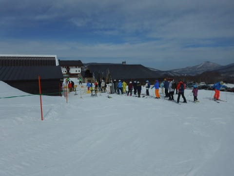

それほど待ち時間は無かったし．

フラットな大回りバーンを満喫！！

いやーーー！

いいよ！これは！！！

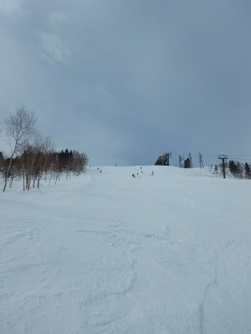

と，しばし奥志賀エキスパートコースを

堪能してましたが．

やっぱりここが一番バーン状況が

良いからか．

今日は珍しく人が多く…

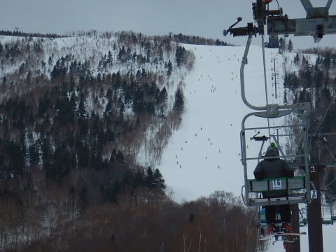

…なんだか，ゲレンデの人口密度が

かなり上がってきましたね（涙）

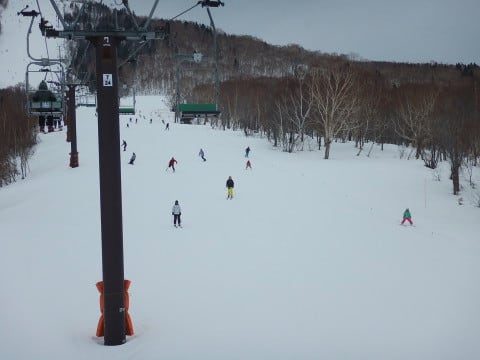

多くの人が滑ったバーンは，

表面が削られて，結構ツルツルに

なってきちゃいました…

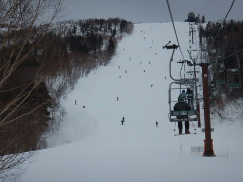

ってことで．

人も多く，部分的にアイスバーン化

してしまったため．

奥志賀エキスパートコースも，

昼過ぎにはちょいと快感度が

低くなってきていたところ…

ここで，ポール練習でクローズされていた

一の瀬ファミリーのパーフェクターコースが

午後1時からオープンするという噂を聞き．

一の瀬へ，ワーーーーーープっ！！！！

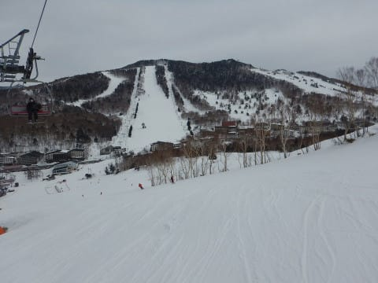

…一の瀬ファミリーの下半分，

修学旅行生で埋まってましたが…

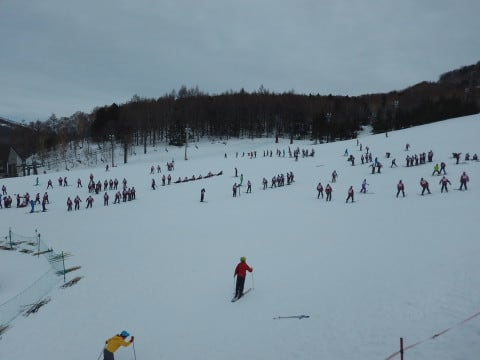

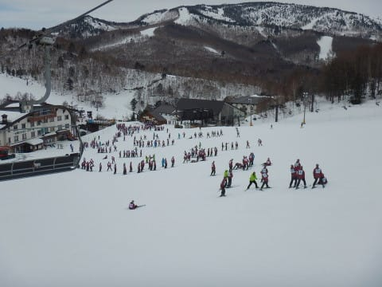

でも．

午前中，貸し切りバーンだったので，

まったく荒らされていないパーフェクターコース．

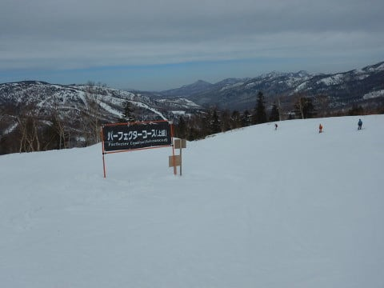

いや，もう．

これは完全なるフラットバーン！

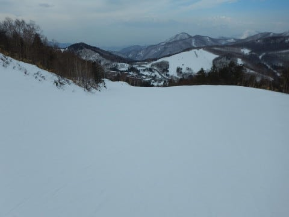

…そして．

雪質も．

まったく硬くないんですが！？？？

激烈に気持ちいい，締まった圧雪なんですが！

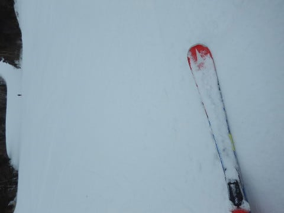

そして．

人も少なくて…

いや…

まさか．

今日の午後に．

こんな気持ちいいバーンを滑れるなんてっ！！！

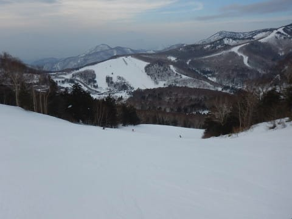

楽しい！

楽しすぎる！！

…と，ひたすらパーフェクターコースを

滑り続けたのでした…

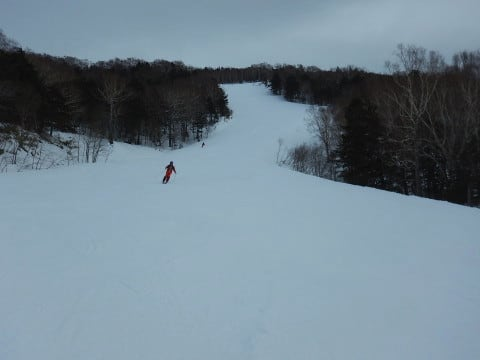

一度だけ，一の瀬正面バーンを

滑ってみたところ．

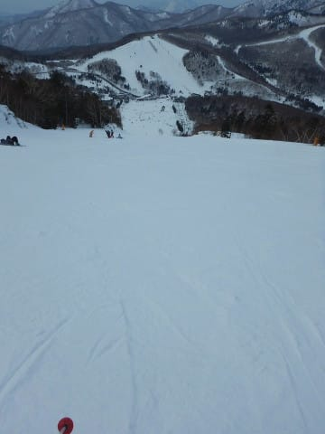

意外とエッジが効く雪だったものの．

やっぱり朝から多くの人が滑ってため，

ちょいと固めになっていたので．

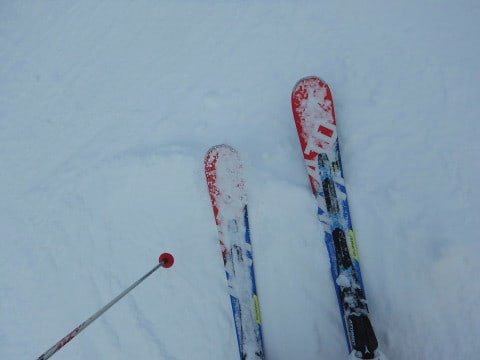

うむ．

悪くないけど，パーフェクターの方が

良かったな…

と，パーフェクターコースをグルグル

していると．

夕方になったので．

そろそろ自分の居住地，

焼額へ戻りますか…

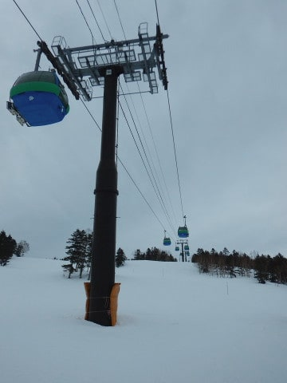

焼額も，夕方というのに．

山頂近くはかなり雪が良く，

バーンも荒れておらず，

いい感じでフラット！

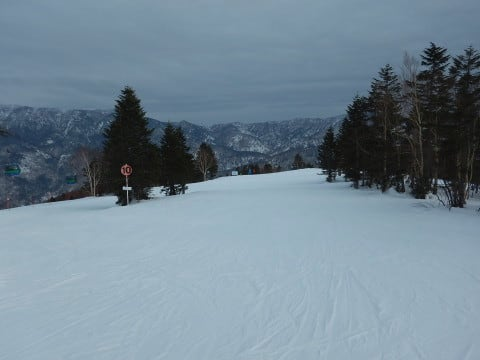

…だけど．

人が多かった，サウスやGSコースは．

ちょいと荒れ始めていて．

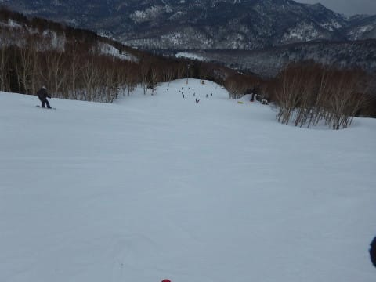

雪質も，日が当たるコースは

緩んだ雪が固まった，ザラメ状に

なってました…

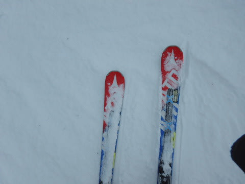

とはいえ．

さすが夕方は，滑る人もおらず．

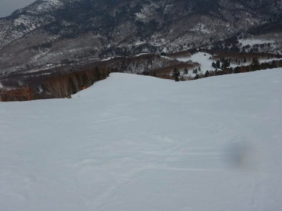

日が暮れかけた，誰もいない

無人のコースを．

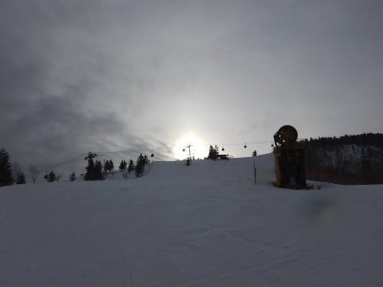

今日もリフトストップまで，

しっかり滑り続けたのでした…

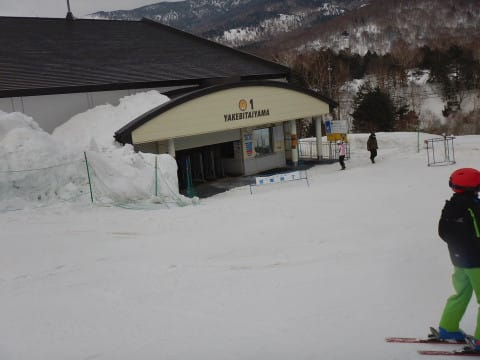

ってな感じで．

コースによっては，ちょいと固い

所もあったものの，

あさイチの焼額は良かったし．

午前中の奥志賀エキスパートは楽しめたし．

午後のパーフェクターは嬉しいボーナス

だったし．

雨も降らなかったし．

「木曜に雨が降って，土日は

　アイスバーンか？

　…そして，日曜は午後雨になるのか？？」

という予想から比べれば．

予想以上に，結構楽しめた

一日だったのでした…

今週は7日に雪が積もりそうだから．

今週末も，いいコンディションに

なるといいなぁ…

…いや，私が踊り続けているので．

いいコンディションになる．

なってくれるはず！！！←だから，あなたが志賀高原の天気を決めてるんじゃないですから…

## 💬 コメント一覧

### 💬 コメント by (地元民)
**タイトル**: 久しぶりに
**投稿日**: 2019-03-06 01:52:30

なんか久しぶりに焼額山のゲレンデマップをみたくなって、ネットで開いてみました。

あ、あれ？　リフト、こんなにスッキリしてましたっけ？　なんか一の瀬から滑り込むと、クワッドに接続できた気がするんですが・・・。

あと山頂からみて左のベース部に奥志賀にアクセスできるペアリフトありませんでした？

あとブログ読んでいて、いつも「？」って思ってたのがオリンピックコース。そんなコースあったかなぁって実は、いつも思ってたんです。

位置的に、もしかして、昔のスラロームバーン？

実は志賀高原、近すぎて１５年も行ってないんです。今度、久しぶりに行ってみます。

### 💬 コメント by (真美子)
**タイトル**: Unknown
**投稿日**: 2019-03-06 15:37:45

3月3日の午後から5日まで、年に1回の焼額でした。憧れのスキーヤー様にお会いできると、心ウキウキしていたのですが、会うことがかなわなかった～。奥志賀と一ノ瀬へ行っていたのですね。残念無念。

4日は雨の様な雪でした。風もあり、辛かったです。

5日は雪面を心配していたのですが、心配を他所に、前日が雨だった？と思わせる雪面、雪質でした。楽しく滑ることが出来ました。

来年こそはお姿を拝まさせていただきたいです。

### 💬 コメント by (Skier_S)
**タイトル**: ＞地元民さま
**投稿日**: 2019-03-07 01:49:31

＞地元民さま

オリンピックコースが，昔はスラロームバーンといっていたことを

知っている人は，今の焼額スタッフでも少ないかも…

コース名は，そのほかにも．

パノラマアウト⇒パノラマコース

パノラマイン⇒ビギナーズコース

って変わりました．

そして．

一の瀬ダイヤから滑りこんで接続できたクワッドは．

第1高速リフトだと思いますが…

6年ほど前に廃止になり．

2年ほど前に撤去されました（涙）

その向かいの山の神のトリプルリフトも撤去されてます．

山頂から見て左の，奥志賀へアクセスできるペアリフト．

第3ロマンスリフトは，確かこれも6～7年前に廃止になり．

これも2年ほど前に撤去されてます．

そのほか，第3高速乗り場の下あたりから

オリンピックコース下まで移動できる第1ロマンスA線，

そこからオリンピックコース上までつながる第1ロマンスB線も，5年ほど前に撤去済み．

オリンピックコースてっぺんから，第1ゴンドラ山頂までつなぐ

第5ロマンスも，10シーズン以上動かないまま放置

されていましたが，2-3シーズン前に撤去されてます．

そのほか，昔パークがあった第2ロマンスも撤去済み．

ピーク時には，

第1ロマンスA,B

第2ロマンス

第3ロマンス

第4ロマンス

第5ロマンス

第1高速

第2高速

第3高速

第1ゴンドラ

第2ゴンドラ

と，11本のリフト＆ゴンドラがありましたが．

今生き残っているのは

第4ロマンス

第2高速

第3高速

第1ゴンドラ

第2ゴンドラ

の5本だけです…

寂しくなりました．

そのほか，15年前からだと

渋峠クワッド

ダイヤモンドトリプル

寺子屋の一の瀬側にかかっているリフト

一の瀬タンネの第7ペア

ブナ平クワッド

蓮池第2高速ペア

そして，

蓮池ロープウェー

も廃止になり．

さらに，前山スキー場，笠岳スキー場は無くなり．

ジャイアントスキー場の黄色いペアリフトと

高速トリプルリフトは撤去され，

ジャイアントは遅いペアリフトのみとなりました…

昔を知っている人にとっては．

志賀高原，寂しくなりました…

### 💬 コメント by (Skier_S)
**タイトル**: ＞真美子さま
**投稿日**: 2019-03-07 01:52:18

あら…

3日，お会いできず残念でした．

すみません．珍しく長時間焼額を不在に

していました…

4日は残念な天気でしたが，5日はいい感じのコンディションだったんですね！

楽しめたようで何よりです…

次はいつ志賀高原にお越しになるのでしょうか？

次にお越しの際は，またコメントください～！

あさイチなら，ほぼ間違いなく焼額にいます．

### 💬 コメント by (あきたけん)
**タイトル**: Unknown
**投稿日**: 2019-03-07 19:42:13

いつも大いに参考にさせていただいております

というのも当方山口県のため常時志賀入りできる状況ではなく、今シーズンは雪不足のため地元では全く滑ることができず、正月と今回で今シーズンが終わると言う悲しい事態です

今回は３月４日から６日の3日間でしたが初日の荒れバーンで大きくスタミナが削られましたが、それなりに楽しめました

恐らくというか確実にまた志賀入りを来期する事になると思いますので、新しい情報を是非お願いします。

### 💬 コメント by (R)
**タイトル**: Unknown
**投稿日**: 2019-03-07 21:01:09

奥志賀高原と、妙高高原で悩んだ末新潟へ。奥志賀高原にすれば良かった。

### 💬 コメント by (Skier_S)
**タイトル**: 今週も意外とコンディション良さそう
**投稿日**: 2019-03-08 02:20:17

＞あきたけんさま

始めまして～！コメントありがとうございます．

山口から志賀高原まで…！！

遠くからすごいですね…

4日は天気が悪くて大変だったかと．

これに懲りずに，来シーズンと言わず．

また今シーズンに志賀高原に滑りに来てください～！

＞Rさま

…この日は，標高が低いところはかなり雪が

緩んだかと…

やはり，3月を過ぎると，標高が高い志賀高原の雪質の良さは．

他のスキー場から一歩抜きんでている感じです…

次は志賀高原へお越しください～！

