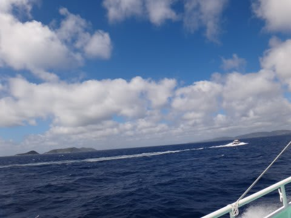
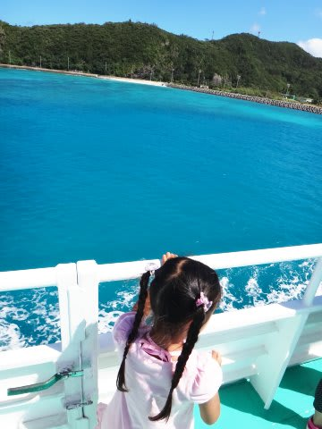
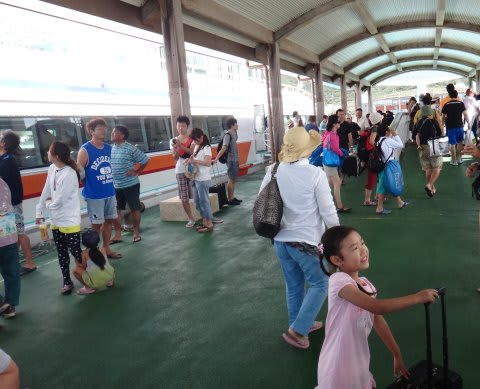
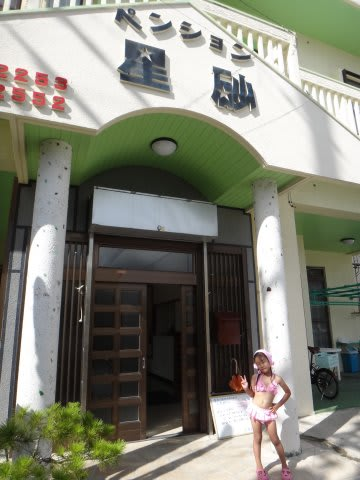
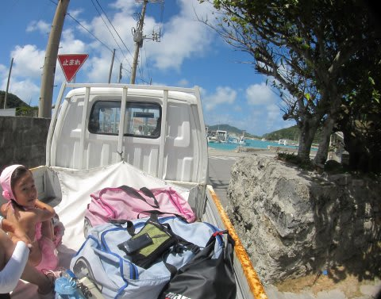
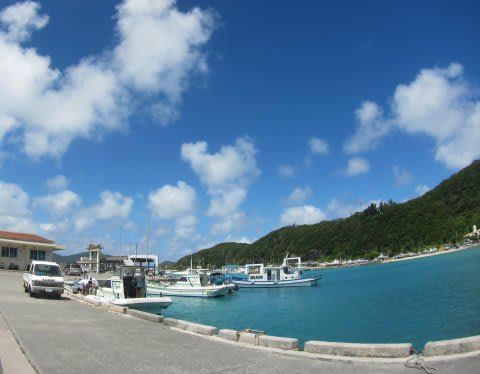
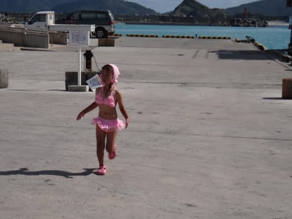
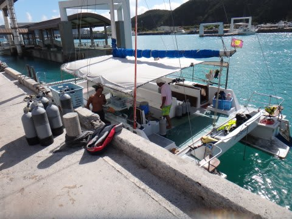
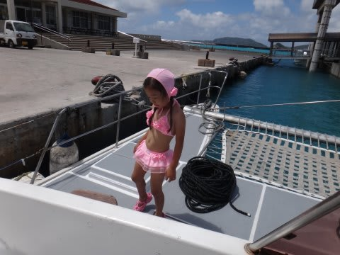

# 2013年7月　子連れ座間味ダイビング旅行記その3…座間味に到着！

📅 投稿日時: 2013-07-24 00:31:00

🏷️ カテゴリ: [ダイビング日記](ce3a7a8d424d112fce83ee85c81a0e344.md)

とゆーことで．

座間味を出航した高速船．

波は高めで高速船は結構ゆれたけど，

天気は晴天！

座間味が近づいてくると，海の色が南国色に染まってきますね～．

だんだんテンションが上がってきますね～っ！

そして那覇から1時間…

1年ぶりの座間味へ，上陸！

港から歩いてすぐの星砂さんへ到着．

今年もお世話になります～．

高速船に乗って，海を見た瞬間から

「早くお船に乗って泳ぎたい～！！」

という娘にせかされるように．

30分ほどで急いでダイビング器材の準備をして，

ダイビング器材と一緒にトラックの荷台に乗せられて，

ドナドナを歌っていると，港へ到着です…

港で，久しぶりのザマミセーリングのヨット，

ティンガーラ号を見た瞬間

「お船だ！お船！乗る～！」と大興奮の娘．

…どーでもいいけど．

この水着．

「これかわいい～これ欲しい～」

といって，娘が自ら選んだものです．

「おへそ出ててかわいいでしょ？」

…あーた，そーゆー水着は，もっと大きくなってから着なさい．

んで．乗船すると…

…ティンガーラ号は，誰も他のお客さんが乗ってないのに，

すぐ出航しちゃいました．

あり？

ありり？

予約の電話をかけたときは，他のお客さんも結構いるって

聞いたんだけど…？

私「…オーナー，他のお客さんは？」

オーナー「…台風で3日間連絡船が来てなかったんだから，

　他のお客さんが来れるわけ無いよ」

…なるほど．

運良く再開第1便に乗って来れたうちの家族以外，

他のお客さんがいないのね．

…ってことは，

今日はまるまる，この船はうちの家族で貸切？？

オーナー「今日どころか，明日の午前中まで貸切だよ」

…ってことで．

ゼイタクにも我が家族だけで一艘まるまる貸切となった，

大型カタマランヨットは．

ゴキゲンの娘を乗せて．

座間味の港を滑り出したのでした…

