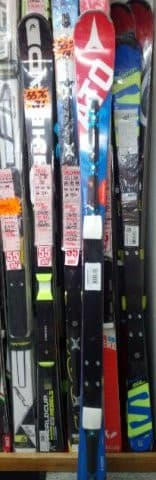

# ついに開催，第7回物欲選手権！その3

📅 投稿日時: 2017-11-18 00:59:08

🏷️ カテゴリ: [スキー雑談](c1f9d2cb7478308da16419928ea3945e9.md)

どうやら．

熊の湯は予定通りの18日オープンを決定

したようですね…！

日曜は，道路凍結しそうですが，

最高のスキー日和になりそうな気配…

そして．

かぐらも23日オープン決定！（ぱちぱちぱち）

今シーズンは順調にスキー場がオープンしそう…

うむ．いい感じじゃ．

…で．

Olaf2015さんからコメントを頂きましたが．

志賀高原は，Skilineをやめて．

iSKIへの移行を推奨するって情報が．

[ここのBLOG](http://blog.goo.ne.jp/olaf2125/e/5db42abef111b5e9fdc3211e48e9e554?st=0#comment-form)にありました…

うーむ．

やっぱり，Skiline，かなりのお金がかかってたんですね…

Olaf2015さん，情報ありがとうございました！

…ってことで．

間に天気予想を1日はさみましたが，

第7回物欲選手権．第3回です．

果たして，勝負の行方や如何に！？？

これまでの戦い（？）の経緯は，[その1](e38b4d4ca6ea3af24cebf3838ab8c791d.md)，[その2](efc5f894d3d04c4c90abdf5ac3a2a0535.md)を見てね！

---

アナウンサー　「ということで，いつものお店にやってきたSkier_S

　選手ですが．

　剥離した'16SX．果たしてこれが，保証の対象になるのか？

　あるいは，保証対象外の『単なる破損』扱いになるのか…？」

解説　「あ，Skier_S選手．店員から何か告げられてる

　ようですよ…？」

アナウンサー　「どうやら…あぁ，ATOMICに送って確認するので

　一週間くらい待ってくれ，と言われたようです…」

解説　「まぁ，そうでしょうね…」

アナウンサー　「どうやら，Skier_S選手．

　すぐに結果が分からず，ちょっとがっくりしているようです…．

　まぁ，板を買うかどうかは，一週間後．

　結果がどうなったか聞いてから…ということになりますね」

解説　「そうですね…

　一週間待って無償交換になれば，

　新しい板を買う必要は全くありませんから．

　今回の選手権は，ちょっと拍子抜けの結果に

　終わりましたね．」

アナウンサー　「なんと…

　意外な結果ですが，これはSkier_S選手の勝利と言って

　良いのでしょうか？」

解説　「いや…これは，勝利と言うより．

　一旦中断，一週間後に結果を聞いてからの再試合…

　という扱いですね．まだ勝利とは言えません」

アナウンサー　「未練たらしく，S9i PROを横目で見ていきますが…

　おっと．通り過ぎました．

　値段も聞かず通り過ぎていきます．

　Skier_S選手，今回はS9i PROを買いませんでした！！！」

解説　「まぁ，今日は買わなかったとはいえ，

　まだ選手権は終わっていませんから…

　来週の延長戦に期待しましょう」

アナウンサー　「とういことで，いったん引き分け再試合となった

　今回の第7回選手権でしたが……

　…って，え？」

解説　「あれれ？」

アナウンサー　「なんだか…Skier_S選手．

　'17SXを手に取りましたよ」

解説　「…もし無償交換になったら，

　新品のSXが手に入るので…

　買わないと思いますが」

アナウンサー　「え？？

　値段聞いてますけど？」

解説　「常識的に言って，今買わないと思うんですが…

　ってか，買っちゃだめだと思うんですが…」

アナウンサー　「どうやら，ビンディング抜きで

　すごい安値がでたようですが…

　…

　って，ええ！？？

　あれれれれっ！！！

　お金払ってますっ！！！

　行っちゃいました！

　この場で，なぜか板を買ったようです！！！

　それも，今持っているのと全く同じモデル，

　'17SXをっ！！！！！」

解説　「なんと…！！！

　　なぜ，なぜこのタイミングで買う？？

　なんとありえない，我慢力の無さ…っ！！！」

アナウンサー　「さすが，物欲大魔王！

　底知れぬ物欲の主！

　常人の理解を超えていますっ！！

　…信じられないことですが，

　無償交換になったら，同じ板が2セット

　並ぶことになってしまうというのに…

　それでも買ってしまいました！！」

解説　「どうやら，このお店だと．

　型落ちのSXをビンディング別で売ってくれるので，

　ビンディングセットでしか売らない他の

　お店と比べて，信じられない安さで買えて．

　その上，このお店の'17SXの165cmの在庫が

　もう無くなりそう…

　ということで，ついつい買ってしまったようですね」

アナウンサー　「我々の想像を激しく超えますね…

　さすが，Skier_S選手…

　…もし，剥離した'16SXが無償交換になって，

　同じ板が来ちゃったらどうするつもりなんでしょうか…？」

解説　「その場合は，喜んで新品2セット

　持っていくでしょうね」

アナウンサー　「しかし，どうやら．

　'18 S9i PROと比べ，半額以下で'17SXが手に入るという

　事実に，ついついクラクラと，前後の見境なく

　買ってしまったようですね…」

解説　「そこは，さすが常人の理解をはるかに超越した

　物欲大魔王の実力を見せつけましたね．

　もう，彼は自制心というものを，アンドロメダより遠く．

　はるか異次元の彼方にまで葬り去っているようですね」

アナウンサー　「ということで．今回も．

　無償交換の板が手に入るかもしれないという状況にも

　関わらず，また'17SXを買ってしまうという，

　我々の想像を激しく超える大敗で終えました，

　第7回 スキーヤーの物欲を刺激する街神田に来て，

　物欲にまみれたスキーヤーが買い物をせずに

　我慢できるか選手権　　

　今回も，Skier_S選手の大敗ということで…」

解説　「…

　…あれ？」

アナウンサー　「え？」

解説「ちょっと待ってください」

アナウンサー　「……あれれ？

　Skier_S選手．まだ今度は，違う店に寄ってますね…」

解説　「確かに…」

アナウンサー　「そして，太い板を見てますね…

　…

　…買うはずのない板を買ったばかりですから，

　見てるだけと思いますが…」

解説　「普通ならそうでしょうが…

　ここはSkier_S選手ですから．

　『まさか』ということがないとは言えません…」

アナウンサー　「えー．

　…目の錯覚でなければ．

　私の見間違えでなければ．

　…なんだか，今度は太い板を買っているように

　見えるんですが…！！？？？

　こ，これは，目の錯覚か！？？」

解説　「…私にも，板を買っているように見えます…

　目の錯覚ではなさそうです…」

アナウンサー　「な，な，な，なんということだ～！

　さらに，太い板も行ってしまいましたっ！

　なんてことだっ！！

　板2連チャンっ！！

　歴史に残る，板2連発です！」

解説　「…

　…

　…まさか，ここまで自制心が無いとは…

　…

　さすがSkier_S選手とはいえ…

　同じ日に板2セット購入は，歴史上初めてですね…」

アナウンサー　「…歴史的瞬間への立ち合いですね…

　そういう意味では，喜んでいいんでしょうか…？」

解説　「どうやら，『S9i PROを買うよりずっと安く済んだから，

　太い板も買ってもいいよね』，と自分に言い訳して，

　2セット目を買ってしまったようです…」

アナウンサー　「すごい…

　もう，あまりにも理解を超越しすぎて，

　なんとコメントしてよいのかもわかりませんが…

　…とりあえず．

　第7回 スキーヤーの物欲を刺激する街神田に来て，

　物欲にまみれたスキーヤーが買い物をせずに

　我慢できるか選手権　　

　ですが．

　…さすが，Skier_S選手．

　我々の想定を激しく超える…

　というより，想像すらつかなかった，びっくり驚愕の

　板2連発という．

　今後歴史上塗り替えられることがないだろう

　大敗という結果になりました．

　では，また第8回にて，またお会いしましょう！」

解説　（やっぱり，第8回もあるのか…）

(終了後)

アナウンサー　「Skier_S選手．満足そうに神田を後にしましたが…

　でも，本来の目的の．

　スキーパンツは買わないで帰っちゃいましたね」

解説　「そうですね…板を買った喜びで，

　買うのを忘れちゃったみたいですね…」

ーーー

ってことで．

買っちゃいました…

## 💬 コメント一覧

### 💬 コメント by (しんちゃん)
**タイトル**: 歴史的敗北
**投稿日**: 2017-11-18 01:24:12

すごい!!板二本を一日で買ってしまうとは。。。

しかも昨シーズンからあればいいなと言っていた、太板ゲットされたとは。恐るべし物欲の街の威力ですね。

これで降雪の時も、春のザブザブの雪の時も、ピーカンのシマシマバーンも、全天候雪さえあれば楽しめちゃう訳ですね。

一人では担げない本数になるのでは(＠_＠;)

### 💬 コメント by (yama)
**タイトル**: まさかの
**投稿日**: 2017-11-18 05:37:39

1日に２本とは、歴史的大敗でしたね？こんなに負けていたとは、想定外でした。でもゲレンデでは無敵になりましたね。

### 💬 コメント by (Goku)
**タイトル**: 終わってます（笑）
**投稿日**: 2017-11-18 07:01:01

ついに太板に手を付けてしまいましたね。

でも朝イチ用大回り板も今年中ダメになりませんか？

なので、今シーズン中に３本目逝っちゃってください。

期待しています（笑）

### 💬 コメント by (ほっぽ)
**タイトル**: 茶水
**投稿日**: 2017-11-18 12:58:13

今日は朝から茶水へ。

maeさんと合流して運試し。

私はペアリフト券GET。

そこからmaeさんと別れました。

maeさんは新しい板を物色していました。

カンダハー本店には17SX姿がなかったので売り切れたんですね。

絶妙なタイミングでのお買い上げ、流石です！

しかも一気に二本とは、日本経済活性化への貢献度大ですね🎵

### 💬 コメント by (まいる)
**タイトル**: 久しぶりのコメ
**投稿日**: 2017-11-18 15:34:58

えー板を２セットも買っちゃったんですか!

びっくりです。

私は、もともと予定していた？、 今シーズンのスノーボードとスノーボードのジャケットとスキーパンツを買ってたりしてますが・・・

### 💬 コメント by (タカ)
**タイトル**: 二本ですか❗
**投稿日**: 2017-11-18 16:32:04

すごいの一言です。

太板はテックビン付けるんですかね？それだと今度はブーツも欲しくなるパターンですよね。次回も期待です。

### 💬 コメント by (mae)
**タイトル**: 太板
**投稿日**: 2017-11-18 17:37:39

お久しぶりです。

ベーコンにしたのですか。LINE懐かしいです。

１ゴンのスキーラックには入りそうですね。

かぐらのゴンドラは新型スキーラックに変えたみたいですが、２ゴンも改善して欲しいです。

今シーズンはエキスパ、ゴンドラ下、シカ落としなどにも踏み出しましょう。

今年からSKILINEが無くなったのですね。たまには志賀以外にも行きたくなり、本日、茶水で他のスキー場の早割券を購入してしまいました。

### 💬 コメント by (KENKEN)
**タイトル**: あれっ
**投稿日**: 2017-11-18 23:28:34

パンツはどうするんですか？

### 💬 コメント by (Skier_S)
**タイトル**: 歴史的大敗です
**投稿日**: 2017-11-19 01:05:04

＞しんちゃんさま

ここで，太板いっちゃいました．

いや，S9i Pro1セット買うより，17SXと太板のほうが

安かったので，いいかな，と…←よくない

これで今シーズンは新雪もバッチリ！

＞yamaさま

2セット行っちゃいました…

太い板，2シーズン落ちビンディング込3.8万

だったので，

ついつい安さにふらふらと…

＞Gokuさま

実は，今年は2月末に板を買っているので，

1年で言えば3セット目だったりします．

いや，X-raceは今シーズンはもちます．

…持つはず．

……きっと，大丈夫…

＞ほっぽさま

日本経済の発展にこうけんしてきました．

やっぱり，もうSXなかったんですね…

だとすると，絶妙なタイミングでの購入でした！

＞まいるさま

そちらも予定通りとはいえ，

かなりのお買いものですね(笑)

私の板2セットは，想定外でしたが…

まぁ，太い板は3シーズン以上もつはず！

＞タカさま

太い板は，普通のビンディングです…

いや，これ以上物欲を促進させるような

ことをすると危ないので(笑)

＞maeさま

安かったんですよ…この板．

1ゴンに乗るかはわかりませんが，センター110

超えてるのでけっこういろんなよ所ににいけそうです

＞KENKENさま

ズボンはまた別に買いました…

その話は，また別のネタで！

### 💬 コメント by (michi)
**タイトル**: Unknown
**投稿日**: 2017-11-19 14:30:37

久しぶりの物欲選手権、またまた面白かったです。が、なんと板二本購入ですか‼️

ビックリです。

自分もパンツが欲しくて何度か神田に行きましたが我慢して帰ってくる日々でした。

しかし、先週、遊びに出かけたついでに寄ったスポーツ店で衝動的にパンツを買ってしまいました。完全に敗北です（笑）

### 💬 コメント by (Skier_S)
**タイトル**: michiさま
**投稿日**: 2017-11-19 21:47:15

板2セット行ってしまいました…

いや，今シーズンモデル買うよりずっと安く

済んだので，ここは太板をいっておかないと！！

…って思いまして…←何かがおかしい

パンツ欲しくても何度も我慢するとは，

すごい我慢力強いですね．

…でも，やっぱり最後はしっかりと

負けてるのですけど（笑）

### 💬 コメント by (おおすぎ)
**タイトル**: お久しぶりです
**投稿日**: 2017-11-20 19:37:09

流石です、大先輩の太っ腹？！見習いたいです！！

（実は、大きな声ではいえませんが、Ｓさまが見送った９Ｓｉpro、わたくしがＧＥＴして来ました！！）

### 💬 コメント by (Skier_S)
**タイトル**: おおすぎさま
**投稿日**: 2017-11-21 02:52:46

えええええ！！！

S9i Pro，行っちゃったんですか！！！

うらやますぃーーーーっ！！！！！

うらやましすぎる！！！

…でも，いいんです．

私の愛するSXを買えたのですから…

そして，S9iとの差額で，太い板も

Getできたのですから…

…いいんです．

買わないぞ…

シーズン途中にS9i Pro買ったり

しないぞ…！！

…しないはず

…しないよね…

### 💬 コメント by (西館)
**タイトル**: フリーライド用板もいろいろ有りますよね
**投稿日**: 2020-06-02 01:23:31

LINE良いですよね、最近雪質に関係無く、太板履いている人増えました。

相棒君の板ストリクトリーは日本製で、ブルーモリス（スキー板のメーカーで青森の会社だから）の工場を使って作っているんですって。

彼は、ジャンプがしたくて奥志賀のフリーラインパークでぴょ～んって滑っています。

それに付き合うために買った私の板ARMADAはLINEと同じく米製で、こういう遊び用板を作るのは流石アメリカだなぁと思います。

ATOMICもROSSIGNOLもフリーライド用板を作っていますけど、名古屋のショップにはあまり並んでいないです。

### 💬 コメント by (Skier_S)
**タイトル**: ＞西館さま
**投稿日**: 2020-06-02 01:28:41

何と古いネタにコメントを…

今履いているLINE，かなり気に入ってます！

軽いのにしっかりグリップして，きれいにカービングできるし，

そこそこの幅で浮力もあって，かなり扱いやすいです！

ATOMICの板も悪くないんですが…

LINEの板はすごい安くて，コストパフォーマンス高いです…

