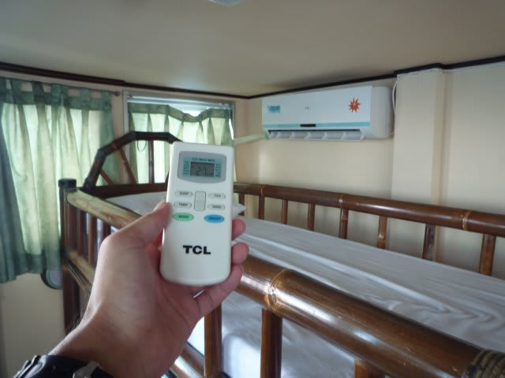

# コドモとコモド！子連れダイブクルーズ6　天国の6号室

📅 投稿日時: 2011-07-09 00:07:47

🏷️ カテゴリ: [ダイビング日記](ce3a7a8d424d112fce83ee85c81a0e344.md)

という感じで．

これから6日間を過ごすクルーズ船に乗船したわけですが．

まずは全ゲストが食堂に集合し，説明を受けます．

娘は，K村さんの説明中に，食堂に常備されている

バナナを発見し．

「バナナ食べたい．バナナ，バーナーナーっ！！」

…クルーズの説明中，一人で嬉しそうにバナナを食べてました．

まぁ，お前は説明聞く必要ないから，いいんだけど…

食堂での基本的説明が終わると，ダイブデッキに下りて

トイレやシャワーなどの説明です．

この船，トイレやシャワーはダイブデッキ部分に

ありますので…

で，説明が終わってみると．

この船，微妙にいろんなところが改装されてますね…

客室廊下と食堂部分の床が，カーペット敷きから

フローリング風シートに変わってたり，

トイレは完全に新しく作り直されてました．

(一昨年)

(今年)

便器はピカピカ新品です．

外壁も明るくなり，清潔感がかなりアップ．

…でも，数は変わってませんね．

トイレが2箇所，トイレ＆シャワーが1箇所，

シャワーが2箇所．

今回のゲストの10人くらいではトイレ待ちは

全くなく，全然気になりませんでしたが，

前回のように20人近く乗ると，もう少し

トイレがあるとうれしいんだけどなぁ．

さて．説明終了後，割り当てられた客室に入ると…

なんだこれは！！！！！？？？？？？？

ひ，広い…っ！！！

この船にこんな部屋があったとはっ！！！

（この写真で，部屋の半分．反対側にもう一組2段ベッドがある）

広すぎ．

子供が遊びまわれるくらい広い．

自分の家のリビングよりずっと広い．

運動会が出来るくらい広い．

我が家にあと子供が3人くらい産まれても大丈夫なくらい広い．

こっちがさっきの写真の反対側．もう一組2段ベッドがありますねー．

…つまり．2段ベッドが2台．

うち1台は，下段はダブルベッド級の広さ．

部屋の3方向は窓．

この部屋は船の前端にあるので，船の進行方向が

見渡せる，見晴らしのよさ！！！

この船の特徴である，客室が完全に水線上に

あるというメリットが生きてますね～

そして．部屋の真ん中にガラステーブルと椅子が2脚．

なんと．窓からの景色を眺めつつ，椅子に座ってのんびり過ごせる

贅沢スペース．

他のクルーズ船を含めて，ここまで広く，かつ贅沢な

部屋があるんだろうか．

天国の6号室！！！

子供づれなので，特別に広い部屋を準備してくれるとは

言ってくれてましたが…

ここまですごいとは．

こんな部屋があるとはっ！！！！

これなら，荷物が多い子連れでも問題なし．

（荷物をいっぱい広げてもこの程度)

いや～．すごい．

これは，普通のクルーズ船にはもう乗れませんな．

普通の狭い船室だと，子供が座って過ごすスペースなぞ

ないですが，

ここなら親子で椅子に座って，のんびり過ごせる…

そして．

なんと．全ての部屋に個別エアコンが．

前回乗ったときは無かったぞ？

これもありがたい…

子供は，二つ並んだ2段ベッドを繰り返し上り下りして，

「ジャングルジムみたい～！」

と大喜び．

この部屋だったら，子供を連れて5日間，問題なく過ごせそう…

と．

普通のクルーズ船にはありえない部屋の広さに感動する私を横目に．

「普通こんなもんじゃないの？」

と，クルーズ船への乗船経験が無い妻は言い放ったのだった…
