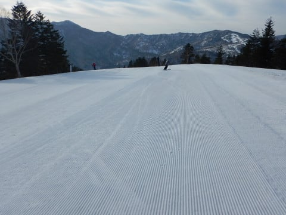
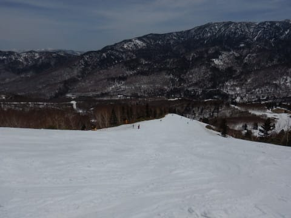
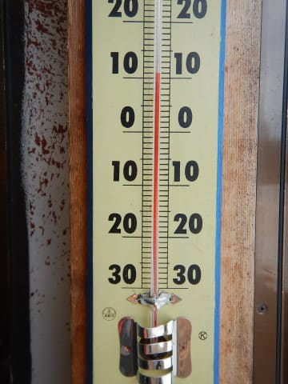

# 2019/5/3(金)，GWも後半戦の志賀高原スキー場は…終日晴れ！朝イチカリカリ，午前中に重い雪になったけどひどいザブザブ雪にならず．まだまだ雪たっぷり！

📅 投稿日時: 2019-05-03 21:23:47

🏷️ カテゴリ: [2019スキー滑走日記](c3e4496fc0fb7f9c17ff21214a35b1ace.md)

というわけで．

10連休も7日目が終わり．

GW前は，

「10日中9日もスキーしたら，

　さすがに飽きないかな？？」

と思ってましたが．

実際にGWも7日を過ぎると．

なんということだ…あと3日しか滑れないのか…

という気分になっている，Skier_Sです．

あぁ…20連休くらいで毎日スキー滑りたい←会社クビになるから．サラリーマンには無理

ってことで．

本日の志賀高原レポートですが．

まず．

早朝勝負のこの時期．

当然のごとく，6:30の早朝営業開始前に

並ぶわけで．

さすがに昨日より人は多く．

この後ろにも並んでいて．

トータル40人ほど並んでいたでしょうか…

で．

山頂にやってくると…

今日はピカピカ晴天でのスタート！

あさイチは放射冷却で冷え込み，

山頂の気温は0℃程度．

朝早くはさらに冷え込んだようで…

早朝一番のゲレンデは，かなりガリガリの

硬めに固まったシマシマバーン！

きれいなシマシマですが…

滑ると振動が膝に伝わる，

電動マッサージバーンです（ちょっと涙）

でも，朝日が差し込む中．

硬く締まってスピードが出るバーンが

滑れるのは．

この時期では早朝だけ！

昼間には重い雪になっちゃうのが

分かりきっているので．

この時間に，人の少ない締まったバーンを

気持ちよくかっ飛ばすのだ！！

…でも．

昨日の夕方のゲレンデが，

かなり荒れ気味だったからか…

圧雪されきってない凸凹が，

ところどころあったのが惜しい…

かなり雪が硬いので，

凸凹に突っ込むと，結構怖い

思いをすることができます．

気を付けて滑りましょう…

そして．

早朝営業開始後，1時間ほどで．

表面が緩み始め，ちょうどいい

エッジのかかり具合になってきましたよ！

表面がいい感じで緩んでエッジがかかり，

下地が緩み切らずにしっかりしている，

この時期としては最高に気持ちいいバーン．

このバーンを，思いっきり傾きながら

かっ飛ばせるのが，早朝のいいところ！

…そして．

通常営業開始の8:30に，

いつも通り通常営業開始と同時に

オープンのパノラマコースへ！

そうです．

早朝開始時に引き続き．

本日2度目のシマシマ，いただきま～す！！

雪は早朝より緩んでるけど．

でも，まだ下地まで緩み切っていない，

このシマシマを2度も味わえるゼイタク！

通常営業開始時のゴンドラで登ってくる人より

一歩早く，パノラマコースで2度目の

シマシマを味わえる，早朝スキーならではの

プレミアムです！！

そして．

第2高速沿いの唐松コースも一番乗り！

朝9時ごろまでは，人も少なく．

シマシマいただき放題！！

…ただ．

9時を過ぎると，

さすがにシマシマは消滅してきます…

で．

第2高速リフト沿いの唐松コース．

コース右側の，土が出てきているエリアが

ちょっと広がってきましたね…

そして．

最後の落ち込み部分も．

昨日からブッシュが出てきて，

ポールでバッテンされていたところ．

その下に，ちょっと土が出てきました…(涙）

でも．

遠目で見るとまだ全く分からない程度で．

この真ん中に，ちょっと茶色くなっている

部分がありますが…よく見ないとわからない

レベルですね．

まぁ，まだ滑るには問題ないかと．

焼額山は，それ以外のコースは，

まだまだ問題なく幅いっぱい雪が

ついていますし．

ブッシュの気配も

ありませんよ～！

何度も言いますが，今年は雪が多いですよ～！！

…しかし．

午前10時ごろになってくると．

さすがに雪はどっしりと重い，

春の雪になっていき…（涙）

完全なストップ雪というほどでは

無いですが，ちょっと滑りが悪く

なってきました（泣）

ただ．

雪の状態が悪くなっていくにつれ．

ゲレンデの人も減っていき…

なんだか，早朝より人が少なく

なってきたんですけど？？

だもんで．

昼過ぎには気温も+10℃に達し．

雪も結構重くなって来たのに…

なんだか．

午後になってもコースは意外と

荒れて来ませんよ？

さすがに，人が一番多いGSコースは，

昼過ぎには結構荒れはじめて．

夕方には結構な凸凹斜面になりましたが…

サウスコースの緩斜面や．

人が少ないビギナーズコースは，

午後になってもかなりフラットなまま！

だもんで．

午後になっても大回り板で滑れるん

ですが！？？

さすがに雪は重くて，

人が滑らないところは

汚れも浮いてきてますが．

1ゴンから滑り込みにくい2ゴン側の

パノラマコース．

1ゴンしか動いていない春営業期間は

滑る人が少ないからか．

夕方でもこんな感じなんですけど！？？

今年は，パノラマコース側から

イチゴンに戻るコースも，まだまだ

雪はたっぷりあるし．

今日の午後は，パノラマ～サウスコースが

良かったなぁ～．

最後に1本，1ゴン側のGSコースを滑って

締めましたが．

こちらも雪はたっぷりあるものの…

コースはすごい荒れてましたね（涙）

ってなことで．

今日もお約束通り．

ゴンドラ営業終了の4時まで，

滑り倒したのでした…

いやー．

しかし．

今年のGW．

ホントに雪が多い…

志賀高原は，営業しているコースは

どこもほぼコース幅いっぱい滑れます．

今日も気温が上がったとはいえ，

せいぜい10℃．

終日晴れたので，止まっていると

日差しで暑く感じるけど．

滑っているときは，ウェアを着ないと

風で冷えて寒い程度なので．

雪もブーツや板が埋まっていくような，

透明なドロドロに融けてないし．

GWと考えると，いい状況ですよ～！！

一の瀬ファミリー正面バーンも，

まだ穴はあいてませんよ～！＞KonSukeさんへ，S夫婦よりメッセージ

GWもまだ残り3日もあるし．

最終日まで雨になることはない

予想なので．

悩んでいる人は，志賀高原へいらっさーい！
