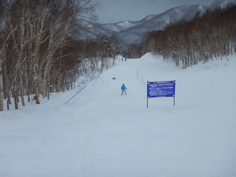

# 2月12日，3連休最終日の志賀高原詳細モード！…真冬らしい冷え冷えだったけど，標高が低いところは下地が固め（涙）もう一降りほしい…

📅 投稿日時: 2018-02-14 06:32:42

🏷️ カテゴリ: [2018スキー滑走日記](c11b88dc181f34079ab41db74a3587646.md)

これから一週間．

15日にわずかに降りそうなのを除くと．

志賀高原にはほとんど積雪がなさそうな

天気図なのに落ち込んでいるSkier_Sです．

うーむ．

これからの1週間もかなり冷えるんだけどなぁ…

でも．

きれいな冬型に入りませんね（涙）

西風ベースで，志賀にはほとんど積もらなさそう…（泣）

あぁ…そろそろパウダーも滑りたいんだけど，

もうしばらくお預けか…

ってことで．

昨日速報でお伝えした，3連休最終日の志賀高原

詳細レポートです～！

えー．

まず，朝ですが．

速報でお伝えしたように．

わが娘の

「今日は焼額のゴンドラ以外で滑りたい～！！」

という．

焼額第1ゴンドラ住人の娘としてあるまじき発言←住人じゃないから．ゴンドラに住んでないから

により．

蓮池スタートとなった，この日ですが．

えーっと．

なんだか，朝から吹雪いてるのですが？？

かなり寒そうなんですが？？

娘よ…

こんな日にゴンドラじゃなく，リフトで

滑りたいのですか？？？

という説得も聞き入れてもらえず．

まずは蓮池ゲレンデにでてみますが…

朝から結構雪が降ってるので．

圧雪コース上も5cmほど雪が積もってますね…

コース脇は10～15cmほどの積雪かな？

こんな中，まずは丸池を通過して，

サンバレーへ行ってみますが…

焼額住人の私．

毎週志賀高原に来ているというのに．

昼間の蓮池・丸池・サンバレーを滑るのは，

今シーズン初だったりします…←滑るところ偏りすぎだから

志賀高原にいるというのに．

すごいアウェー感が…

しかし，朝イチのサンバレー．

ガラガラですな…

とても3連休とおもえない…

で．

サンバレーを滑ったあとは，また丸池⇒蓮池と移動して．

トンネルをくぐって，そのあとの道を

とぼとぼ歩いてジャイアントに移動します…

本来なら，蓮池からジャイアントへの移動の

ロープトゥがあって．

これを使えばトンネルを

人が多い3連休のこの日も動いておらず．

おそらく，これは．

今シーズン動かすつもりはないな．

ってな感じで．

ジャイアントにやってくると…

蓮池・丸池・サンバレーエリアより人は

多いですね…

ようやくちょっと3連休らしい感じかな．

ジャイアントは素通りし，西館を突っ切りますが…

西館はちょっとだけリフト待ちがあり．

さすが3連休…といった感じ．

西館クワッドを降りた向こう側．

普段は混まない西館の高天ヶ原側も…

今日は人が多め．

とはいえ，天気が悪く異常に寒いので．

昨日に比べると，人数はぐっと減った感じです…

で．

高天ヶ原も，リフト待ちはゼロだったけど．

ゲレンデの人は多めで…

一の瀬ファミリーは，修学旅行生でかなりの

人口密度でした…

いや．

この寒いのにリフト滑って，修学旅行生も大変だ…

さらに寺子屋まで行ってみると…

いや．

さーむいよっ！！

そして，景色も何にも見えないよ！！

気温は-13℃で，さらに風も吹いてるので…

体感温度は半端なく寒いよ！

ただ，その代り．

西館より下は，ちょっと下地が

固い感じがあったけど，

寺子屋は雪質が良かったなぁ…

さすがに寺子屋は寒すぎるので，

早々に退散！！

で．

昼を過ぎると…

あら．

ゲレンデはガラガラになってきましたよ！？？

東館山に移動してみたけど，

タイミングによっては貸し切り状態！

…ただ．

東館山はところどころ雪が薄くて．

ありゃ？？

なんだか，出てきてはいけないものが

ところどころに…（泣）

東館山オリンピックコースの最後の

つづら折り部分．

かなりの浮石が出てました（涙）．

石が出てないところも，西館より標高が低い

ゲレンデは，下地の固めの雪が出てきているところも

あって．

うーむ．

やはり，1月は積雪が少なかった志賀高原．

まだ，雪が足り無いようで…

昼を過ぎても，気温は-10℃とかなり

寒かったので．

リフトに乗ってると凍死しそうだったので，

午後は東館ゴンドラをグルグル…

人が少ないコースをガンガン滑れます！

そして，昨日レポートした通り．

娘は金さんと銀さんの両方ゲットできて，満足…

この日の午後はガラガラだったため，

ゴンドラ乗り場前で「金さんが来た～！」

と，狙った搬器が来たのを見て走れば，

その搬器に乗れるくらい待ちがなかったので．

無事両方ゲットできました…

そして，

西館に移動したけど，午後はこっちもガラガラ！

西館初級コースには，ちょっとプチパークっぽいのが

できてましたね…

最後はジャイアントを通って…

またサンバレーに戻って，

16:30のリフト終了まで滑って，

今日のツアー終了！

サンバレーまで来ると．

標高が低いため，ゲレンデはコロコロがいっぱいで．

雪質がちょっと残念な感じでした…

うーむ．

トップシーズンの2月というのに．

やっぱりちょっと積雪が足りないなぁ…

今日も雪降りの一日だったけど．

パラパラと降る程度で，そんなに積もらず．

やっぱり，もう一降りほしい…

って感じで．

この日は．

志賀高原にいながらも焼額に行かないという．

焼額メインの私としては，今シーズン初となる

焼額不参加の一日を過ごし．

おそらくたぶん．

私が焼額に行かなかったから，天気が激冷えの

雪降りの一日になっちゃったんじゃないか…

と反省しているSkier_Sなのでした←だから違うから．あなたが志賀高原の天気を決めてるんじゃないから

## 💬 コメント一覧

### 💬 コメント by (サトシ父)
**タイトル**: 今度こそ！
**投稿日**: 2018-02-14 19:00:45

11日ヤケビを徘徊してましたがお見かけできず残念でした。連休の中日でこんなに混んでる志賀高原初めてかもって位でした。正直Sさんを探す気力が萎えました…次回は再来週の予定です。次回がんばります！私もK県民ではありますが、渋滞なしで片道4時間です。きっと安全運転のSさんなんだろうと想像しています。

### 💬 コメント by (Skier_S)
**タイトル**: サトシ父さま
**投稿日**: 2018-02-15 04:00:21

11日は朝から終日ヤケビを滑ってましたが…

うーむ．

お会いできず残念…

この日は，子連れの4家族が集まって

滑るというかなりにぎやかな午前中で，

子供5人と一緒に滑ってましたが…

ゴンドラ混雑中はずっと3高を滑ってました．

次回再来週お会いしましょう…！

でも，同じK奈川県民なんですね．

うちは高速のインターに出るまでが

ちょっと時間がかかる場所なので，

4時間半かかっちゃいます…

