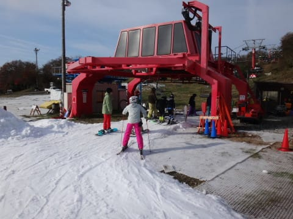

# 2013/2014シーズンオープンから3週目，11月9日土曜のYetiは…意外と空いてたよ

📅 投稿日時: 2013-11-09 22:32:28

🏷️ カテゴリ: [2014スキー滑走日記](c992167609b6415052179ee69ea1ea7d8.md)

うーむ．

確か．今週は．

[火曜まで，南の島にいた](e4543948249d8bebd229ff0fe4dee55d6.md)はずなのに．

中3日挟んだだけで，土曜にはスキー場に来ているという…

って感じで．

週末3回で，スキー→ダイビング→スキーと，激しい季節の移り変わりを

体験している今日この頃，皆様いかがお過ごしでしょうか．

とゆーわけで．

季節感がむちゃくちゃになりつつある中．

本日は2週間ぶりのYetiへ行ってきたわけですが．

さてさて．

本日のYeti.

朝はすっきり晴れて，富士山がきれいに見えましたね～！

8時オープン時点は，人も少なくガラガラ！

こんな感じのうひょうひょバーンが待ってます！

雪の厚みも十分．

こんな感じで先々週より幅が広がったコースを，

人をよけることなく滑ることができて．

朝イチは，リフト待ちもほとんどなし！

うひょー！

この朝イチ，今シーズン3日滑った中で，一番いいコンディションだなっ！

でも．

朝イチのうちはいいけど．

今日は天気もいいから，これからかなり混んでくるんじゃないかな～…

と，危惧していたけど．

午前10時近くになっても．ゲレンデの人口密度はこの程度．

オープンから1時間半以上，結構快適な中回りを楽しめちゃいました！

うひょー！

この時期に，これだけ滑れれば結構いいなぁ…

で．

11時になっても，リフト待ちがこれだけ，3分程度の待ちしか無い！

一体，なにがあったんだ？

ってほどの空き具合．

11時すぎには，ちょっと曇り始めてきたけど…

でも，ゲレンデの人はいつもより少なめですねー！

いや，この時期のYetiとしては，上出来！

…と，快感だったのは，午前中まで．

土曜は昼過ぎから混み始める，このスキー場．

1時ごろには，さすがにリフト待ちも5分を超えるくらいになり…

ちょっと人が増えてきたな～，

と思ったら．

平行したペアリフトが動き出しました．

その後は，クワッドリフトも5分以下の待ち時間．

ペアリフトは完全に待ち0．

いや～．

この時期のYetiとしては，かなり空いてるよ．

いいじゃないですか．

リフト2本体制で，リフト待ちはなくなったけど．

リフト2本でゲレンデに人を運ぶことになるので．

ゲレンデ人口密度は，午前に比べると上がってしまい…

滑り出しの部分も，ボードを装着する人たちで混みだしてきたけど．

(富士山も午後は雲で隠れちゃいました)

…でも，まぁ，いつもの土曜に比べればかなりマシですね～．

あー．

午後，ゲレンデにわずかに土が出てきた場所があったのは惜しかったけど．

んで．

天気は．

…朝のうちは晴れ．

11時ごろから夕方まではずっと曇りって感じで．

日が射した午前中はちょっと暑いくらいだったけど．

午後は結構冷えましたよ～．

日が射さない天気のときは，ウェア着ていったほうが

いいですよ～！

…ってことで．

これまでに比べて，コース幅もそこそこ広がり(っつーても廊下なのは変わりないけど)

土曜というのに．

そこそこ空いていて，待ち時間も少なく滑れたので．

結構満足な，本日のYetiでした！

