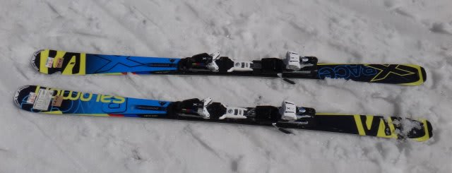
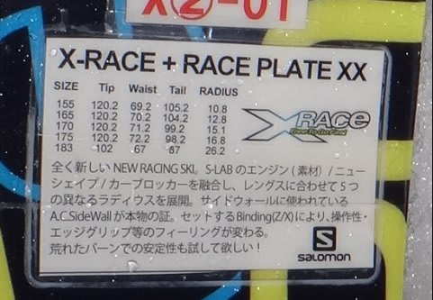
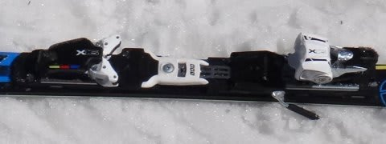
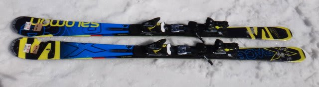
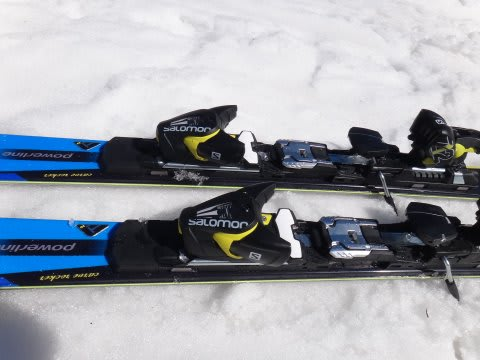
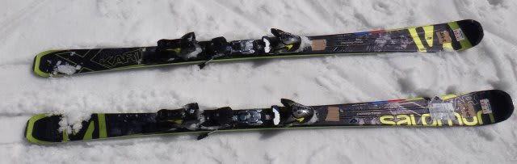
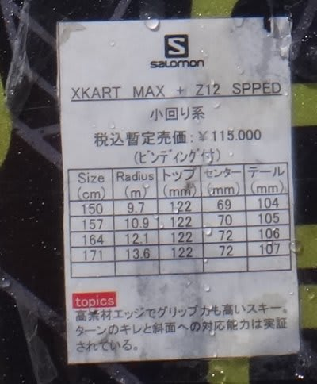

# お待たせ！2014シーズンモデルのスキー試乗レポートその1…SALOMON編

📅 投稿日時: 2013-03-21 01:24:58

えーーー．

つい先ほど，遠い出張から戻ってきました．

ってことで．

大変お待たせしました…（え？待ってないって？）

…

…大変お待たせしました(あえて強調してみる)

…待ってた人がいるということにして，進めます．

先日，尾瀬岩鞍で試乗してきた2014シーズンスキー板の

試乗インプレッションです．

んで．

当日の天気は晴天．

雪質は，かたい下地の上が溶けてクリーミーになった感じ．

どこまでももぐってしまうようなザブザブ雪ではなかったものの，

溶けた雪は比較的やわらかく，どちらかというとフレックスのかたい板，

整地スペシャルな板は不利な条件だったかも…

で．

いつもの注意事項ですが．

レポートを書いているのは，テククラも指導員資格も持っていない，

単なるレジャースキーヤーです…（汗)．

レジャースキーヤーの単なる感想ですから，

私が「ダメだー！」って書いた板でも，他の人にとっては最高の板かもしれませんし，

私が絶賛した板でも，他の人にとって「なぜこの板を誉める…」って板かも知れません．

ってことで．

あくまで参考程度に読んでやってください…

ということで，まずはSALOMON編，どうぞ～！

-----

○SALOMON X-RACE X16 170cm

えー．

レース用…なのかな？

SALOMONは，S-LABモデル(選手用)ではない，レース向けセカンドモデルとして，

このX-RACEという一つのブランドを165cm～183cmまで展開するようですが…

長さによってサイドカーブが全く異なるようですけど．

170cmのR=15って，SL用なんだかGS用なんだか微妙な長さですが…

で．

試乗したのは，170cm，X16ビンディングをつけたモデル．

あー．ATOMICのSXやAXの「X」モデルと同じATOMICのXビンディング，

開放値が16まであるやつですね…

X16ビンディングって聞いただけで，強そうな板の感じがしますが…

案の定．

…強いよ…

かなりがっつりしたエッジグリップ．

どっしりした板の重量感．

結構しっかりした板の張り．

今日のような春雪では，板をたわませていくのが難しいと感じるくらい，

強い板です．

で．

エッジグリップがトップからテールまでかなりしっかりしているうえ，

スイングウエイトがかなりずっしりと重いので，小回りはかなり難しいです．

この日の雪＆私の技術では，板をたわませることもずらすことも難しく，

ひたすらサイドカーブにのって落ちて行くだけの滑りしかできなかった…

でも．サイドカーブに乗って曲がっている分には，安定感があります．

とても170cmとは思えない安定感．180cmクラスの感じを受けます．

…やっぱ，この板はレース用ですかね～．

足場がしっかりした，かたいアイスバーンで滑るといいでしょうが．

うーん．ゲレンデスキーには向かんなぁ．

 ○SALOMON X-RACE Z12 165cm

こんどは，同じX-RACEでも，短めの165cmを履いてみました…

さらに，ビンディングも弱めの，SALOMONのZ12ビンディングです．

…でも，Z12ビンディングの下にはなんだか強そうなプレートがついてますね～．

この板も，やっぱりしっかりとしたグリップ．どっしりとした重さ．

かなり強めのフレックス．

しかし，さすが170cmより小さめの半径で回ってきます．

でも…R=12.8ってことですが，感覚的にはそれより大きいです．14-15mくらいの感じ．

んで．

Z12ビンディングでも，ずっしりと重いです．

不整地で飛ばされると．

足元にありえないくらいの重さを感じます．足にずっしりと響く感じ．

とばされたのをきっかけに，板をスイングさせようとか思わないほどの重さ…．

フレックスの硬さともあいまって，コブとかには向かなさそうです…

この板も．おそらく，しっかり硬い整地で本領を発揮する感じですねー．

ゲレンデの普段履きには，ちょいときつい感じ…

○SALOMON X-Kart MAX 164cm

…これまで，「24hours X-Kart」だったのが．

24hoursが取れて，後ろに「MAX」がつきましたね…

SALOMONの人いわく，「フレックスを少し強めにしました」ってことですが…

確かに，テールの張りがちょいと強くなったかな．

今年のX-kartは，角付けするとどうしようもなく板なりに曲がっちゃう板でしたが．

来年モデルは，テールのフレックスの強さを出したので，ある程度たわみ量が

コントロールできるようになって，乗り手の操作範囲が増えた感じ．

今年モデルが板なりの小回り以外不可能な小回りスペシャルとすると，

来年モデルは小回り～中回りまでの自由度がある感じですか…

でも，ちょいとトップのグリップが弱めに感じます…

荒れた斜面だと，ちょっとトップのエッジが効かず，トップが落ち着かない感じ．

トップのロッカーが強すぎて，圧がトップにかかっていないのか，

板のチューンナップなのかがわかりませんが…．

ってことで，トップが内側に入って曲がってくる板ではなく，足元からテールに

かけてのグリップで曲がっていく感じの板です．

で，テール部分のたわみがある程度コントロールできる感じ．

ってことで，踵加重で，足首を起こし気味にして，トップを使わないイメージで滑ると

テールの張りを感じられていい感じでした．

板自体はかなり軽快に感じます．

たわみによる圧の溜りとか，圧の開放とかもそれほど感じられず，軽快に

回っていく感じ．

フレックスはそこそこしっかりしているので，ある程度のスピード耐性はあるけど，

あんまりカリカリ攻めて滑るタイプでは無いですね～．

…なんだか，去年感じた驚きはなくなっちゃったかも．
