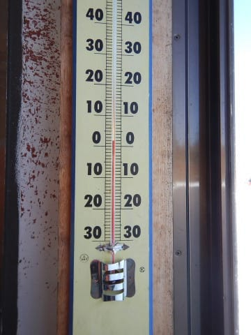
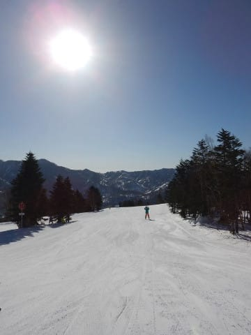
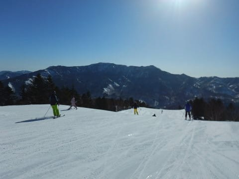

# 3月4日(日)の志賀高原詳細モード！…ヤケビ午前中に壊滅状態（涙）．いい雪を求め，ヤケビを脱出してみた

📅 投稿日時: 2018-03-06 03:57:00

🏷️ カテゴリ: [2018スキー滑走日記](c11b88dc181f34079ab41db74a3587646.md)

あぁ…

春だ…

春ですよ．

気温も上がるし．

涙が出まくりです…

あぁ…花粉がツライ…←そっちか！！

ってなわけで．

先週金曜から突然大量に飛び始めた

花粉に悩まされているSkier_Sです．

で．

本日．

やはり，志賀高原．

雨になったようですね…（涙）．

志賀高原に送り込んでいる有能な特派員（？）から

レポートがありましたが．

えーこちら志賀高原

朝から小雨、更に強風でゴンドラ運休

さきほど３高も運休しました。。。

雨と強風とゴンドラ運休の三重苦です！

おまけに、避難していた第三高速まで10時

過ぎには運休となり、泣きながら移動中の

哀愁スキーヤーとなってしまいました(泣)

ということらしく…

今日の焼額は，1ゴン，2ゴンは終日動かず．

3高も午前中に止まるくらいの強風で．

夕方まで雨が降り続けたようです（涙）．

でも．

ライブカメラを見ると．

夜は雪になったようですね…

…あんまり積もらずにやんじゃいそうですが（泣）．

そして．

今週は…金曜9日もヤバそう（涙）．

この週末も，かなり微妙な天気＆雪に

なりそうな予感…

でも．まだどうなるか分からない！！！

なんとかなる！

激荒れどしゃ降りかも…と思ってた木曜も，

ひどい雨にならずに済んだし．

踊り続ければ何とかなるっ！！

冷え冷え降れ降れゲレンデコンディション改善しろ踊りを

踊るぞ！踊り続けるぞ…！！←なんだか，踊りの名前がえらく伸びてないか？

ってな感じで．

前フリが長くなりましたが，本題へ．

日曜の志賀高原，詳細レポートです～！

えー．まず．

なんということか…

朝イチの山頂の気温がプラス気温

という．

普通の3月上旬ではありえない気温で始まった

日曜日．

朝イチから太陽がサンサンと照り付けて…

…これは，今日は．

かなり雪質が悪くなりそう…（涙）．

ただ，朝イチは比較的締まったきれいな圧雪で．

結構いい雪質！！

朝のうちは，予想以上の快適シマシマバーンを

かっ飛ばせます！

うむ！！

意外といいじゃないですかっ！

…しかし，2本ほど滑ると．

やっぱり，雪がだんだんとしっとりと

してきたんですが…（ちょっと涙）．

気温が高いだけならまだ良かったんだけど．

すっきり晴天の，強い日差しにさらされて…

うーーーむ．

営業開始わずか1時間で，ゲレンデはかなり

荒れ始め…

雪の上に，ダマダマが大量発生

し始めます…（涙）

春スキーだと思えば，

…天気が良くて，あったかくて．

景色も良くて．

のどかないい感じなんだけど．

この強い日差しのおかげで．

うげげげげげげ．

ゲレンデはあっという間に，

3月はじめと思えないレベルの

モサモサが溜まっていく雪と

化してきたんですけど…（涙）

なんてこった…（絶望）

そして，ゲレンデの人も増えて来たんですけど…（泣）

でも，1ゴンは今日もそれほど長い列にならず．

最大の待ちでもゲートから外に数人並ぶ程度，

ただ，2ゴンは10分待ちまで行ったようですね～．

あ，そうそう．

この日も晴天だったので，営業は15分延長して，

ゴンドラが4:15，リフトが4:30までの営業に

なりました～！

しかし．

強烈な日差しが照り付け．

さらに，気温もぐんぐん上がっていき．

暑いくらいになってきて…

…なんだよ～っ！！！！！

標高2000mの山頂でプラス8℃って！！？？

これは…4月末，GW並みの気温だよ…（激烈猛烈涙）

だもんで．

ゲレンデの雪は，一部がしっとりと水を吸ったような

雪になり．

スキー板に粘りつくような，滑らない

雪になってきちゃいました…（激涙）

これは…

やむをえまい．

焼額を愛する私ではあるが．

朝日があたる東斜面の焼額は，雪が

悪くなるのが早いので…

焼額を脱出して，北斜面の奥志賀へ遠征！

奥志賀の第2ペアリフト沿い，エキスパートコース．

一見良さそうに見えるけど…

…あぁ…北斜面のここも雪はかなり解け気味で．

かなり重いダマダマ雪が溜まってます…（涙）．

ひどい貼りつく雪ではなかったものの．

焼額と変わらないレベルの重い雪だったので．

次へ移動っ！！

次にやってきたのは…

一の瀬ファミリー．

12時頃にやってきたけど…

西斜面で，朝のうちは日陰になる一の瀬ファミリー．

パーフェクターコースは，わずかにダマダマに

なりかけてるけど，下地はしっかりしていて…

意外といい！！

まだまだいけるよ！

そして，正面バーンは…

おおおお！！

素晴らしい！！！

やはり朝のうちは日陰になる，真西斜面！

まだ全然ダマダマも出てないし，

板も滑るし，すごいフラットだし，

これはいい！！

…と，しばらく滑っていると．

残念ながら，午後2時ごろには．

一の瀬ファミリーも，強い日差しと高温に

やられちゃったんですが…（涙）．

ダメだ…ここも，貼りつく雪になっちゃったよ…（泣）．

ってことで．

残るは，さらに標高が高い寺子屋に行くしかない！

…をを！！

午後2時過ぎというのに．

ここはまだ雪が良さそうだよ…！！

ってか，実際にいいよ！

まだほとんどダマダマ雪が出てないし．

雪も貼りつかないよ！！

良かった…

もう，志賀高原全面アウトかと思ったけど．

寺子屋がまだ滑れる雪で残ってくれたか…（感動）

幸いなことに．

夕方4時近くまで，寺子屋はまともな雪を

キープしてくれて．

良かった…

寺子屋があって，良かった…

そして．

営業終了間近の．日が傾いたころ．

我が住み家（住んでないけど），焼額へ戻ってきましたが…

朝日があたる東斜面の焼額は，

夕方には日陰になるので．

太陽が隠れたコースは，雪が固まりはじめ…

うげげげげげ！！

この形のまま凍り始めてきたんですが？？

かなり滑りにくいのですが…？？（涙）．

と，嘆きながらも．

夕日が沈みゆくゲレンデを．

今日もしっかり，リフトストップまで

滑り続けたのでした…

…しかし．

天気は良かったけど．

普通なら喜ばしいことだけど．

気温がこれだけ上がると，日が射すと

雪がひどいことになりますね（泣）．

とても志賀の3月第1週とは思えない雪の

状況でしたが…

これから積雪の積み増しはなさそうだし．

また9日の金曜に液体が降ってくか

どうかというレベルだと…

…

…

この週末も．雪質の劇的改善は厳しそう…（涙）．

うーーーむ．

せめてもう一回，パフパフパウダーで滑りたいんだけどなぁ…

今シーズンはもうパウダーは終わりか…（泣）．

## 💬 コメント一覧

### 💬 コメント by (新潟のスキーヤー)
**タイトル**: リベンジ失敗！？
**投稿日**: 2018-03-06 18:54:36

お久しぶりでございます。

本日、極上のシマシマを求めて志賀高原まで足をのばしたのですが…

昨日までの天気で予想はしていましたが…

ガチガチの上に殺人コロコロが大量発生！

全然気持ち良くな～い！！

ピーカンだったので景色は最高だったのですが…

多分、明日も同じ様な状況でしょう…。涙

### 💬 コメント by (michi)
**タイトル**: Unknown
**投稿日**: 2018-03-06 20:23:52

花粉症、ホントに辛いですね。

やはり長野より関東の方が花粉が多いようです。今年はいつもより早くて辛い期間が長そうで憂鬱です。

週末の暖かさと昨日の雨でヤケビの雪が20センチくらい減ったようですね（泣）

少し降ってくれないとヤバいです。

### 💬 コメント by (いー)
**タイトル**: Unknown
**投稿日**: 2018-03-06 21:13:11

まさかのファミリーでお会いするとは(笑)

リフトではお世話になりました‼

11:00頃 ヤケビに行きましたが滑らない雪にがっかり… そんな時は、3高フーディ横のコブでコソ練 結構楽しかったなぁ～

### 💬 コメント by (Skier_S)
**タイトル**: もう一度パウダーを滑りたい…（懇願）
**投稿日**: 2018-03-07 00:42:49

＞新潟のスキーヤーさま

お久しぶりです～！

いや，火曜はガチガチだったんですか…やっぱり．

でも，月曜の強風運休＆雨に比べれば，

ピーカンなだけ，まだマシだったということで…

（無理やりのポジティブシンキング）

明日も滑るのですか？？

おそらく明日も晴れそうですが，

そこそこ冷えるので，雪は固いかと…

晴れなくていいから，雪が欲しい…

＞michiさま

いや，ホントに突然花粉がやってきました…（涙）．

やっぱり月曜日の荒天で，かなり雪が減ったようですね．

うーーむ．

あと1週間，積もってくれるタイミングはなさそう…（泣）．

春営業，大丈夫かな…（心配）

＞いーさま

焼額の雪が悪すぎて，さすがの私も

一の瀬・寺子屋方面に遠征しました．

これは私の4月下旬の行動パターンなんですけど，

今回は4月並みの貼りつく雪になったので，

朝日があたらない一の瀬方面へ逃げました…

3高横，ミドルコースのコブの雪はブレーキ雪

じゃなかったですか？？

あの日の昼間の3高のコブじゃない斜面は，

すさまじい貼りつき雪でした…（涙）

