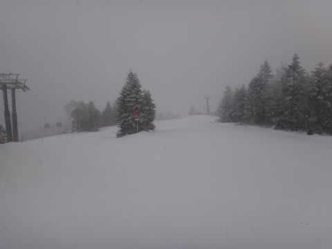
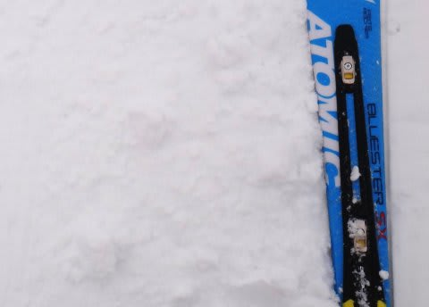
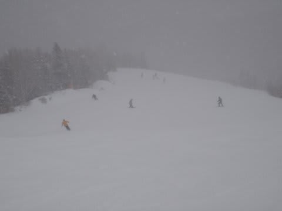
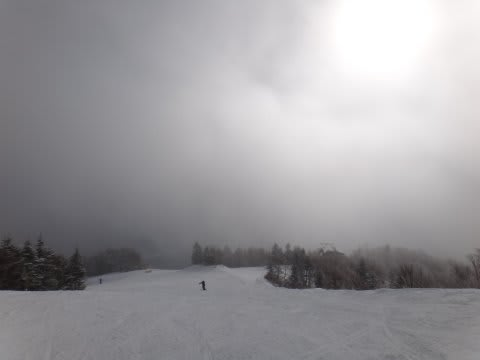
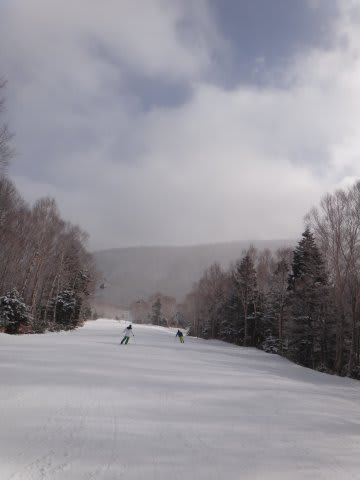
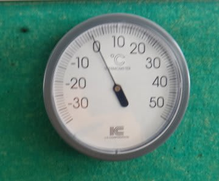
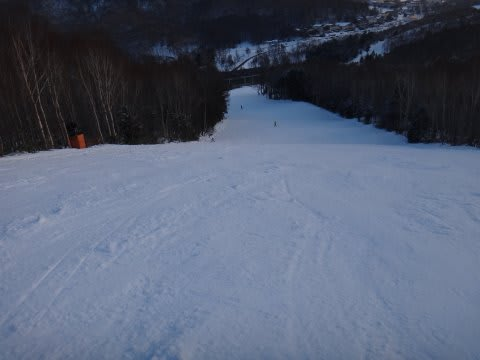
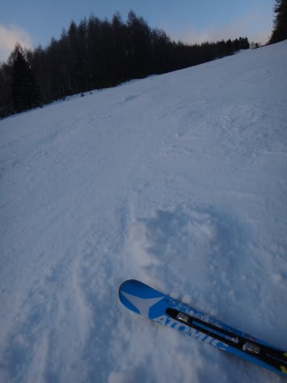

# 12月16日(日)の志賀高原は小雪…天気予想おおむねあたり

📅 投稿日時: 2012-12-17 01:25:27

🏷️ カテゴリ: [2013スキー滑走日記](c91dbe557f9a69230b1600e48622fdd61.md)

えー．

今日も一日焼額で滑ってましたが．

[金曜段階の天気予想](e38b637ad96459cc1c84e986709bbe0b2.md)に

日曜は朝までは雪が降りますね．

って書いたとおり，

朝は雪が降ってました…

んで．

志賀高原は，アイスバーン＋重い新雪がうっすらと，って感じかな．

って，この予想がどんぴしゃ当たったゲレンデ状況．（当たらなくていいのに…)

つるつるアイスバーンではなかったけど，カリカリと固いバーンの上に，

うっすら2－3cm雪が乗ってる程度…

ピステンの跡が，透明な氷になっているのが分かるでしょうか…

そして．

アイスバーンの上には氷のころころが…

ううううーむ．

微妙．

あんまり楽しくない…

基本的に午前中は，小雪が降り続け，時々強く降りましたね～．

でも．

アイスバーンが隠れるほどつもってはくれず…(涙)．

で，

でも，午後には晴れてきますね．

久しぶりの太陽の下ですべれるのが，救いかも．

ってところは．

昼ぐらいは雪はやみ，太陽も顔を出し始めたものの…

結局，晴れたのは午後3時近くですかね～．

ちょっと晴れたのが遅かったので，あんまり太陽の下で滑れた，って感じはなかったなぁ…

でも，気温が上がりそう，という予想のとおり．

昼間の気温は，山頂でもプラス2度まで上がりました…(泣）．

でも，強い日差しがなかったので，それほど気温が上がったと感じられず．

固い斜面はそんなに緩みませんでしたが(さらに涙)．

まぁ，今日は第1ゴンドラと第2ゴンドラのどっちも動いたので，

ゴンドラが全く込まなかったのがせめてもの救いでしょうか．

夕方になり，気温が冷えると…

こんな感じで，荒れた斜面がそのまま凍っちゃいました．

…これ，やわらかい雪じゃないですよ．

この形で凍っちゃってます(悲）．

…って感じで．

天気予報は見事当たったものの．

ちょっと悲しい感じの，日曜の志賀高原でした…
