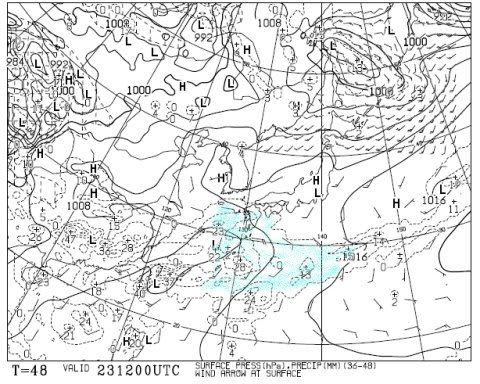
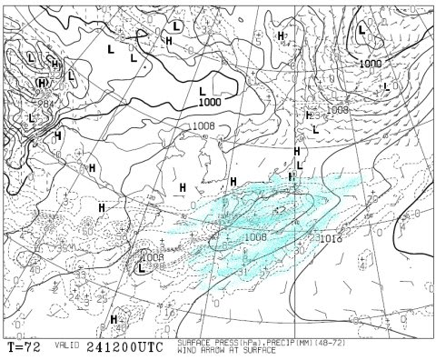
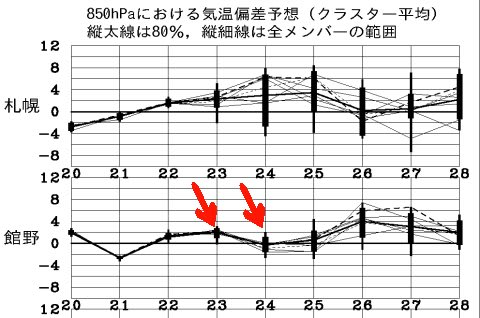

# まだ続くスキー天気予想．今週末のかぐらの天気は…土曜は晴れ．日曜は曇り，かな．

📅 投稿日時: 2015-05-22 01:16:56

🏷️ カテゴリ: [スキー天気予想](c6554f5c3c106093b511a8daae23757e8.md)

ということで．

はっきり言って．

この時期，スキー場の天気を気にする人は．

もう絶滅危惧種に近いほど，希少だと思うので．

…このBlogの天気予想を必要とする人も．

それはもう，かなーーーーり少ないのではないか…

と，思う今日この頃なわけですが．

まぁ．

それでも．

この時期に，こういう情報を必要とする人は．

「滑らないと死ぬから，何があっても滑りに行く！」

とか，

「仕事が死ぬほど忙しくても滑りに行く！」

とか，

「多少体調が悪かろうが，滑らないともっと悪くなりそうだから

　滑りに行く！」

とか．

…そういう人ばっかりで，←それ，全部自分のことでは？

そういう人たちは，もう，かなり必死になって，

いろいろ情報を集る人ような人たちだろうから．

おそらく，天気予想を見てくれる人もいるだろう…

と信じて．

…今週末の天気予想，行くのだ！

えーと．

…

土曜日の天気図は，と．

こんな感じで．

水色で塗った，前線による降水域は，太平洋側はるか南ですな．

日本海側は全然OK．

これは，晴れです．

1日晴れます．

で．

日曜の天気図は，こんな感じで…

うううーーーん…微妙なところ．

夜9時までの降水予想域，ぎりぎり日本海には

かかってないのですが．

うーむ．

朝から雲が多め．

午後はガスったり，霧雨っぽい雨が降る可能性があるかな～．

気温自体は，850hpa気温がこんな感じなので…

まぁ，大体平年並みか，それを上回る程度．

日が射せば長袖Tシャツでも十分行けるくらいでしょう．

とゆーことなので．

まとめると．

土曜日：朝から1日晴れ．日が射すので，暑いよ！

　　雪は終日粘つく，滑りがあまりよくない雪でしょう…

日曜日：朝から1日曇り．気温は平年並み．午後には，

　　山頂に近いかぐらエリアでは，ガスが出たり，

　　霧雨っぽい，湿り気の多い空気に覆われるかも…

　　

という感じですかね～．

私は日曜に予定があるので，土曜日帰り予定！

＃個人的には，この時期は晴天より多少曇ってくれた方がうれしいんだが…
