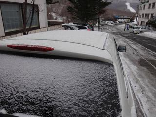

# 3月20日、3連休中日の志賀高原は…全山春のアイスバーン祭り絶賛実施中！（涙）

📅 投稿日時: 2016-03-20 22:55:25

🏷️ カテゴリ: [2016スキー滑走日記](c70c67ed5248e9432b899dcd5747048bb.md)

えー．

この週末．

ノートPCを持ってくるのを忘れ，

たまたま同宿だった他人のPCをお借りして

Blogを書いているSkier_Sです．

＃一瞬、記事を書かないという選択肢も頭をよぎったのですが…

＃写真サイズがいつもと違うのもその影響です

ってことで．

本日、３連休中日の志賀高原ですが…

…

…冷えましたよ．予想通り…

で．

先日の天気予想に書きましたけど．

　　朝は，前日の雨で溶けた雪が固まったアイスバーン．

　　昼間も気温が上がらないので，終日固いバーンコンディションでしょう…

…って．

ええ．書きましたけど．

そんな当たらなくていい予想が，

ドンピシャ当たらなくてもいいじゃない…（涙）

なんで、こんなことに…(泣)

とりあえず．

積雪は、わずか５mmってところで始まった、朝．

天気は曇り、小雪もちらつくという、

予想通りの天気の朝で．

気温は…

ここも、水曜日の予想がぴったり正確で、－５度ですか…

ふむ．

昨日は、雨だったと．

今日まで積雪はなかった、と．

で、本日は冷え込んだ、と．

これは…

はい．

このシマシマを拡大してみましょう．

はい、ズーーーーム、インっ！！！

…そうです．

凍ってます．

ゲレンデ全面氷ですっ！！！

春の全山アイスバーン祭り絶賛開催ですっ！！！！！（涙）

…気持ち良いはずの朝イチが．

かなりの振動を伴うガリガリ全自動マッサージ機能付き

バーンと化します．

前日が高温で溶けたならまだしも、

雨で溶けた水分たっぷりの雪がそのまま凍ったので、

かなりガチガチ＆凸凹な、滑りにくいアイスバーン…

それでも、朝イチはひともすくなくフラットで良かった．

朝イチは、まだ良かったのだ．

ところが、数本滑ると…

あたたたたっ！

ゲレンデ全面、氷コロコロ敷き詰めバーンに…（激涙）

ガチガチで、キャタピラ跡が残るような凸凹アイスバーンの上に．

大量の氷コロコロがばらまかれているという…

「こりは、何かの鍛錬の場でしたっけ？？」

と問いたくなるような修行バーン化（涙）

…そして、追い打ち．

３連休中日なので…

え？？

えええええ？？？

なんですと？？

第２ゴンドラ、15分待ちですか？？

この斜面を、15分待ってまで滑りたいですか～？？？←あなたも滑ってるでしょ

ただ、第1ゴンドラ側、コースは混んでいたけど、

なぜかゴンドラはガラガラで．

第2ゴンドラが10分以上街だったのに、

第1ゴンドラは最大1分待ち程度だったのが、

せめてもの救いだったでしょうか…．

コース上は、昨日雪が薄くなっていたところは、

一部雪寄せしてなんとか継続している状態で．

（写真の左側の雪を右側に寄せてある）

雪が結構薄くなっている箇所もちらほらあります…

来週高温だったら、来週末はやばい感じです…（激涙）

そして．

苦しみはこれだけで終わらない．

午後になってくると…

…今度は、ガスですか…

もう、いいよ…

何が来ても、もうぼくは驚かないよ…（遠くを見る目で）

アイスバーン＆

氷のコロコロ＆

コース上激混み＆

ところどころブッシュ＆

ガスで前が見えない

という5重苦を背負いながらも．

滑り続けるしかない本日．

午後はアイスバーンが削れた、砂のような重い雪が

ところどころゲレンデを覆っていき。

こういう混雑の中を、こういった凸凹アイスバーンと…

その上に乗った、砂のような雪のまだらという、

難しいコンディションで滑らざるを得なくなり．

た、楽しくない…

雪不足でいろいろあった今シーズンですが．

おそらく、一番楽しくないコンディションの一日です．

ってか、ここ数シーズンでもワースト１のような気が…

ダメだ．

今日も、ダメだったよ…

…と、悲しみつつも．

焼額山が営業終了したあともリフトが動いている一の瀬へ移動し．

焼額のような凸凹したアイスバーンじゃない、

大勢のスキーヤーに磨かれて、つるつるアイスバーンに

なっている一ノ瀬正面バーンを．

５時リフトストップまで滑り続けた、

Skier_Sなのだった…←それでも最後まで滑るのね（お約束のツッコミ）

…

だもんで．

この悔しさを晴らすべく．

ナイターでリベンジです！！

ナイターバーンは、かなり固めで、

コロコロもいっぱいある凸凹の

圧雪だったけど…

んでも．

人も少なく、シマシマがそれほど崩れない

比較的まともなバーン状況が最後まで続いたので．

昼間のうさを晴らせる、超ハイスピードぐるぐるを

堪能でき、ちょっとは満足できたSkier_Sなのでした…

…しかし．

皆さんの日頃の行いが鬼のようによければ．

明日は新雪フワフワが10cm積もるはずなんだけど…

…今のところ、全く降る気配はないのですが…？？

明日の朝．

皆さんの日頃の行いが良かったどうか、明らかになりますので…

## 💬 コメント一覧

### 💬 コメント by (aqura)
**タイトル**: Unknown
**投稿日**: 2016-03-21 06:34:31

おはようございます(月曜日の朝)。土曜日は、天気がヤバイとのSkier_Sさまの予報に従い(？)、土曜日はキャンセルして、日、月曜日参戦しています。

いゃ～あ、日曜日、修行、修行の１日でしたね。だい2ゴンドラへの荒れたコースに立ちすくんでいると、お隣に「あれ、Skier_Sさん？ 写真を撮ってましたね」、(^○^)

もう滑るのやだと、思いながら、一の瀬辺りをぐるぐると、4時近くまで頑張りました。

月曜日に期待していたのてすがU+3030この朝の天気U+3030(-。-;)

### 💬 コメント by (べべ)
**タイトル**: 昨日は
**投稿日**: 2016-03-21 09:16:52

ほんと悲惨なコンディションでしたね(TT)

(これが今シーズン最後の志賀とは思いたくない…)

そういえば昨日S様と思われる人をお見かけしましたよ。

いい傾きのターン、かっこ良かったです！

(あのブーツ、あの板、ゴンドラに乗る手際のよさ、間違いないはず笑)

### 💬 コメント by (Skier_S)
**タイトル**: 今朝はけっこういいコンディション！
**投稿日**: 2016-03-21 10:00:41

>aquraさま

昨日は最低でしたね…

しかし、隣にいらしたんですね！

全く気づきませんでした…(^^;)

昨日は気合いの入らない滑りをしてたので、

ちょっと恥ずかしいです(汗)

また今日見かけたら、声かけてください～。

>べべさま

あら、べべさまにも発見されてましたか。

ゴンドラ乗り場の早さを見たなら(笑)間違いないです。

今日も志賀ですか？

また見かけたら、よろしくです～！

### 💬 コメント by (Goku)
**タイトル**: Unknown
**投稿日**: 2016-03-21 11:47:03

土曜日は雨予報だったので行かず、月曜日が一番良さそうだったので今日行こうと思ってましたが、このレポートを朝読んで意気消沈・・・

ほとんど雪も降っていないようだし、コンディションが回復していないのでは？と気分も乗らず今日は止めました～

まさか３連休に滑りに行かないとは思わなんだ・・・

### 💬 コメント by (Skier_S)
**タイトル**: Gokuさま
**投稿日**: 2016-03-21 12:33:34

じつは、今日の朝はけっこういいコンディションだったんですよ～！

固めのしまったハイスピードバーンでした…

今は雪が腐りはじめて来ましたが、朝2時間は昨日までと全然違う、けっこう楽しめるバーンでした…

いま、日差しで強烈に雪が劣化中(泣)

晴れなくていいから…曇ってちょうだい!

### 💬 コメント by (いか)
**タイトル**: Unknown
**投稿日**: 2016-03-21 22:17:40

し、視界がある！すごい！

…ということで、八方は日月とガス＋アイスバーンで人が見えないのに金属音だけが響き渡るという…。ちなみに土曜日は雨でしたのでお昼から宴会です（笑）こんなにひどい3連休は初めてでした。

私は最終日の今日は、区切られた専用ゲレンデのなかで旗と二桁の数字のボードを持った人達に向かって滑るタイプのスキーをしておりましたが、無事（？）、「レジャースキーヤー」の称号をキープいたしました。

### 💬 コメント by (Skier_S)
**タイトル**: いかさま
**投稿日**: 2016-03-22 01:52:05

ホントにひどい3連休でしたね…

しかし．

あれですか．

ビブ着けて順番に滑るやつ，やっちゃいましたか…

あれは，ゴルフのプロテストと同じで，

合否に関わらず受けた瞬間に「レジャースキーヤー」

の称号を失うんですよ！（嘘）

一級まではセーフですが，「ぷらいず」とかいうヤツを

受けた人は，アウトです（大嘘）．

