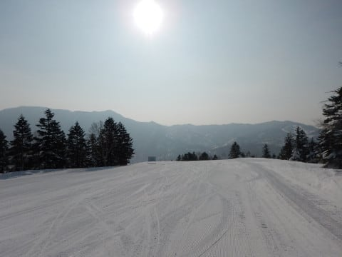

# 2月24日(土)の志賀高原は…朝一瞬だけ晴れたけど，曇り～雪の一日（涙）でも，雪は良くてそんなに混まなかったよ

📅 投稿日時: 2018-02-25 00:15:51

ということで．

今日も一日志賀高原を滑っていたわけですが．

…なぜか週末狙ったように悪天候になる今日この頃（涙）

何かに呪われているとしか思えない…（泣）

まず，朝の登りの道路は晴れてたんですよ．

…でも．

2月としてはありえないほど雪がないですね…（涙）

一の瀬近辺まで来て，やっと雪が出てきましたが．

今週も雪がそれほど積もってないようですね…

で．

本日は．

焼額より営業開始が30分早く，8時営業開始で．

営業終了も焼額ゴンドラの16時より30分長い16:30まで

やっている，奥志賀からスタート！

朝日が顔を出して，すっきりいい天気…！！

朝イチゴンドラから見えるコースは，

朝日に照らされた最高のシマシマっ！！

山頂に着くと…

うほほほほほ～！！

まだ誰も滑ってないシマシマがお出迎え！

では，いただきま～すっ！

うほーーーーーー！

最高っ！

しっかり締まった，最高のシマシマっ！

晴天ぴかぴかの下滑るシマシマ…

うおおおお！

シアワセ！

これをシアワセといわず，何をシアワセと

いうのだ！

…と，奥志賀ゴンドラを2本ほど滑ったあと，

8時半の第4ペア営業開始と同時に

ホームゲレンデの焼額へ戻ります…

そうすれば，8時半の第1ゴンドラ営業開始に

乗ってくる人より先に，第1ゴンドラ山頂に

立てるのだ！

焼額の山頂気温は，-8℃．

いい感じの冷え冷えですね！

そして．

ファーストトラックで多少荒らされているものの．

焼額でシマシマアゲイン！

ファーストトラックの人しか前に滑っていない

貸し切り状態の冷え冷えシマシマバーンを…

再びおいしくいただきます！

晴天の下，冷え冷え締まったシマシマバーンを

思う存分切り裂けるこの快感…

これ以上の快感がこの世にあるだろうか…！！

あぁ…シアワセ…

だが．

シアワセタイムは長く続かなかったのだ…（涙）

通常営業開始から30分を過ぎた9時過ぎには，

なぜか曇りだし…

さらに，ゲレンデの人口密度が…

ちょっと高くなって来たんですが…（泣）

しかし，朝イチは最高晴天だったのに，

営業開始直後から嫌がらせのように曇って

くるのはなぜ？？

でも，コース上の人は多かったけど．輸送力の高い第1ゴンドラの待ち時間は

それほどでもなく．

せいぜいゲートの外にちょっと並ぶ程度だったので，

まぁマシだったかな．

…第2ゴンドラは強風減速運転だったので

30分待ちだったようですが…

で．

昼前になると．

さらに嫌がらせのように，

ここしばらく降ってなかったらしい

雪が降り始めてきたんですけど（涙）

それも，昼を過ぎると，結構本格的に

降って来たんですが…(泣）

うがーー！

なんだよ～！

晴れてたのは朝一瞬だけで．

営業開始直後から天気が崩れ出し，

そのまま悪化していくって…

先週と同じパターンじゃないか～！！

コースには，うっすら雪が積もり，

時々減速するので難しめの状況に…

でも．

そんな中でも．

オリンピックコースは人も少なく．

さらに，雪もしっかり固めだったので．

結構がしがし滑れたので，楽しかったかな！

…って感じで．

アホのようにグルグルグルグル，

オリンピックコースを滑り続けていたら…

午後2時過ぎには．

今度はガスが…（激涙）

なんということだ…！！

昨日の予想で

「ヘタするとガスるかも？」

と書いた，悪いほうの予想が当たっちゃったよ…（泣）

なぜ，いつもこんな悪い予想は当たるのか…

結局この日は．

夕方まで山頂付近はガス．

ふもと付近は視界はいいものの，雪降りという

一日となり．

あぁ…

残念な天気だったなぁ…

と思いつつ．

16時の焼額ゴンドラの営業終了後．

「奥志賀は16:30営業終了だからまだ30分滑れるよね（はぁと）」

と，ルンルン気分で朝にスタートした奥志賀に戻ると…

…あ，あんだと～！！！

16:15終了！？？

悪天候で，営業終了時間が15分短くなってるよ！！！

一体何の仕打ちだ！

なんてこった…

なんてこった…

……

営業終了した奥志賀ゴンドラのゲートを

眺めつつ．

……

滑り足りない．

滑り足りないのだ．

…

そうだ！！

こういう時は．

あの呪文を唱えればいいのだ！

「瞬」

「間」

「移動っ！！」

…をを！

なんということか！

この呪文を唱えると．

奥志賀のゴンドラ営業終了まで滑っていたというのに．

奥志賀からかなり離れた一の瀬ファミリーのリフトに，

乗っているではありませんか！！

一の瀬ファミリークワッドは16:50まで営業なので．

まだ2本ほど滑れるのだ！

…でも．

一の瀬ファミリーも，山頂付近はガス…（涙）

バーンはちょい固めだったけど，

締まった雪のおかげでそれほど荒れてなくて，

コブコブよりは滑りよかったかな～．

ということで．

いやーー．

朝8時から17時まで．

滑った～！

滑ったよ…

…

でも，まだ滑る．

まだ滑るのだ！

まだ滑り足りないのだ！

そう，夜18:30～21時までは，ナイタータイム！

昼間積もった雪が圧雪された，やわらかくて

気持ちいいシマシマバーンっ！

いや，シマシマはやめられませんな～．

夕方のガスで視界が悪かった憂さを晴らすような，

すっきり視界のシマシマバーンで．

気持ちよく滑れたのでした…

（このシュプールを見るだけで，

　ナイターに私が来ていることがわかるらしい…）

ってことで．

先週に引き続き．

朝まで晴れてたのに，

営業開始直後から天気が崩れていく…

という嫌がらせのような天気になっちゃった

本日でしたが．

「もしかするとガスになるかも」

なんて書くからガスになっちゃったんじゃないか？？

というクレームも一部から出たので．

それならば．

明日の予想は，

「一日中晴れ！すっきり晴れ！雪質最高！」

と，書くだけ書いてみよう…

これでホントに．

低気圧が接近してくる明日一日，

すっきり晴れになるようだったら…

その時は．

志賀高原の天気を決めているのは私だ

ということを，公言してみようかと思う

Skier_Sだったのでした…

## 💬 コメント一覧

### 💬 コメント by (しんちゃん)
**タイトル**: 前からそう感じていました
**投稿日**: 2018-02-25 01:50:02

前からヤケビの天気はＳさんが決めているのではと感じていました（笑）

スマホをいじると突然晴れだしたりしたし、ご家族で来ていてスマホを見れていないときは終日降雪でした。

いろいろ持っている特殊能力の一つではと思っています。

### 💬 コメント by (yasu)
**タイトル**: Unknown
**投稿日**: 2018-02-25 06:51:04

S様、おはようございます！

昨日、一の瀬のラストリフトでご挨拶させて頂きました。念願のS様に会えて自己紹介もすっかり忘れてしまい、失礼しましたm(__)m

あまり焼額山には遠征しませんが、志賀にはほぼ毎週出没してますので、どうぞよろしくお願いします！

### 💬 コメント by (ほっぽ)
**タイトル**: Unknown
**投稿日**: 2018-02-25 07:03:12

Ｓさん

昨日は奥志賀スタートでしたか。奥志賀はゴンドラ間引き＆減速運転で昼間は長蛇の列だったようです。

風が強いときは１ゴンですね。

しかし、８時から１７時まで滑ってナイターまでとは、本当にスキーが好き、というかスキーサイボーグなのですね。(^^;

ちょい早上がりして宿の部屋でゴロゴロしている私には想像も出来ません。

私は１６時半の一の瀬ファミリーで早上がりするという軟弱なスキーでした。

### 💬 コメント by (サトシ父)
**タイトル**: 多分お見かけしました
**投稿日**: 2018-02-25 09:17:25

作日午後、1ゴン並んでたらSXを両手にニコニコしながら空席待ちからゴンドラに飛び乗って人を発見しました！きっとSさんに違いないと思いました。20000M倶楽部の人はゴンドラやリフトに乗るのが大好きとブログにありましたので…

### 💬 コメント by (michi)
**タイトル**: Unknown
**投稿日**: 2018-02-25 12:16:18

昨日もお疲れ様でした。

しかし、ホントに毎週末に狙って天気が悪い、、、昨年と真逆ですね。

たぶんSさんが決めてるんだと思います（笑）

来週こそ、ピーカンに期待してます(^^)

### 💬 コメント by (Skier_S)
**タイトル**: 今日は良かったよ…
**投稿日**: 2018-02-26 02:10:21

＞しんちゃんさま

今日，証明されてしまいました．

やっぱり，志賀高原の天気を決めているのは

私だったようです…

これからは毎週，週末は晴天の最高雪質に

しようと思いますので，よろしくお願いします←お前は神か？？

＞yasuさま

土曜はお会いできてうれしかったです～．

お互い生息地(？)が違うので，なかなか

お会いする機会がないですよね…

軟弱な私は，ゴンドラが無いとトップシーズンは

寒すぎて滑れませんから(笑)．

ぜひまた一緒に滑りましょう～！

＞ほっぽさま

どうしたわけか，今日もお会いしませんでしたね…

何かタイミングが悪いんでしょうか．

土曜は朝8時から夜9時まで，たっぷり滑って

満足でした…

2週連続子連れスキーだったので，滑り足りなかった分を

一気に取り戻した感じです．

日曜は宿の朝食の関係上，さすがに8時スタートは

無理でしたが，

しっかりリフトストップまで滑り倒しました～．

満足の週末でした…

＞サトシ父さま

あら…両手でSXを持ってゴンドラに飛び乗るって…

それ，ほぼ間違いなく私です．

片手に板1本ずつ，両方の手で持ってゴンドラ

乗り場に向かう人は少ないと思うので…

そこまで接近遭遇しているなら，ぜひお声をかけていただければ…

また志賀にお越しになるのでしょうか？

その際はぜひ一声かけてください．

お待ちしています…

＞michiさま

土曜はまた滑り出したら天気が崩れる，

嫌がらせ天気でしたね…

でも，日曜は良かったですよ！

私が「晴天最高雪質」と書いたら，その通りになるようで…(笑)

来週の天気図はかなり微妙ですが，

私が何とかしてみましょう…←神の気分になっている

### 💬 コメント by (まうちゅう)
**タイトル**: Unknown
**投稿日**: 2018-02-26 21:44:46

ひとりパウダー８ならぬ、ひとりカービング８ですね！

内足への荷重は私も最近、絶賛練習中です。

### 💬 コメント by (Skier_S)
**タイトル**: まうちゅうさま
**投稿日**: 2018-02-27 08:03:32

狙ったわけでは無いのですが，

8の字シュプールになりました…

ダイヤナイターのリフト沿いの

シュプールは私の定位置です…

私は内足への荷重が逆に強すぎるので，

外足荷重絶賛練習中です（笑）

