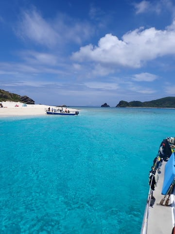
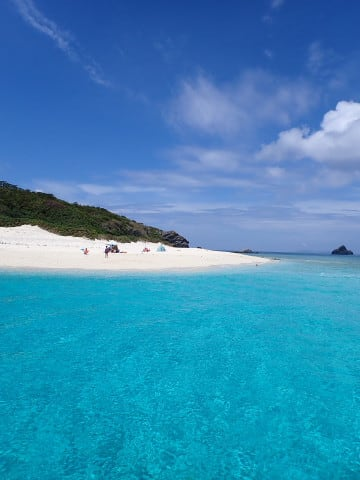

# 2023年8月，座間味で親子3世代ダイビング！その12…今日もお昼休みはガヒ島で

📅 投稿日時: 2023-09-26 03:36:41

🏷️ カテゴリ: [ダイビング日記](ce3a7a8d424d112fce83ee85c81a0e344.md)

えー．

先日．

我がLEVORG君が，やっと走行12万kmを

越えました～！！

[あの日々](ecdca7ac058e50b9e3a2a3ae04e18b623.md)から5年と2か月で12万kmか…

前のBRレガシィが5年車検の前に

16万3000㎞走って手放したことから

考えると，やっぱり走行距離が少ない

ですね…

で．

走行距離が少ないのはコロナの外出規制の

せいかと思っていたら．

コロナの行動規制が一通りなくなった

今でも，コロナ前と同じくらいしか

走行距離が伸びてないことに気づきました…

これまで，走行距離が伸びないのはコロナで

出かけられなかったせいだと思っていたら．

コロナのいろんな規制が無くなった今年．

冬は仕事でスキーに行けない週末が増えて．

夏も仕事が忙しくてあまり遠出できていない

というのが理由だったとわかりました（泣）

そうか…

全ては仕事が原因だったか…

いや．

ガソリン代とかタイヤやオイルなどの

費用も減るし．

車の買い替えサイクルも伸びて，お財布

には優しいんだけど．

でも．

お金がかかってもいいから遊びに行きたい（涙）

次のシーズンこそ，

絶対毎週末確実にスキーに行けますように…←昨日の記事で，それはすでに望み薄だと分かってるよね…

…ってなことで．

本題へ．

今日もまた[昨日の続き](eadccacdd081cf52435d9d157f88d074a.md)，ダイビング日記です…

ーーーー

ってな感じで，

ダイビング初日の昨日は様子見の

ダイビングでしたが．

今日は1本目，2本目とも満足度の高い，

充実した2本でした！

2本目終了後，もうお昼を過ぎていたので．

船はいつものお昼休みポイントへ向かいます…

この船が，お昼休みに向かう場所といえば．

そうです．

決まってますね…

ということで．

今日もやってきました，ガヒ島ビーチ前！

いや…

何度来ても，ここ，きれいだよな…

ってなことで．

今日もこのきれいな海を眺めながらの

お昼ご飯タイム！

今日もお昼は，星砂さんにお願いした

お弁当．

ちなみに，これで3人前です…

かなり量が多いので，5人だけど

3人分だけ頼んでます．

きれいな景色を眺めながらのお昼ご飯．

なんてぜいたくな時間でしょう…

そして，星砂さんのお弁当もかなり

おいしいし…

今日は幸せだ…

で．

お昼を食べ終わった娘．

じっとガヒ島を眺めてましたが…

そうだよね…

やっぱり泳ぎたいのね…

ってなことで．

今日も娘と一緒に，しばらく泳いだら…

ガヒ島へ上陸！

あぁ…

なんと贅沢な時間…

これまで結構いろんな海に行ってきたけど．

やっぱり慶良間っていいよね…！

世界に誇れる海だと思う．

ってなことで．

しばらくガヒ島ビーチでぜいたくな

時間を過ごしたら．

出発する時間になったので，船に

戻ります…

ってなことで．

ガヒ島ビーチ前を出て，今日の3本目の

ポイントへ移動開始！

ってか．

移動はごく一瞬，5分程度で終わり…

やってきたのは，座間味港のそば，

阿真ビーチ前．

今日のラストダイブの準備をして…

ポイントのブリーフィングを受けたら…

いざ，3本目へエントリー！！

（[続く](ecc3a37cfb1d9496a0259a6d11f49f66a.md)）
