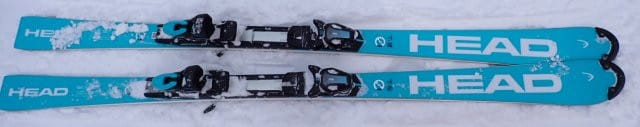
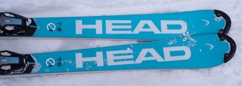
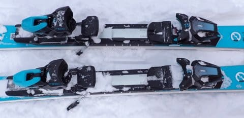
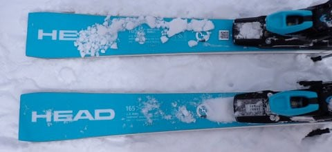
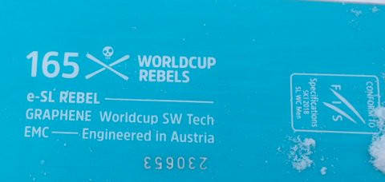

# 2025シーズンモデルのスキー板，試乗レポートその1… HEAD Worldcup Rebels e-SL RD FIS SPEEDBLUE

📅 投稿日時: 2024-05-16 01:29:12

🏷️ カテゴリ: [スキー板試乗](c0bd8048615710cee890e403a36cc9a2b.md)

えー．

今週末は月山と横手山がまだ滑れる

わけですが．

月山は木曜夜から金曜にかけ，

雨が降りそうなものの．

土日は月山も横手山も天気は

晴れそうな感じですね…！

とりあえず．

まだシーズンは終わってないので

スキーネタが続くこのBlog．

今日から，2025シーズンモデルのスキー板の

詳細試乗レポート開始です！！

まずは3月，コンディションがいい志賀高原で

試乗した板のレポートから始めます．

まずはヘッド編．

では，どうぞ～！

〇HEAD Worldcup Rebels e-SL RD FIS SPEEDBLUE 165cm 

SL競技，基礎小回り

[速報レポート](e177a669ff33025faf72b49091ac5cc36.md)にも書きましたが，

FIS規定SLモデルのe-SL RDの青色バージョンの

この板．

昨年のカタログには

「WC SL-REBEL FIS RP-WCR14 SPEEDBLUE」

という名前で載っていますが…

プレートも白いe-SL RDと同じRace Plate の

WCR14がついていて，FIS公認マークも

ついているSL板なんですが，基礎小回り用と

しても使えるよね…

と，デモ系板の水色に塗られたバージョンを

出している…という位置づけの板です．

サイドカーブもプレートも，構造も全く

同じはずで，トップシートの色が違うだけの

白とブルーのe-SL RD．

色が違うトップシートの特性が違うようで，

実は板の性能に微妙に違いがあります．

青い方が粘りがあるたわみが出る感じで，

白い方は硬めでしっかり感がある感じ．

私レベルでも明確に違いを感じたので，

粘りがあるたわみとたわみ戻りの際の

メタル感のある返りが好きな人は青，

たわみの出にくいしっかりとした硬さと

それによる反応の速さが好きな人は白

を選ぶのがシアワセになれます…

（白い方の試乗レポートは[こちら](ef69b2c7fa4e2b9762fd27cbac6897045.md)）

とりあえず，今回は青い方．

滑ってみると…

踏んでいくときに気持ちいいバネ感を

感じます．

いきなりサイドカーブで板が回り始める

のではなく，粘りがあるフレックス感で

板がたわんでいき，谷回りですっと板が

たわんだ後，強いグリップでたわみに

沿って板が回っていく感じ．

強いグリップで板が回っていったあと，

切り替え時にすっと板が返ってきて，

気持ちよく反対の谷回りに入っていけます．

新雪が蹴散らされた荒れた雪でも，

強いグリップとサイドカーブでクイクイ

回っていくし，

軽さを感じるので取り扱いやすく，

切り替えで飛ばされても，エアターンで

谷回り側のエッジを入れつつ着地して

そのまま鋭い谷回りに入れるような取り扱い

やすさを感じます．

競技用SL板でよくありがちな，フラットな

硬い斜面じゃないと本領が発揮的ない…

という対応幅の狭い板ではありません．

たわみの返りもそこそこ早いし，

かなり軽快に感じる板です．

軽快なのに高速安定性も強く，

グリップもいい感じ！

がっちりずっしりというより，

ガッツリハイスピードまで行ける

軽快なゲレンデ用小回り板．

軽快ながらも，しっかりグリップして

たわみ量で回転弧を好きなように

コントロールでき，

比較的縦目のターン弧から，谷回りで

捉えてからしっかりたわませていく

ことでかなりの深い小回りまで，

ターン弧の自由度は高いし．

グリップが強めの板ながらもひねりを

入れてズレの小回りもできるし．

強いグリップで板なりにカービング

させられてしまう小回り強制マシーン

ではなく，幅の広い滑りができます．

この軽快さと自由度の高さは…

ホントにSL競技用なの？これ？？

しっかりグリップと高速対応性があり，

それでいて軽快さと取り扱いやすさもあり，

ターン弧の自由度も高いし，

普通の人が気楽に履くにはちょっと

フレックスが強めと感じるかもしれませんが…

スピードを出す人，レベルの高い人の

ゲレンデ小回り板としてはかなり

おすすめ度高いです…！！
