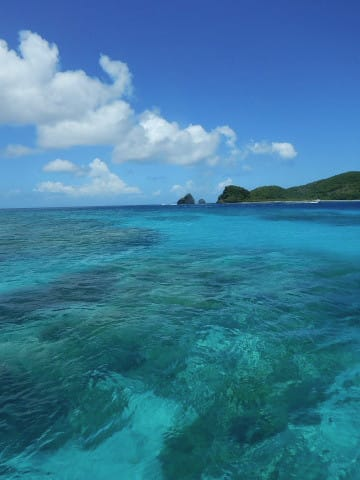
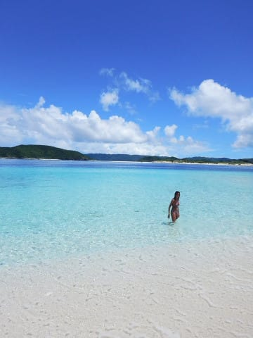
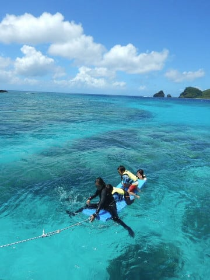
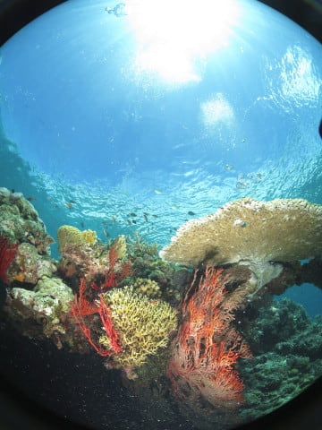
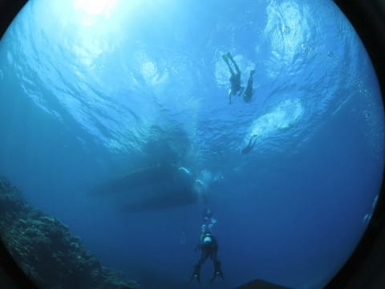
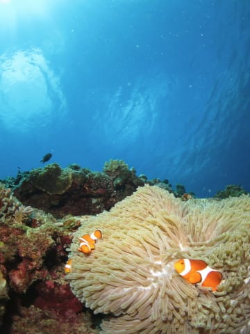
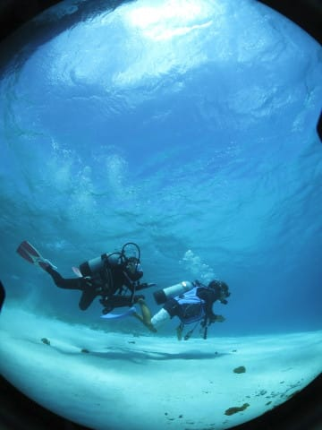
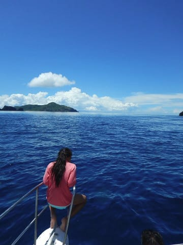
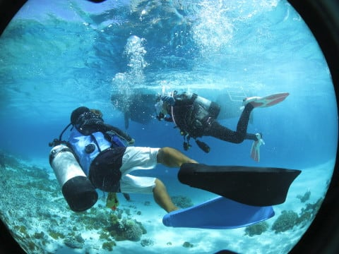
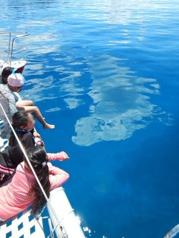

# 2018年8月，子連れ座間味で小5の娘とファンダイビング！プロローグ

📅 投稿日時: 2019-08-27 03:14:17

ということで．

[2018年の夏休みパート1](e308d9a01caec22968e6edff28fd5e5bc.md)で，

娘が無事にジュニアオープンウォーターの

実習を終了し，Cカード保持者となったわけで．

…となると，当然．

2018年の夏休みパート2は

娘とダイビングしまくりツアーだ！！！

…と，計画するわけですが．

小学生ダイバーを連れて潜るには，

やっぱり娘のことを良く知っている

ショップの方が安心だし．

いろいろ融通をきかせてくれるだろうし，

こっちもいろいろお願いしやすいし…

となると．

やっぱり，

ザマミセーリングさん＆

ペンション星砂さん

という鉄板の組み合わせの，

いつもの座間味になるよな…

まぁ，12歳になるまでは最大深度12mという

制限もあるし．

ド初心者の娘を連れて，カレントの強い

上級者用の海も厳しいから．

浅場でも見所がたくさんあり，

島に囲まれていて海が荒れない

座間味は，娘にとってちょうどいいよね…

ってな感じで．

この夏休みパート2は，

3年連続，6度目

という，もう恒例となった感もある

ザマミセーリングさん利用での

ダイビングと相成ったのでした…

うーん．

本音を言えば，そろそろ座間味以外の

海に行きたいんだけど．

まぁ，娘の経験本数が増えて，

かつ，12歳までの最大深度12mの

制限が取れるまでは，

座間味＆モアルボアル

という組み合わせが続くことに

なりそうです…

ということで．

読者のみなさんにとっては．

そろそろ座間味レポートも読み飽きた

という感じもあるかもしれませんが．

今回，ジュニアオープンウォーターを取得した

小学生の娘と一緒にダイビングをするという，

子連れダイビング旅行記

という，新しい視点での旅行記になるので．

懲りずにお付き合いのほどを…

…しかし．

この旅行に出発したのは，

昨年2018年の8月25日．

ちょうど1年経ってからの

旅行記の連載スタートという，

すごいタイムラグのある旅行記

になっちゃいました…．

ってなことで．

子供と一緒に座間味でダイビング旅行記，

（ちょっと巻き気味で）

次回から連載開始です！

　

　

　

　

## 💬 コメント一覧

### 💬 コメント by (KENKEN)
**タイトル**: Unknown
**投稿日**: 2019-08-27 22:53:50

第2夏休みの伊是名島から帰ってきました。

水深が浅いポイントが多く、珊瑚も綺麗で流れもあまりないので子様連れに良い場所でした。

ショップ(1軒しかありません)の対応も良かったので来年の候補にしてみて下さい。

10月に座間味も訪問予定です。(3回目の夏休み?)

### 💬 コメント by (Skier_S)
**タイトル**: ＞KENKENさま
**投稿日**: 2019-08-28 01:04:40

伊是名島！！

いやーーー．

離島マニアの私としては，与論島と並んでぜひ行ってみたいと思っている島です．

サンゴがきれいなんですね…

宿はどんな感じでしょうか？

### 💬 コメント by (KENKEN)
**タイトル**: Unknown
**投稿日**: 2019-08-28 21:43:30

伊是名島は座間味と似たようなポイントが多かったですね。

透明度もとても(かなり)良かったです。

ポイントも開発途中なのでこれからに期待です。

ショップ近くの宿を紹介頂きましたがまあまあ( ´∀`)です。

島は座間味みたく観光地でないので旅慣れしてないとちょっと辛いかも。

逆に言うと古き善き沖縄の雰囲気が多く残っている島でした。

お子様も歓迎して貰えますので是非検討して下さい＼(^_^)／。

10月の座間味訪問では星砂さん満室で予約出来ず((T_T))。

### 💬 コメント by (Skier_S)
**タイトル**: ＞KENKENさま
**投稿日**: 2019-08-29 01:38:53

星砂さん，10月でもいっぱいでしたか！

残念でしたね…

ぜひ伊是名島行ってみたくなりました（笑）

