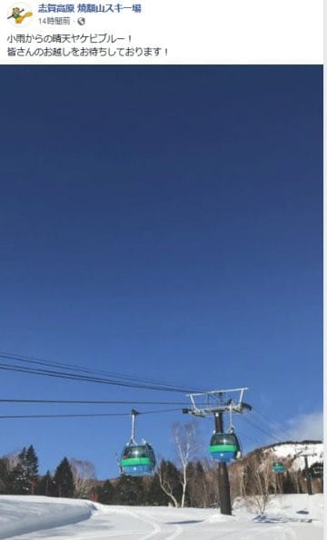
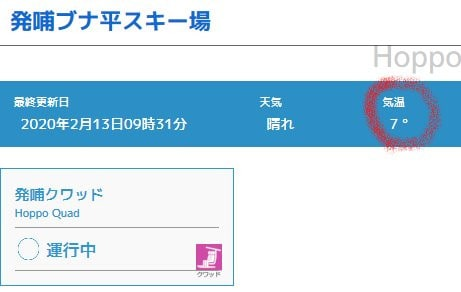

# 昨日2月13日（木）の志賀高原，朝のみ雨で昼間は10℃くらいまで上がり，春の雪になったようですね…

📅 投稿日時: 2020-02-14 07:10:17

🏷️ カテゴリ: [日記](cc4b5682fb7b8b144980957a978653fb0.md)

ダメだ…

昨日も帰宅後倒れたように寝てしまってた…

ちゃんと布団に入って寝ていたのが，

いつもよりマシだったけど…

とりあえず．

昨日木曜の志賀高原．

朝8時過ぎくらいまで雨だったようですが（涙）

でも，

13日（木）：早朝3時ごろ～8時過ぎまで雨．時折強く降る．

　ただ，9時くらいには雨は止む．

という予想通り，営業開始のころには止んでくれて．

…そして．

営業開始直後から，すっきり晴天になったようです！

（焼額山Facebookより）

ただし．

すっきり晴天の上，気温が

+10℃くらいまで上がったみたいですね（泣）

（志賀高原索道協会HPより）

朝9時過ぎの時点で，+7℃って…（涙）

だもんで．

　雪質は，雨でしっとりと水分を含んだうえ，

　高温で溶けた，重い4月の雪．

って予想が当たって．

先週の冷え冷え雪は一気に4月のような

ダメダメストップ雪になっちゃったみたいです（激涙）

あぁ…

冷え冷え雪だったのは，一瞬だったか…

とりあえず．

今週末も気温はかなり上がりそう（涙）

そして．

15日は何とか雨にならずに済みそうだけど．

16日，もしかしたらちょっとだけ液体が

ぱらつくかも…

いや，ザーザー降りにはならなさそうですが…

とりあえず．

もう仕事に行かなくてはならないので．

すみませんが，コメント回答は今晩！

## 💬 コメント一覧

### 💬 コメント by (ほっぽ)
**タイトル**: Unknown
**投稿日**: 2020-02-14 08:03:22

Ｓさん

今日はニゴンポールポジションGETしたら、日体大効果で８時から営業開始、実質7時55分に一番篭GET、ラッキーでした。

レインボー隊の皆さんにご挨拶して、朝イチヤケビ満喫します❗😊

### 💬 コメント by (レインボー)
**タイトル**: Unknown
**投稿日**: 2020-02-14 17:51:57

ほっぽさん、本日はお会いできて楽しかったです。一人一番ゴンドラに乗りながらも、ブログ写真のためにあっさり先をゆずって頂きました。ブログって大変だな、自分は手を出すまいと思いながら、ppを頂きました。ありがとう。

今日は以前お世話になっていたやどのお孫さんと滑る任務が発生して、裏さんと、普段使わない筋肉を使ったため、整骨院でケアしました。

今日は雪は緩んだものの、妖怪足つかみは出現しませんでした。

日曜日には、妖怪に会えると思いますよ。皆様、おたのしみに。

### 💬 コメント by (レインボー)
**タイトル**: Unknown
**投稿日**: 2020-02-14 18:25:38

ちなみに、道路の雪は、全て消失しました。

皆様、安心して聖地志賀へおいでください。もちろん油断は禁物ですが。

### 💬 コメント by (なるなる)
**タイトル**: Unknown
**投稿日**: 2020-02-14 19:44:11

本日の志賀高原。朝はカリカリでしたが、シマシマに板が引っ掛かり悪くは無かったです。

昼頃から雪は緩みましたが、曇っていたおかげで、昨日のような止まってしまう雪にはならず、一日楽しく滑れました。

しかし、極一部ですが茶色い物が出てきてしまいました…

今は滑る分には問題無いですが、雪の追加が必要な感じです。

### 💬 コメント by (Skier_S)
**タイトル**: 週末も志賀高原！
**投稿日**: 2020-02-15 00:07:12

＞ほっぽさま

今日の志賀は春の雪＆コロコロ地獄だったようですね…

また明日お会いしましょう！

＞レインボーさま

道路の雪が消えたということは，ゲレンデの雪もかなり

消えたということでしょうか…（涙）

＞なるなるさま

この飛び石4連休で，トータル70cm以上積もったと思うのに，

もう茶色くなってる部分があるのですね（涙）

でも，雪質がそれほどひどくなかったのが救いでしょうか…

### 💬 コメント by (ほっぽ)
**タイトル**: Unknown
**投稿日**: 2020-02-15 13:26:20

レインボーさん

今日も奥ゴン朝イチからご一緒させて頂きありがとうございました。

昨日は人生の大先輩には道を譲るべきという私のポリシーです❗😅

Ｓさん

今日は早々に呪縛が解かれて、妙な場所で？お会いしましたね。

また、明日もよろしくお願いします。

