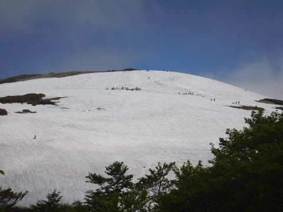
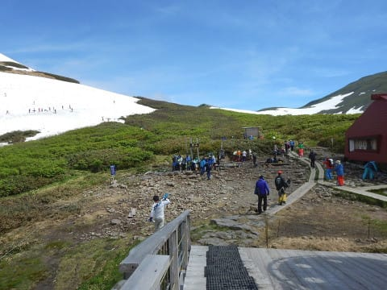
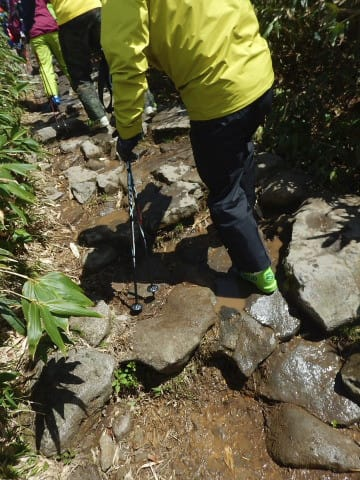
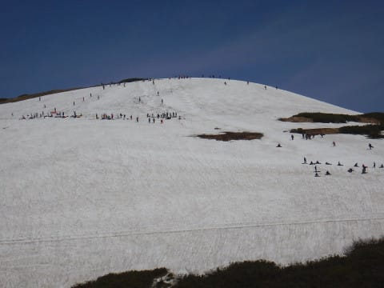
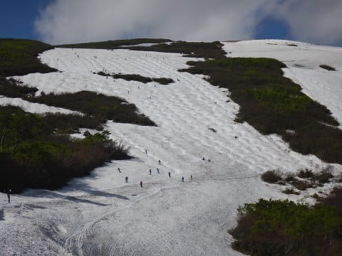
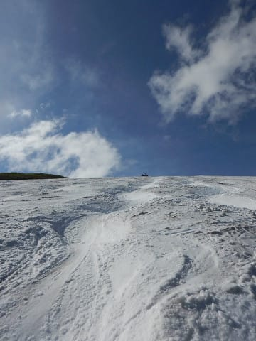
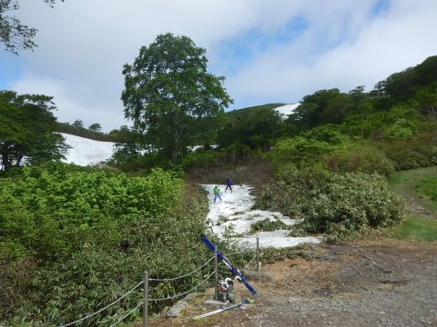
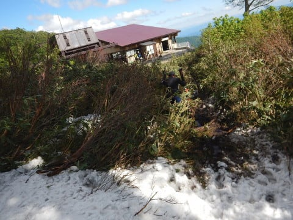

# 6月17日（日）日帰り月山！速報モード…大斜面はまだ行けるけど，リフトの乗り降りは歩くよ！

📅 投稿日時: 2018-06-18 02:40:23

えー．

これまで何度も月山に日帰りをして．

何度も学んだことなんですが．

やっぱり，月山に日帰りで滑りに行って．

リフト営業開始からラストリフトまで滑ると死ぬ

ということを，今日もまた学びました…←学習能力無いんかい！

夜中2時に出発，8時前に月山に到着して．

4:15のラストリフトまで滑って．

途中休憩しつつ，帰ってきたら1時過ぎ…（涙）

帰りの途中，30分ほど寝ましたが．

ほぼ24時間起きてます（泣）

…早く寝ないと明日会社に行けないので．

とりあえず，今日は超速報モードにて…

えー．

本日の月山は，朝のうちは雲が多めでしたが．

昼からは，時折雲が飛んでくるものの．

概ね晴れの一日！

リフト降り場は，リフトを降りてから

雪のあるところまで，これだけの距離を

登って行かなくてはならなくなってます…

こんな岩場を歩いて行かないと，ゲレンデに

出れません（涙）

月山に行ったことがある人なら，

この写真を見ると分かりますが．

右側に土が出てしまっているので，

Tバーはかなり上に上がってます．

Tバーを滑りたい人は，リフトを降りてから

すごく登らないと行けませんし．

距離も短いです…（泣）

でも，大斜面はまだまだ行けそうですね～！

コブラインはまだ上から下まで

比較的長いラインがつながっていて．

大斜面は楽しめます！

沢コースが水没で滑れないのが

残念ですが…

で．

今日の朝までは，リフト乗り場まで

ギリギリ滑りこんでこれたのですが．

この部分．

今日の夕方には，完全に雪が融けて．

朝までここ滑れたの？？？

という藪になっちゃいました（泣）

ということで，明日からは．

リフト乗り場も，かなり下から

歩いて登らないとリフト乗り場に

たどり着かない，最終形態になります…

あぁ…

もうシーズンも終わりですね（涙）

とりあえず．

今日は寝ないと死ぬので．

明日また詳細レポートやります…

おやすみなさい…

## 💬 コメント一覧

### 💬 コメント by (もりや)
**タイトル**: お疲れ様です
**投稿日**: 2018-06-18 03:46:36

まだこんなに雪があるんですね。それにしても、片道6時間を日帰りとは驚きです。うちの子供達も月山に行きたいと騒いでいたので、色々検討していましたが、今シーズンは断念。来シーズンは行ってみたいですね。

### 💬 コメント by (Skier_S)
**タイトル**: もりやさま
**投稿日**: 2018-06-20 04:58:23

月山は4月中旬になって

やっとオープンするくらいのスキー場ですから，

まだまだ滑れますよ！

…ただ，6月中旬くらいには，リフトから雪のあるところまで

かなり歩かなくてはならなくなるのが厳しいですが…

でも，リフトからゲレンデまで，板を履いて

行き来できる時期は，めちゃくちゃ混みます．

リフト10~20分待ちはざらです．

だもんで，今の時期が混まなくていいのかも…

とりあえず，来シーズンは話のタネに，

一度チャレンジしてみてください…！

