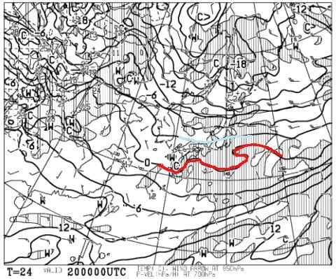
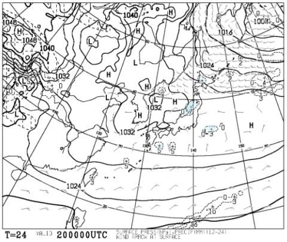
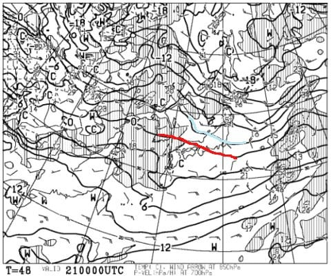
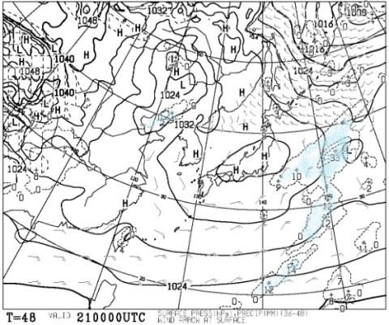
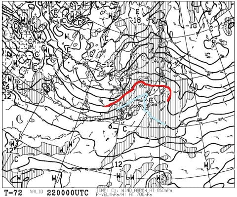
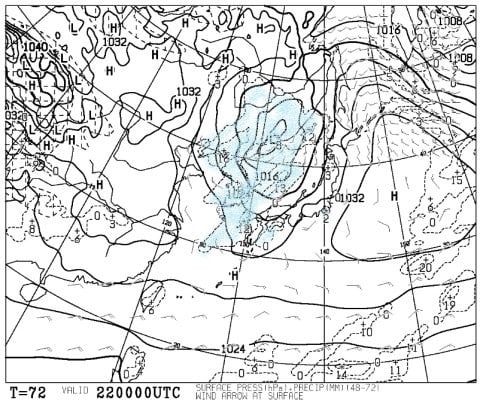
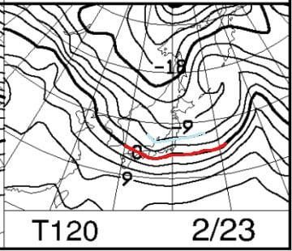
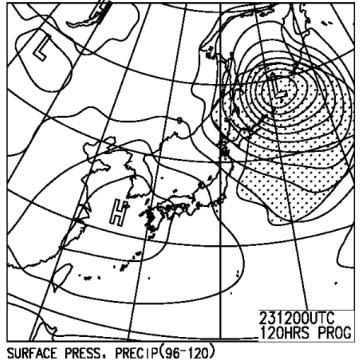

# 2月22，23日の志賀高原スキー場の天気は…22日土曜はヤバい．荒れて液体が降るか？23日日曜は冷え冷えで晴れそうだけど，雪は硬いかも．

📅 投稿日時: 2020-02-20 00:46:44

えー．

焼額特派員よりレポートがありましたが．

どうやら本日の志賀高原．

昨日からの雪でゲレンデ状況は回復，

冷え冷えのいいコンディション

だったようです…！

いやー．

先週末のひどい状況から，

なんとか回復しましたね…

このまま週末まで，このコンディションが

続くといいなぁ…

いや．

続く．

続かせてみせる！！←だから，あなたが志賀高原の天気を決めてるわけじゃないから

…と念じつつ．

今週末までの天気を見てみるわけですが…

まずは，20日木曜の850hpa図を見ると．

うむ．赤色の0℃線は太平洋側まで下がり，

－3℃線が志賀にかかっているので．

まぁ，そこそこの冷えですね…

昼間も気温がマイナスをキープして

くれそうな感じですね．

そして，この日の地上天気図を見ると．

わずかに新潟近辺近くにかかってますが．

志賀高原では，全く雪が降りそうな

気配はありませんね…（涙）

うーん．

まぁ，冷えてくれてるだけでありがたいと

しておきましょう…

次は，21日金曜の850hpa気温図ですが．

志賀高原には－3℃線がかかってますので．

この日も，朝はそこそこの冷えで

スタートしそうですが．

おそらく，昼間はプラスまで気温が

振れそうな感じ…（ちょい涙）

そして，この金曜の地上天気図を見ると．

完全に高気圧に覆われているので，

すっきり晴れそうですね…

晴れてプラス気温になりそうなので．

昼間，南斜面の雪は緩むかも…（さらに涙）

で．

肝心の週末，21日土曜の850hpa図を

みてみますが．

赤い0℃線は，東北まで北上してるよ…（泣）．

これで降水量があるとヤバいのですが．

この日の地上天気図を見ると…

朝9時の段階では，なんとか

降水域は本州にかからないでいて

くれてます…

とりあえず．

これなら，気温が上がりこそすれ，

昼過ぎくらいまでは降らずにいてくれそう…

ただ，低気圧に向かって強い南風が吹くので．

また，ゴンドラが減速運転とか，

ヘタすると運休になるかも…

そして．23日の日曜ですが．

850hpa図を見ると．

をを！！この日は，水色の－6℃線が

志賀高原にかかるほどなので，

かなりの冷え込みになりそうです！！

ただ…

地上天気図を見ると，冷えるだけで降らなさそう

なので．

…もしかすると，ゲレンデは冷えてカリカリに

なるのかも…？

まぁ，うっすらでも積もってくれれば，

全面ガリガリバーンにはならずに

済むのですが…

ってなことで．

まとめると．

20日（木）：朝は－5℃くらいの冷え冷え，

　締まった圧雪バーン！

　天気は曇り時々日も射す感じかな…

　昼間もそれほど気温は上がらず，

　終日マイナスをキープ．

　急斜面は下地に硬いところが

　出てくるかもしれないけど，

　いいコンディションの一日．

21日（金）：この日も朝は－5℃くらいまで

　冷えてくれそう．

　朝からすっきり晴れで，朝イチは

　最高シマシマ！！

　ただ，昼に向かって最高気温は

　0℃前後にまで上がり，標高が低いか

　南向きの斜面は雪が緩むか…

22日（土）：朝から0℃を超える高温（涙）．

　曇り空で，朝のうちはまだ締まった

　雪だろうけど，気温が上がり，強い

　南風が吹くので，雪は一気に緩む．

　風が強いので，焼額や奥志賀の

　ゴンドラはヤバいかも．

　もしかしたら…

　午後にポツポツ液体が落ちてくるかも．

　今の天気図なら，あくまでポツポツ．

　そして，夕方のどこかの段階で，

　雨は雪になる…はず．

23日（日）：この日は冷えるよ！

　朝は－5℃を下回り，2－3cmの積雪が

　あるかな…（と信じたい）．

　2－3cmでも積雪があれば，朝イチは

　しっかり締まった圧雪でスタート．

　積雪が無ければ…ガリガリ硬い雪．

　ただ，積雪があっても，じき表面の

　柔らかい雪は剥がれて，硬い下地が

　出てきそう…

　この日は午前は雲が多いけど，

　じきに晴れて，午後は晴天のもと

　滑れそうな感じ．

ってところでしょうか．

うーむ．

土曜日，そんなにひどい雨にならなさそうな

感じになってきたけど…

でも，気温が上がっちゃうのが悲しい…（涙）

あぁ…なぜ．

なぜ，2月というのに．

いつもなら，トップシーズンだというのに．

2週連続，週末に液体の危機を迎えねば

ならぬのか…

…これまでの冷え冷え踊りが，

ここまで効かないとなると．

時間差攻撃で，夏に盛大に効いて

激烈冷夏になったりするんじゃないかと，

ホントに心配になってきた…

## 💬 コメント一覧

### 💬 コメント by (かず)
**タイトル**: Unknown
**投稿日**: 2020-02-20 02:55:00

Sさん月曜お仕事ですか？雨より土日の風が気になってきました…3連休で奥志賀が止まると悲惨そう  土曜の南風ってヤケビも？日曜のほうが強風？仕事にしようかな…

### 💬 コメント by (レインボー)
**タイトル**: Unknown
**投稿日**: 2020-02-20 06:11:02

オリンピックは数日前から非整地になっています。そして、1ゴン下の非圧雪が整地されました。ゆみりんによると、団体さんの検定で、オリンピックの代わりの整地に充てるとのことです。

### 💬 コメント by (ゆーき)
**タイトル**: Unknown
**投稿日**: 2020-02-20 12:08:59

この前の日曜の小雨みたいに、なんとか土曜は、踏みとどまってくれんかな、、、私、土日月、2泊3日で志賀高原です。

### 💬 コメント by (まいる)
**タイトル**: Unknown
**投稿日**: 2020-02-20 18:38:21

Sさん、お疲れ様です

今週末、土曜日〜月曜日に志賀高原に行きます。

初日、お昼から焼額山です

運が良ければ一緒に滑りましょう!

### 💬 コメント by (Northfox)
**タイトル**: Unknown
**投稿日**: 2020-02-20 21:32:57

22日、23日は乗鞍と栂池です。

2月で雨の心配をしないといけないなんて。

因みに栂池では太板の試乗会に参加してきます。

あくまでも太板がどんなものか調査、勉強するためです。

絶対に買いません。多分買わないと思う。買わないはずです。

### 💬 コメント by (レインボー)
**タイトル**: Unknown
**投稿日**: 2020-02-20 21:44:20

日体大が今日の昼前に終了。ゲレンデはどこもまさに真空状態。雪もよく、チウホテルのビーフシチューもおいしく、幸せな一日でした。日体大の検定のために、2ゴンは８時スタートだったし。

ところが事件が発生。サウスから1ゴンに向かう分岐は、みんなが加速する所ですが、見にくい段差があって、私の前を行く友人がすっとびました。その30分後に同じ場所で、女性のかたが、顔の流血と打ち身?とかで怪我をされ、ドクターヘリをよんでいました。お互い気をつけましょうね。

### 💬 コメント by (Skier_S)
**タイトル**: コメント遅れてごめんなさい
**投稿日**: 2020-02-21 23:46:40

＞かずさま

月曜は休みです．滑りますよ～！

風は土曜が強いです．

土曜はヤバいです．ゴンドラダメでしょう．

日曜も，朝は奥志賀はゴンドラダメかも．

焼額が止まるほどではないと思います…

＞レインボーさま

どうやら今晩はオリンピック圧雪されたようですね！

しかし，1ゴンへの連絡コース，そんなヤバかったんですか…

＞ゆーきさま

土曜は何とかぎりぎり踏みとどまってくれそうになりました！

営業中はほとんど降らずに済みそうです！！

＞まいるさま

久しぶりです～！

3連休とも滑ってます．

ただ，土曜はゴンドラが動かなかったら，焼額から

脱出していると思います．

＞Northfoxさま

あら…

乗鞍と栂池ですか．志賀じゃないのですね…

23日だったら，太板の試乗会にちょうどいい雪になるかもしれません(笑)．

