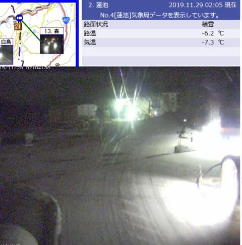
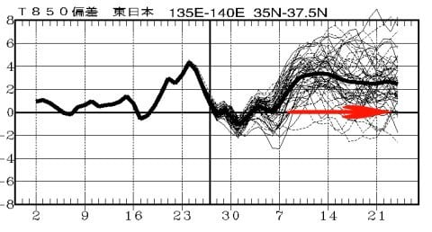
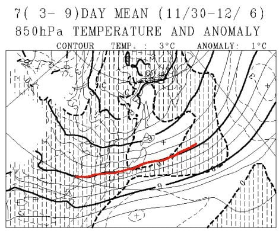
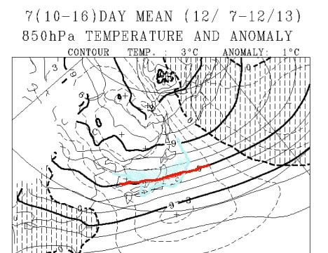
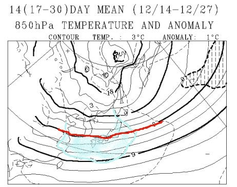

# 週末までの積雪は期待できず…そして，12月のスキー場に雪がドサドサ積もるのか？一か月予想図を読み解いてみる

📅 投稿日時: 2019-11-29 02:58:22

えー．

昨日予想した，

28日（木）

　この時期としては激冷え．雪も降り，この日は10～20cm積もる．

という予想に書いた通り．

本日は10cmほどの天然雪が積もったようですね…

…しかし．予想積雪量の多い方じゃなく．

少ないほうの10cmになってしまったのが残念…

そして．

今は志賀高原の雪も止んでしまったようですが．

でも，まぁ．

気温は-7.3℃とかなり冷え込んでいてくれて．

人工降雪機はフル稼働できる気温だし．

天然雪がちょっと積もってくれてるだけ，

まだマシかな…

（[北信建設事務所道路気象状況ページ](http://hokushin-camera.org/)より）

で．さらに．

その時の予想．

29日（金）

　この日も激冷え．天然雪は期待できないが，人工降雪機フルパワー！

と書いたのも，どうも当たりそうで．

29日の金曜日，雪が多少ぱらついたとしても，

積雪になるほどは降らなさそうです…（涙）

…でも．

冷え冷えなので，人工降雪機は

頑張れるのだ！！

がんばれ，人工降雪機！！

ってなことで．

そのあとの予想も，昨日からは変わらず．

30日も冷えるけど雪はほぼ積もらず．

1日からまた気温が上がりそうです…

うーむ．

かぐらはオープン日未定．

アサマ2000は30日オープンと言ってるけど，

オープンできるのか…

とりあえず．

11月はちょっと大変かなりむちゃくちゃ残念な状況なので．

ここは12月の冷え込みに期待したいところ！！！

…ってなわけで．

月末恒例，一か月予想図を見て．

12月が冷えるかどうか，読み解いてみましょう～！

さーて．

11月に寒気が南下しなかった分，

十分に溜まった寒気が12月にドカッと

南下して，12月は冷えてくれるはず…っ！

…

…

…

って．

なんじゃ，こりゃ～～～っ！！！！（愕然）

なんということ！！！

赤矢印で示した12月7日以降，12月24日の

予想範囲いっぱいまで．

平年比3℃くらい高い日がひたすら

続いているんですがっ！？？？

どういうこと？？

これは，今から7日までの冷え込みが

最後で，それ以降は異常高温が

続くということ？？

なんてこった…っ！！！！

さらに，専門天気図のFCVX12から，

11月30日～12月6日までの一週間の

850hpa平均気温を見てみると．

まだこの期間は，赤く塗った0℃線が

志賀高原より南にありますが…

その後，

12月7日～13日までの一週間の

850hpa平均気温を見てみると．

なぬーーーーっ！！！！

水色で塗った，平年より3℃気温が

高いエリアに，本州がほとんど

覆われてます！！！

そして，赤く塗った0℃線，その前の

一週間より北上して，志賀高原より

北にあるんですが…っ！！！

…これは．

850hpaの0℃線が志賀より北に

あるということは．

この時期に降るのは，

雪じゃなく雨になる可能性が高い

ということですね（涙）

12月中旬に，一週間平均の850hpa0℃線が

志賀高原より北に上がるってことは

普通はありえない．

異常気象です…これ（激涙）．

そして．

12月14日から12月27日までの2週間の

850hpa平均気温は．

…これも，水色で塗った平年より2℃

気温が高いエリアに，本州全域すっぽりと

覆われてます…（泣）．

まぁ，さすがにこの時期になると．

赤く印した0℃線は，志賀高原より

南にありますが．

この2週間の平均の位置が志賀高原より

わずかに南…というレベルなので．

この時期でも，何かあれば雨になる

感じの予想図です（止まらない涙）

…これは，12月下旬も，雨の覚悟を

しておかないとダメか…

あぁ…

なんという…

ここまで悲惨な一か月予想図は，

そうそうない気がする…

…

いや．

でも．

確か昨シーズンも，一か月予想は

あんまり当たらなかった．

ってか，むしろ外れることが多かったはず．

…そう．

きっと．

この予想も外れるはず（根拠のない断言）

…この一か月予想が，気象庁の

コンピューターのたわごとであることを

信じて．

そうです．

我々は，我々の義務を果たすのです．

…このBlog読者のみなさんが，

信心深いスキーヤーであるなら．

そう，踊るのです．

このBlog読者8億5000万人の総力を結集した，←だから，日本人口より多い読者がいるわけないから

ハイパーエクストラスーパー冷え冷え踊り，Ver2020シーズン

　…みんなの情熱で気象庁の予想を外そう！！

を…

## 💬 コメント一覧

### 💬 コメント by (Hide)
**タイトル**: 嫌な予感・・・
**投稿日**: 2019-11-29 07:31:39

S さま

いや～なんとな～く、夏頃から今年は雪少ないかな～なんて嫌な予感があった（Sさんと違って根拠のない過去のなんとなく夏～秋の感じからの単なる勘）のですが・・・

ハイパーエクストラスーパー冷え冷え踊り，Ver2020シーズン

↑振り付け動画配信希望（笑）

### 💬 コメント by (若杉勲72)
**タイトル**: Unknown
**投稿日**: 2019-11-29 11:27:27

なんという恐ろしい忌まわしい予報！

今年は熊の湯解禁から初参戦の予定が、孫のおもりに明け暮れる想定外の好々爺生活。

来週には行こうと思いますが、心配ですね。

予報の改訂版を心待ちしてますよ。

### 💬 コメント by (Skier_S)
**タイトル**: 積雪が…積雪が欲しい…
**投稿日**: 2019-11-30 01:57:19

＞Hideさま

…実は，私はこの冬は雪が多いんじゃないかと

あまり根拠のない予想をしていたのですが…

スタート時点では完全に外れました（涙）

で，ハイパーエクストラスーパー冷え冷え踊りですか…

誰か振り付け付けた動画作ってくれないかなぁ…（他力本願）

＞若杉さま

…ホントに恐ろしい予想です…（戦慄）

今週末もお孫さんのお守りですか？

来週，志賀高原でお会いできるのを楽しみにしています…！

