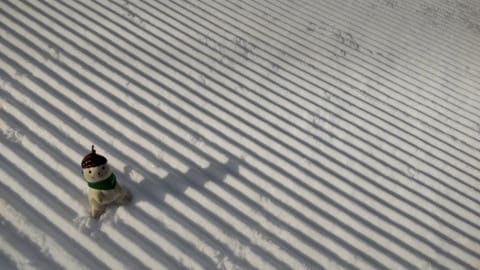
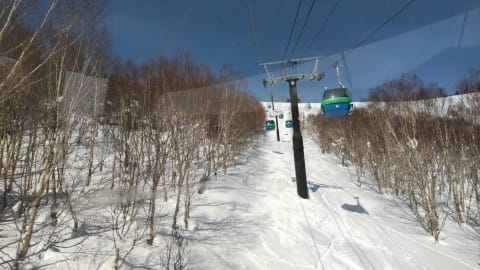
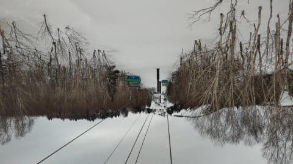
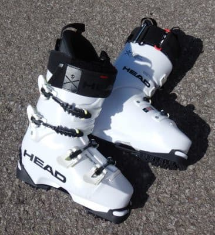
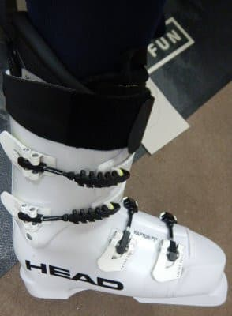
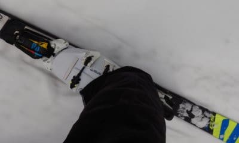

# 今シーズン本格デビューのスキーブーツ，HEAD Raptor WCR3を今シーズン履いてみて…その2

📅 投稿日時: 2022-03-02 02:05:59

えー．

本日の志賀高原ですが．

いつものおこみん特派員からのレポートによると…

朝のうちは結構しっかり締まった，

いい感じの晴天シマシマだったようです！

…ただ，予想では朝のうちだけ晴れて，

すぐ曇り空になると踏んだのに．

意外と午前はずっといい天気が続き…

昼ごろになってようやく曇り空になった

みたいです．

ただ，その後は一気に天気が崩れ，

午後2時ごろには雪がぱらつきだし，

午後4時前には時折強く降ったみたいですが…

気温は高めだったものの，予想通り

ギリギリ液体にならずに

済んだようです…！

とりあえず，これで液体が降る危機は

乗り越えたかな．

次は4日に液体が降りそうなヤバさだけど．

これも無事乗り越えてほしい…

ってことで．

本題へ．

今シーズンから本格的に履き始めたスキーブーツ，

HEAD Raptor WCR3．

[前回](e236e665405cc4eef9821c1d9111c69da.md)に続き，今回は滑ってみた感じの

インプレッションです！！

まず．

やはりフレックス140だけあって，強い．

でも，140という数字から感じるよりは

前屈はしやすいのですが，それなのにブーツの

両サイドはかなりしっかりしているので，

かなりのスピードで強い横Gがかかっても

ブーツがヨレず，楽にしっかりエッジを

抑えていけます．

スピードを出しても，ブーツが勝手に

板を押さえに行ってくれるので，

強いブーツって疲れるのでは…？

と思ったところ．

スピードを出して滑る人は，強いブーツの

方がむしろ楽かも？？

で，このブーツのバンド．

ブースターストラップの技術を流用した，

ゴムで伸びるバンドなので…

前述のとおり，前屈時のフレックスが

140という数字より優しく感じます．

普通はブーツを前屈させていったとき，

バンドが突っ張って耐えるような

感じになりますが，このブーツは

バンドが突っ張る感じは無くて，

予想より前屈しやすいけど，

ぐっと前屈したときに最後にゴムの

粘りが出る感じ．

さらにゴムの反発力があり，切りかえ時に

圧を抜いていくと，ブーツが自動的に

ニュートラルに戻してくれるような感じ

なので．

この点でも，スピードを出していったときに

楽に感じるブーツです．

返りはそれ程早くなく，じんわり返ってくる

感じなので，どちらかと言えば大回りの

リズムに合ってるかな…

とりあえず．

スピードが出た領域で，すごく板に

圧をかけていける…というより，

ブーツがしっかりしているので

乗り手が頑張って踏まなくても，

自動的に圧がかけられる感じで．

めちゃくちゃ踏めます．

189cmのR=27mのかなり強めのGS板でも，

すごくたわませることができます．

ただ…

小回り板を履くと，踏め過ぎて

回りすぎちゃうように感じますが…

そして，

新雪や柔らかめの雪の時は，

板がたわませられるような圧を

掛けられるわけではないので，

「雪が柔らかい時は，もう少し

　柔らかいブーツの方が，

　板の上で動けていいかな？」

って感じです．

でも，しっかりした圧雪や

硬めのバーンでは…

もう，柔らかいブーツに戻れないかも．

ハイスピードで強烈に板が踏めて，

面白いくらいに曲がります．

それでいて，最初に書いたように，

ブーツがしっかりしているので，

人間が強いGに耐えて板を押さえに行かなくても，

ブーツが自動的に板を抑えに行ってくれるし．

さらにハイスピードの中でもしっかり返りが

あって，ブーツがニュートラルに戻して

くれる感じなので…

スピードを出して滑るときは，

このくらい強いブーツの方が楽じゃないか

ということに気づいたのでした…

最初は，

「フレックス140なんて履きこなせるかな…？」

と心配だったけど．

実際に履いてみると，さらにスピード耐性が

1段階上がったように感じ．

そのうえでハイスピードで滑ってても

楽なので…

これはヤバい．

自分の滑走スピードがさらに上がるし．

…そして．

このブーツに合った，さらに強い板が

欲しくなるという，危険な発想が…

…これって．

強いブーツ→強い板→さらに強いブーツ…

っていう，物欲スパイラルの入り口では…？

いや

物欲スパイラルになんか，入らないぞ．

板やらブーツやらを次々買うような

物欲スパイラルになんて，入らないぞ～（小さな声で）

## 💬 コメント一覧

### 💬 コメント by (レインボー74)
**タイトル**: Unknown
**投稿日**: 2022-03-02 17:46:19

水曜日の志賀高原情報

朝の上林+2℃　蓮池-3℃。ニゴン停止なのでイチゴンスタート。

まずはパノラマからカラマツヘ。直かっても100キロは出ない。

GSサイドは10cm新雪があるものの、硬い底付きが心配でいまいちだけど、ファーストなのでまあOK。

オリンピックは重くて滑りにくいとのこと。

上から歩いて奥志賀へ。ぜーんぶ登りだ。

ダウンヒルは快適。でも、三高、エキスパはガスで怖かった。

また上から漕いでヤケビヘ。

GSもオリンピックもガスの中なので、一ノ瀬へ。

大好きなダイヤの非圧雪は未踏でした。

ファミリーはまあ普通。

寺子屋はやっぱり楽しい。ガスもなく滑りやすい。久々に寺子屋昼食を楽しめました。

### 💬 コメント by (Northfox)
**タイトル**: Unknown
**投稿日**: 2022-03-02 21:13:06

次はフレックス150の最強ブーツ導入の前振りでしょうか。。。

ブーツ3足体制という新たな世界も見えてきましたね！

### 💬 コメント by (Skier_S)
**タイトル**: コメント回答遅れました…
**投稿日**: 2022-03-03 22:27:47

投稿されてると思ったコメントが投稿されてなかったので，ちょっと回答遅れました．

＞レインボー74さま

寺小屋が動き出したのは良かったですね…！

しかし，ヤケビも早く2ゴンまた動いて欲しいところ…

＞Northfoxさま

いや…150はさすがにないかと．

その時はもっと強烈な板も必要になりそうです(笑)

### 💬 コメント by (なんちゃってレーサー)
**タイトル**: このブーツ，評判いいですね．
**投稿日**: 2022-03-04 21:27:30

昔のHEADブーツは今ひとつでしたが，WCRブーツはかなり評判いいですね．

柔らかい雪でも問題なく行けますよ．

むしろ，微妙な操作にも素直に反応してくれるので柔らかすぎるブーツよりいいかも．

### 💬 コメント by (Skier_S)
**タイトル**: ＞なんちゃってレーサ―さま
**投稿日**: 2022-03-04 23:47:20

私もHEADブーツはノーマークだったんですが，あまりにもいいという

評判だったので履いてみました…

実際にかなりいいブーツでした！！

柔らかい雪でも，確かに意外といけますね…

ただ，これまで履いていたどの板も柔らかく感じてしまうのが欠点かも（笑）．

